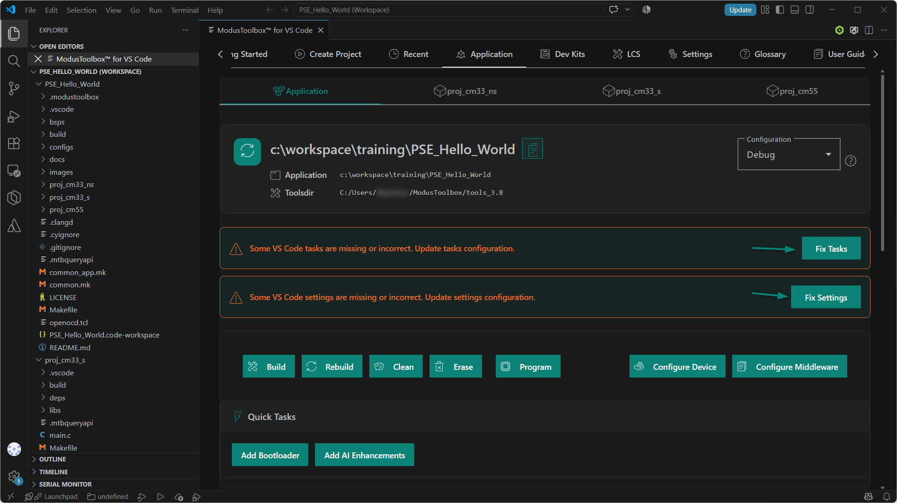
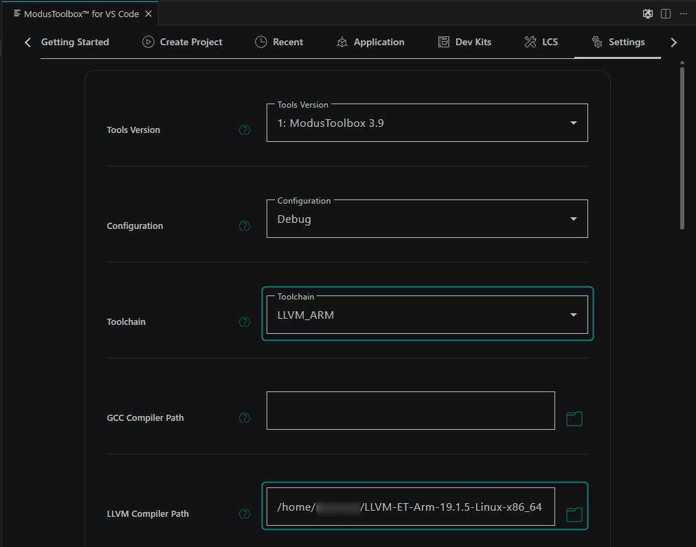

# Appendix A: Creating a PSOC™ Edge application in ModusToolbox™

The following steps show how to create a new project for PSOC™ Edge in ModusToolbox™, using either Visual Studio Code (VS Code) or the command-line interface (CLI).

## Creating an application using VS Code

This appendix shows a quick workflow to create and open a new PSOC™ Edge "Hello World" application using ModusToolbox™ and Visual Studio Code.

1. Open **ModusToolbox™ Dashboard**. Select **Microsoft Visual Studio Code** as the target IDE, then launch **Project Creator**
   If you have not installed ModusToolbox™ or Visual Studio Code, see the [Required development tools](pse84-technical-intro-features-training-manual-ch1-intro.md#required-development-tools) section.


2. Choose the PSOC™ Edge BSP that matches your kit. This training will be using the **KIT_PSE84_EVAL_EPC2**. Then, click Next


3. Select a **path** for your project, make sure the **target IDE** is Microsoft Visual Studio Code, and then select the **"Hello World"** project under **"Getting Started"** section
   Optionally, rename the project desired and click on **Create**.

> [!NOTE] Windows has a 260-character path length limit. A long workspace path and/or a long project name may cause build issues when creating some applications.


4. After project generation completes, open the generated workspace in Visual Studio Code by opening the .code-workspace file created in the project folder


5. The project will be imported and you should be able to see all the files in Visual Studio Code, and the **ModusToolbox™ for VS Code extension** can be used to build and program the project

> [!NOTE] The **ModusToolbox™ for VS Code extension** might show some warnings. Click the corresponding buttons to fix the configuration issues.



### Using LLVM Compiler in Visual Studio Code

1. Download LLVM from https://github.com/ARM-software/LLVM-embedded-toolchain-for-Arm/releases/
2. Unzip to the USER directory. For example:
   Windows: `C:\Users\<user>\LLVM-ET-Arm-19.1.5-Windows-x86_64` 
3. Go to the **Settings** tab in the **ModusToolbox™ for VS Code extension**, and select **LLVM_ARM** as the **Toolchain**, and select the corresponding **LLVM Compiler Path**


## Creating an application using the CLI

ModusToolbox™ also includes a `project-creator-cli` tool so you can create applications without a GUI, or automate project creation in scripts.

> [!NOTE] On Windows, run CLI commands from the **modus-shell** (Cygwin) terminal included with the ModusToolbox™ installation, instead of a standard Windows command-line application. This shell provides access to all ModusToolbox™ tools. On Linux and macOS, you can use any terminal application.

1. Open a modus-shell (Windows) or terminal (Linux/macOS) window, and navigate to the folder where you want to create the application

2. Run the following command to list the available code examples for the **KIT_PSE84_EVAL_EPC2** BSP:

```bash
project-creator-cli --list-apps KIT_PSE84_EVAL_EPC2
```

3. Run the following command to create the **PSOC™ Edge Hello World** application:

```bash
project-creator-cli --board-id KIT_PSE84_EVAL_EPC2 --app-id mtb-example-psoc-edge-hello-world --user-app-name PSOC_Edge_Hello_World
```

4. You can build, program, and open other ModusToolbox™ tools directly from the modus-shell or terminal, for example `make build`, `make program`, `make device-configurator`, `make library-manager`, etc
   Visit the [ModusToolbox™ user guide](https://www.infineon.com/modustoolboxuserguide) for more information.

### Using LLVM Compiler in CLI

1. Download LLVM from https://github.com/ARM-software/LLVM-embedded-toolchain-for-Arm/releases/
2. Unzip to the USER directory
   Windows: `C:\Users\<user>\LLVM-ET-Arm-19.1.5-Windows-x86_64`
3. Define the variable `CY_COMPILER_LLVM_ARM_DIR` to point to this directory based on your operating system

### Disclaimer
All referenced product or service names and trademarks are the property of their respective owners.

The Bluetooth&reg; word mark and logos are registered trademarks owned by Bluetooth SIG, Inc., and any use of such marks by Infineon is under license.

PSOC&trade;, formerly known as PSOC&trade;, is a trademark of Infineon Technologies. Any references to PSOC&trade; in this document or others shall be deemed to refer to PSOC&trade;.

---------------------------------------------------------

© Cypress Semiconductor Corporation, 2023-2026. This document is the property of Cypress Semiconductor Corporation, an Infineon Technologies company, and its affiliates ("Cypress").  This document, including any software or firmware included or referenced in this document ("Software"), is owned by Cypress under the intellectual property laws and treaties of the United States and other countries worldwide.  Cypress reserves all rights under such laws and treaties and does not, except as specifically stated in this paragraph, grant any license under its patents, copyrights, trademarks, or other intellectual property rights.  If the Software is not accompanied by a license agreement and you do not otherwise have a written agreement with Cypress governing the use of the Software, then Cypress hereby grants you a personal, non-exclusive, nontransferable license (without the right to sublicense) (1) under its copyright rights in the Software (a) for Software provided in source code form, to modify and reproduce the Software solely for use with Cypress hardware products, only internally within your organization, and (b) to distribute the Software in binary code form externally to end users (either directly or indirectly through resellers and distributors), solely for use on Cypress hardware product units, and (2) under those claims of Cypress's patents that are infringed by the Software (as provided by Cypress, unmodified) to make, use, distribute, and import the Software solely for use with Cypress hardware products.  Any other use, reproduction, modification, translation, or compilation of the Software is prohibited.
<br>
TO THE EXTENT PERMITTED BY APPLICABLE LAW, CYPRESS MAKES NO WARRANTY OF ANY KIND, EXPRESS OR IMPLIED, WITH REGARD TO THIS DOCUMENT OR ANY SOFTWARE OR ACCOMPANYING HARDWARE, INCLUDING, BUT NOT LIMITED TO, THE IMPLIED WARRANTIES OF MERCHANTABILITY AND FITNESS FOR A PARTICULAR PURPOSE.  No computing device can be absolutely secure.  Therefore, despite security measures implemented in Cypress hardware or software products, Cypress shall have no liability arising out of any security breach, such as unauthorized access to or use of a Cypress product. CYPRESS DOES NOT REPRESENT, WARRANT, OR GUARANTEE THAT CYPRESS PRODUCTS, OR SYSTEMS CREATED USING CYPRESS PRODUCTS, WILL BE FREE FROM CORRUPTION, ATTACK, VIRUSES, INTERFERENCE, HACKING, DATA LOSS OR THEFT, OR OTHER SECURITY INTRUSION (collectively, "Security Breach").  Cypress disclaims any liability relating to any Security Breach, and you shall and hereby do release Cypress from any claim, damage, or other liability arising from any Security Breach.  In addition, the products described in these materials may contain design defects or errors known as errata which may cause the product to deviate from published specifications. To the extent permitted by applicable law, Cypress reserves the right to make changes to this document without further notice. Cypress does not assume any liability arising out of the application or use of any product or circuit described in this document. Any information provided in this document, including any sample design information or programming code, is provided only for reference purposes.  It is the responsibility of the user of this document to properly design, program, and test the functionality and safety of any application made of this information and any resulting product.  "High-Risk Device" means any device or system whose failure could cause personal injury, death, or property damage.  Examples of High-Risk Devices are weapons, nuclear installations, surgical implants, and other medical devices.  "Critical Component" means any component of a High-Risk Device whose failure to perform can be reasonably expected to cause, directly or indirectly, the failure of the High-Risk Device, or to affect its safety or effectiveness.  Cypress is not liable, in whole or in part, and you shall and hereby do release Cypress from any claim, damage, or other liability arising from any use of a Cypress product as a Critical Component in a High-Risk Device. You shall indemnify and hold Cypress, including its affiliates, and its directors, officers, employees, agents, distributors, and assigns harmless from and against all claims, costs, damages, and expenses, arising out of any claim, including claims for product liability, personal injury or death, or property damage arising from any use of a Cypress product as a Critical Component in a High-Risk Device. Cypress products are not intended or authorized for use as a Critical Component in any High-Risk Device except to the limited extent that (i) Cypress's published data sheet for the product explicitly states Cypress has qualified the product for use in a specific High-Risk Device, or (ii) Cypress has given you advance written authorization to use the product as a Critical Component in the specific High-Risk Device and you have signed a separate indemnification agreement.
<br>
Cypress, the Cypress logo, and combinations thereof, ModusToolbox, PSOC, CAPSENSE, EZ-USB, F-RAM, and TRAVEO are trademarks or registered trademarks of Cypress or a subsidiary of Cypress in the United States or in other countries. For a more complete list of Cypress trademarks, visit www.infineon.com. Other names and brands may be claimed as property of their respective owners.
