# Chapter 2: Audio

### About this document

## Scope and purpose

This document is the training manual for the technical introduction to PSOC™ Edge E84 features. This manual helps in getting started with different applications leveraging key features for PSOC™ Edge, using ModusToolbox™ software.

The training is divided into multiple chapters covering topics like audio, graphics, machine learning, among others.

Chapter 2 discusses PSOC™ Edge’s audio features.

**Intended audience**

The document is intended for design engineers, technicians, and developers of electronic systems.

## Introduction

This manual provides detailed instructions to create, configure, build, and run application code examples on the PSOC™ Edge E84 MCU.

## Prerequisites

See the [**Prerequisites** section](pse84-technical-intro-features-training-manual-ch1-intro.md#prerequisites) in the [**Chapter 1 training manual**](pse84-technical-intro-features-training-manual-ch1-intro.md). for a complete list of prerequisites and development tools.

### Tools for audio labs

Note that audio labs utilize the following additional tools:

- [LLVM for Arm®](https://github.com/ARM-software/LLVM-embedded-toolchain-for-Arm/releases/) v19.1.5 or later if recommended by ModusToolbox™
	- The code example used in [Mains-powered local voice](#code-example-mains-powered-local-voice) requires the LLVM for Arm® or the Arm® compilers. This lab uses LLVM. 
	- See instructions in [Appendix A](pse84-technical-intro-features-training-manual-appendix-a.md) for instructions on how to install LLVM in Visual Studio Code.
- [DEEPCRAFT™ Voice Assistant](https://deepcraft-voice-assistant.infineon.com/)
   - You will need to create an account for this tool. This tool is used with [Mains-powered local voice](#code-example-mains-powered-local-voice), but it is not required to build the default example.
- [DEEPCRAFT™ Audio Enhancement Tech Pack](https://softwaretools.infineon.com/tools/com.ifx.tb.tool.deepcraftaudioenhancementtechpack) v1.3.0 or later
   - This tool is not required to build and perform the modifications suggested in this manual; however, this guide provides an introduction and mentions some of its features.

## Code example: PDM to I2S

### Objective

This code example demonstrates how to route pulse-density modulation (PDM) audio data to the inter-IC sound (I2S) interface in PSOC™ Edge MCU. For this code example the PDM/PCM and I2S hardware blocks are configured to be used by the Arm® Cortex®-M33 CPU.

### Description

This code example shows how to record a short audio sample from a microphone and then play it on a speaker or headphone. The example uses the PDM/PCM block to interface with a digital microphone. All recorded data is stored in the internal SRAM. Once the recording completes, the I2S block starts sending data to an external audio codec TLV320DAC3100. Press the user button on the kit to record an audio sample. When the button is released, it plays back the recorded audio.

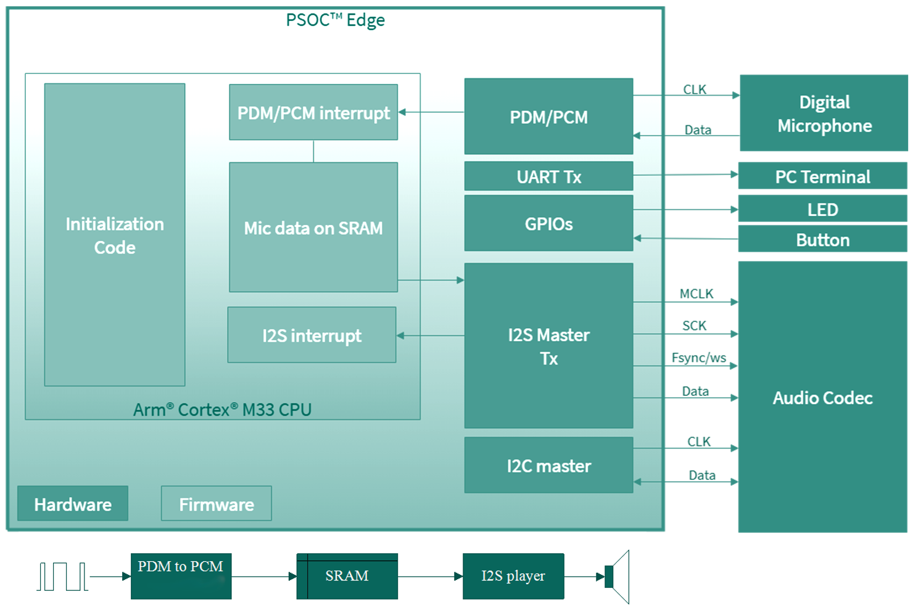

### Audio data flow

Audio data is sampled by PDM mics on EVK in PDM format. PDM is best summarized as "oversampled 1-bit audio" as it is nothing more than a high-sampling rate, single-bit digital signal. Most current digital audio systems use multi-bit PCM to represent the signal. The PDM/PCM block converts PDM data to PCM data. PCM's advantage is that it is easy to manipulate. This enables signal processing operations on the audio stream, such as mixing, filtering, and equalization.

The converted PCM audio data is stored in SRAM. Audio data is played over the speaker on the EVK board. The PCM data is sent to the onboard hardware codec (TLV320DAC3100) over I2S. The speaker is connected to the TLV320DAC3100.

The high-level data flow of audio data is shown below.

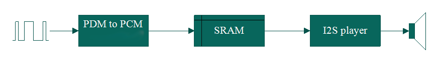

### Hardware overview

* This code example requires BOOT SW in ON position
See [Appendix B: KIT\_PSE84\_EVAL details](pse84-technical-intro-features-training-manual-appendix-b.md) for more details.

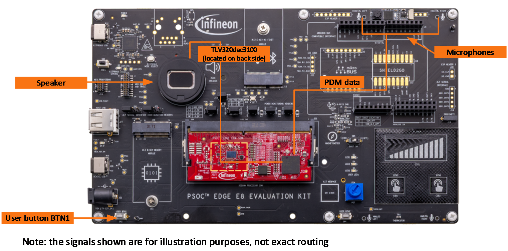

### Project creation

1. Follow steps in [Appendix A: Creating a PSOC™ Edge application in ModusToolbox™](pse84-technical-intro-features-training-manual-appendix-a.md) to create a new application
   When creating the application, select the **PSOC™ Edge PDM to I2S** application under the **Peripherals** section.
   > [!NOTE] To prevent issues with Windows path length, it’s recommended to rename the project if your workspace path is long.
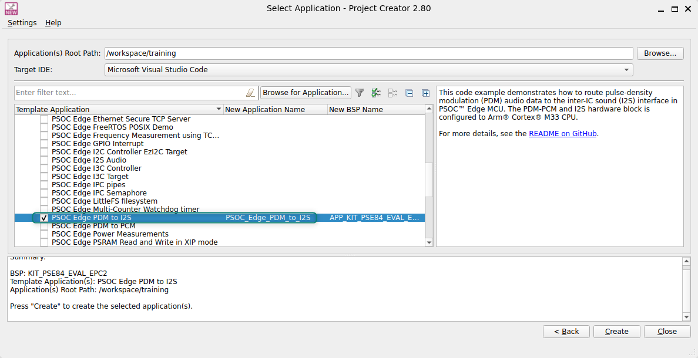

2. [INFO] PDM/PCM and I2S are configured by the **Device Configurator**
   No changes will be implemented at this point, but you can try opening the **Device Configurator** to observe the configuration.
   - **Clock configuration**:
      - Both PDM/PCM and I2S use the same HF7. Due to fractional clock frequency requirements, one PLL is dedicated to audio clocks.
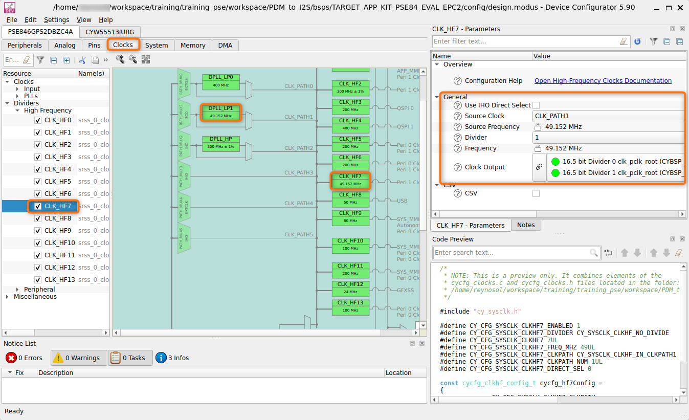
   - The PDM clock (`CYBSP_PDM_CLK_DIV`) is configured as follows:
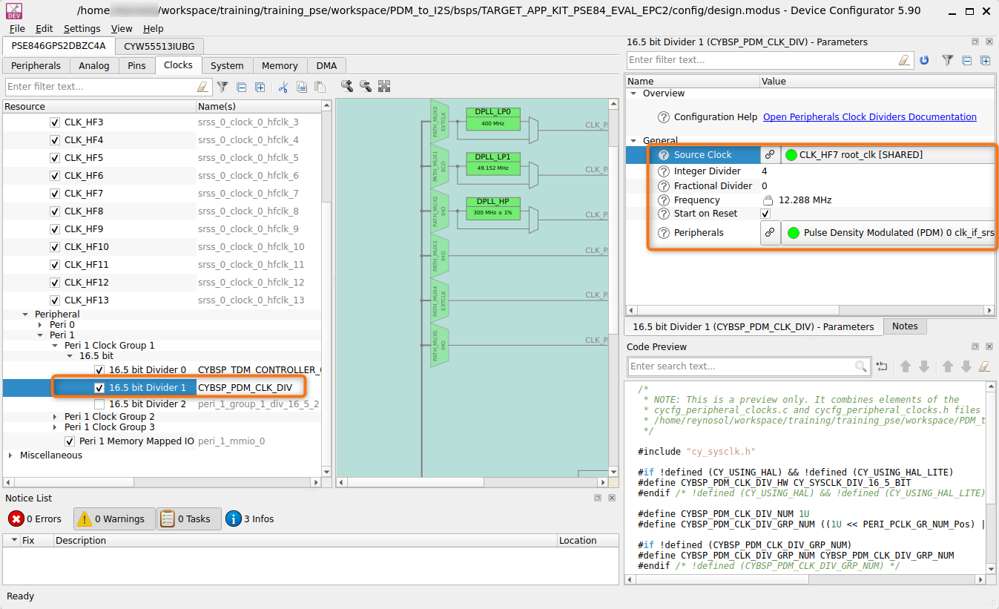
   - The clock path will be:
   DPLL\_PLL → HF7 → 16.5 fractional divider → PDM/PCM interface clock (clk\_if\_srss)
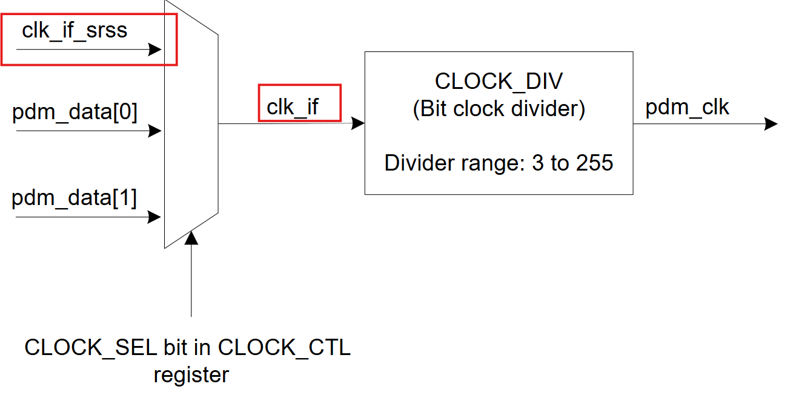
   - The I2S clock (`CYBSP_TDM_CONTROLLER_0_CLK_DIV)` configuration is as shown below:
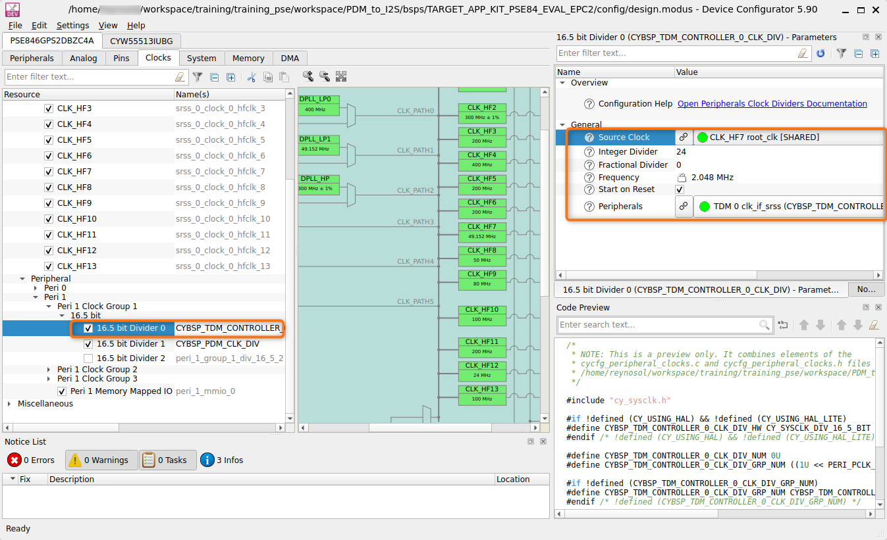
   - The clock path is:
   DPLL\_PLL → HF7 → 16.5 fractional divider → I2S interface clock (clk\_if\_srss[0:3])
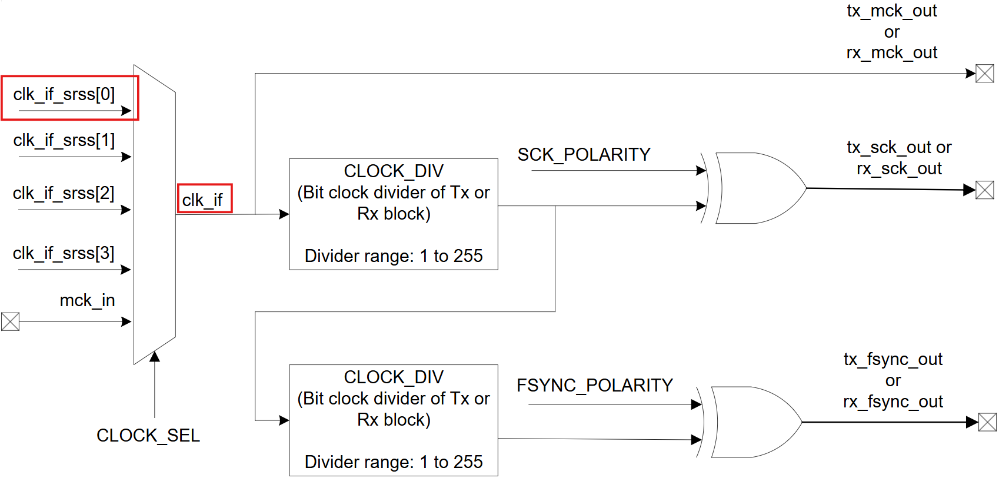

   - **Peripherals configuration**:
      - Observe the PDM/PCM configuration: **Digital** > **Pulse Density Modulated (PDM) 0** (`CYBSP_PDM`) as shown in the figure below.
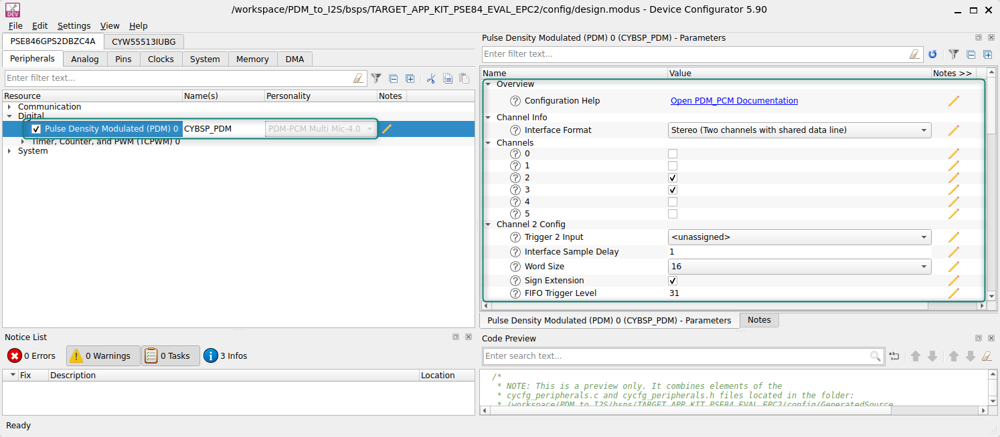
   - Observe the I2S configuration in **Communication** > **Time Division Multiplexing (TDM)** > **TDM 0** (`CYBSP_TDM_CONTROLLER_0`):
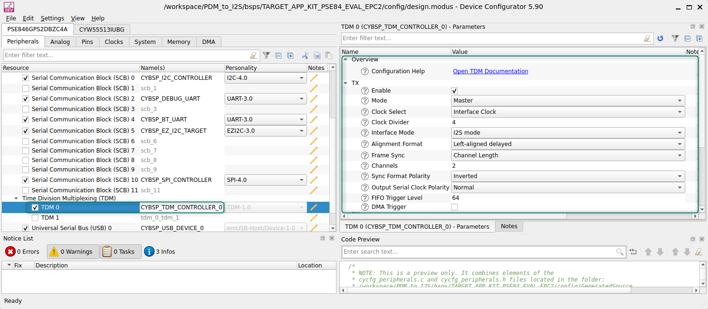

3. [INFO] No modifications are necessary to build the default code, but feel free to observe the source code
   - The application is implemented using the non-secure CM33 project, so the main file is located at:
   `<PROJ_DIR>/PSOC_Edge_PDM_to_I2S.proj_cm33_ns/main.c`
   - The source code to initialize and handle PDM data from microphones is implemented at:
   `<PROJ_DIR>/PSOC_Edge_PDM_to_I2S.proj_cm33_ns/source/app_pdm_pcm/`
   - The source code to initialize and handle output I2S data to speakers is at:
   `<PROJ_DIR>/PSOC_Edge_PDM_to_I2S.proj_cm33_ns/source/app_i2s/`

4. Build and program the application

### Output

After successful programming, press and hold the user button BTN1 on the PSOC™ Edge E84 kit and record audio. Release the button to play back the audio on the kit speaker.

Optionally, open a terminal to observe the application running.


### Modify application

There are many configurable parameters in this code example: the PDM/PCM, the I2S, and the TLV320DAC3100 hardware codec. Try changing the playback volume. This provides a foundation for further experimentation and optimization of the system.

**Hints for advanced modification**

- Look for a codec API to modify volume
- The codec is implemented in mtb\_tlv320dac3100

**Solution**

1. Open the mtb\_tlv320dac3100 API reference available in GitHub at [TLV320DAC3100 API reference](https://github.com/Infineon/audio-codec-tlv320dac3100/blob/master/API_reference.md)

2. Observe the code snippet to adjust the volume of the speaker and headphone. However, notice that the current setup is using the speaker and not the headphone:
   [API reference: speaker and headphone volume](https://github.com/Infineon/audio-codec-tlv320dac3100/blob/master/API_reference.md#snippet-2-volume-control-of-speaker-and-headphone)

3. Open `proj_cm33_ns/main.c` and modify the code as shown.
    Observe that `mtb_tlv320dac3100_adjust_speaker_output_volume` takes an 8-bit value as a parameter which represents the volume in 0.5 dB increments.

```c
/* Initialize the PDM-PCM block */
app_pdm_pcm_init();

/******** Code to modify volume ********/
/* Deactivates TLV320DAC3100 audio codec */
mtb_tlv320dac3100_deactivate();

/* Updates the volume of both the left and right channels of the speaker output */
mtb_tlv320dac3100_adjust_speaker_output_volume(0xFE);

/* Activates TLV320DAC3100 audio codec */
mtb_tlv320dac3100_activate();
/******** End of code to modify volume ********/

/* Enable CM55 */
```

4. Save the changes to the file, rebuild, and reprogram the updated code
5. Test the change by recording and playing back some audio

If the volume seems too high or too low, you can readjust the value until you achieve the desired volume.

### Conclusion

This exercise successfully built and modified the PSOC™ Edge E84 PDM to I2S code example using ModusToolbox™, and demonstrated how to use the PDM/PCM and I2S blocks in the PSOC™ Edge E84 MCU.

This example is a foundation for other audio code examples since it shows how to receive data using PDM microphones and how to transfer to the speaker using I2S.

## Code example: Mains-powered local voice

### Objective

This code example demonstrates how to implement the mains-powered local voice use case, using the audio front end (AFE) components and Infineon’s DEEPCRAFT™ solutions for wake word detection and automatic speech recognition (ASR). By understanding how the AFE Components work together, and customizing them for your specific application, you can optimize the performance of the system and enhance the user experience.

“Mains-powered” simply means that the use-case for this application is to be always on and listening and therefore cannot be powered by a battery.

Note that the inferencing library solution and corresponding code examples are available only for the Arm® and LLVM compilers. These instructions use the LLVM compiler.  
Also note that the audio-voice-core library and voice assistant inferencing library included in this code example have a limited operation of about 15 minutes and 30 minutes respectively. For an unlimited licence, please contact your Infineon support.

### Description

The code example is designed to detect voice commands and activate wake word detection using PSOC™ Edge MCUs. It demonstrates how to use an audio pipeline on the Arm® Cortex®-M55 core, starting from audio capture, audio data processing using Infineon’s DEEPCRAFT™ Audio Enhancement (AE), audio data inferencing with Infineon’s [DEEPCRAFT™ Voice Assistant](https://deepcraft-voice-assistant.infineon.com/) (VA), post-processing of inferred results, and performing actions based on the results. Both VA and AE components (noise suppression and echo suppression) utilize   
Ethos™-U55.

The code example leverages the display to show a music player with 2D graphics and uses “OK Infineon” as the wake word and supports several commands/intents.   
The following block diagram shows a high-level overview of the audio pipeline:

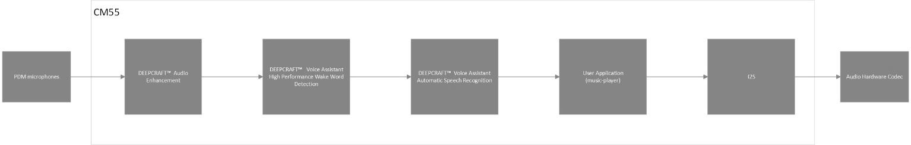

### Audio data flow

The entire audio pipeline runs on Arm® Cortex® M55 (CM55). PDM mics are controlled by the CM55 application.

The audio frames from the PDM microphone are fed into audio enhancement (AE). The processed audio frames are then sent to the inferencing engine for wake word and command detection. Based on the inferred data, the required action is taken, and the pre-recorded audio data is played over I2S on the onboard speakers.

The audio front end (AFE) middleware has multiple software components:

- High-pass filter
- Analysis
- Acoustic echo cancellation (AEC)
- Beamforming
- Dereverberation
- Echo suppression
- Noise suppression
- Synthesis

The audio data flows through each component of AFE depending on whether it is enabled or not. The microphone data is then filtered using a high-pass filter to remove any low-frequency noise or interference. The AEC block uses reference/playback audio data to cancel out any acoustic echoes. The noise suppression component is used to reduce background noise and improve the clarity of the audio signal. Overall, the AFE components work together to enhance the quality of the audio signal and improve the inferencing performance.

The noise suppression and echo suppression components are ML-based and are executed on Ethos™-U55. The processed audio data is then sent to the voice assistant for wake word detection and automatic speech recognition.

The code flow of this application is shown in the figure below for the “OK Infineon” wake word and “Play Music” command.

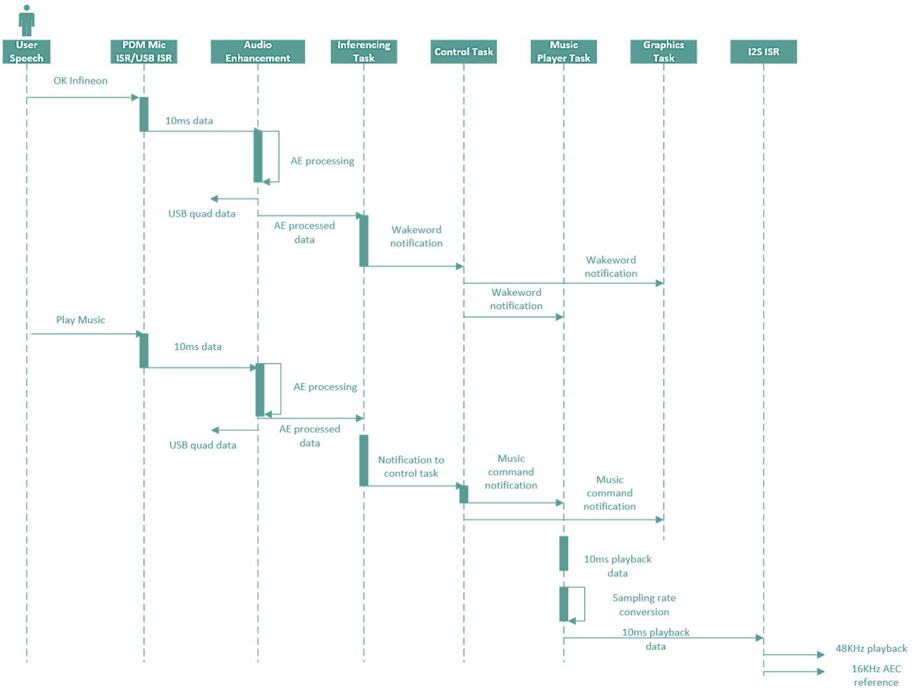

### Hardware overview

* This example requires BOOT SW in OFF position, and it uses the display to show a music player.
See [Appendix B: KIT\_PSE84\_EVAL details](pse84-technical-intro-features-training-manual-appendix-b.md) for more details.

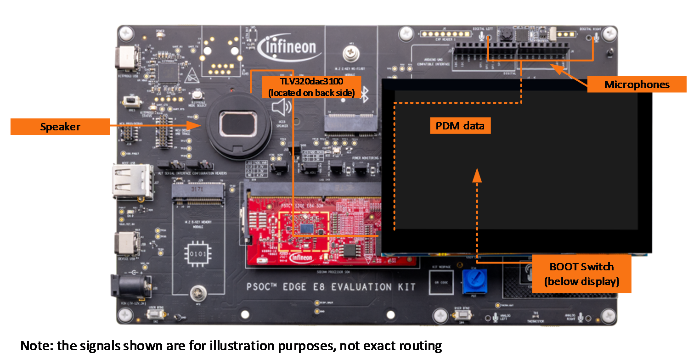

### Project creation

1. Follow steps in [Appendix A: Creating a PSOC™ Edge application in ModusToolbox™](pse84-technical-intro-features-training-manual-appendix-a.md) to create a new application
   When creating the application, select the **PSOC™ Edge Mains Powered Local Voice** application under the **Audio** section.
   > [!NOTE] To prevent issues with Windows path length, it’s recommended to rename the project if your workspace path is long.
   

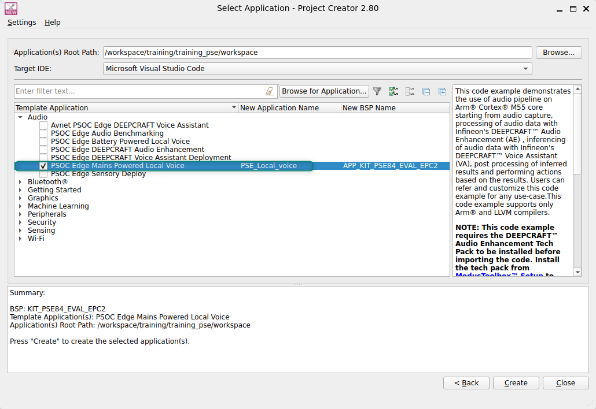


2. [INFO] After the project is created, observe the project file structure:
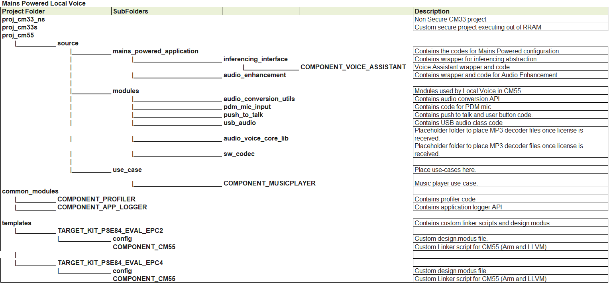

3. [INFO] This code example uses the AFE Configurator tool to choose and customize the audio front end (AFE) components running on PSOC™ Edge. This tool provides a graphical user interface (GUI) that allows you to select the different AFE components, such as acoustic echo cancellation (AEC), beamforming, dereverberation, echo suppression (ES), and noise suppression.
   After configuring the different AFE components, the AFE configurator tool generates source files, which are used directly by the application. In this way, the AFE configurator tool provides a convenient way to configure the AFE components without needing to manually edit the firmware code. It also ensures that the configuration is consistent across different projects and simplifies the process of updating the AFE configuration.

4. To open the AFE Configurator tool, select the **proj_cm55** application in the ModusToolbox™ for VS Code extension, and scroll down to click the **Audio FE Configurator** tool  
 > [!NOTE] The [DEEPCRAFT™ Audio Enhancement Tech Pack](https://softwaretools.infineon.com/tools/com.ifx.tb.tool.deepcraftaudioenhancementtechpack) must be installed as mentioned in the [prerequisites section](#tools-for-audio-labs).

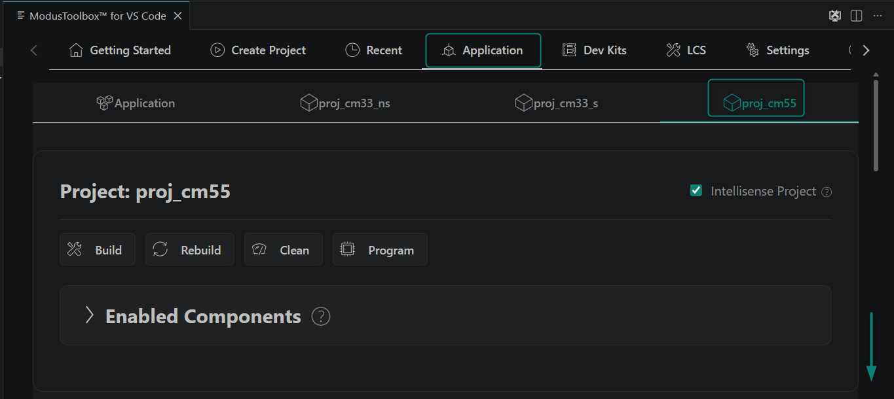
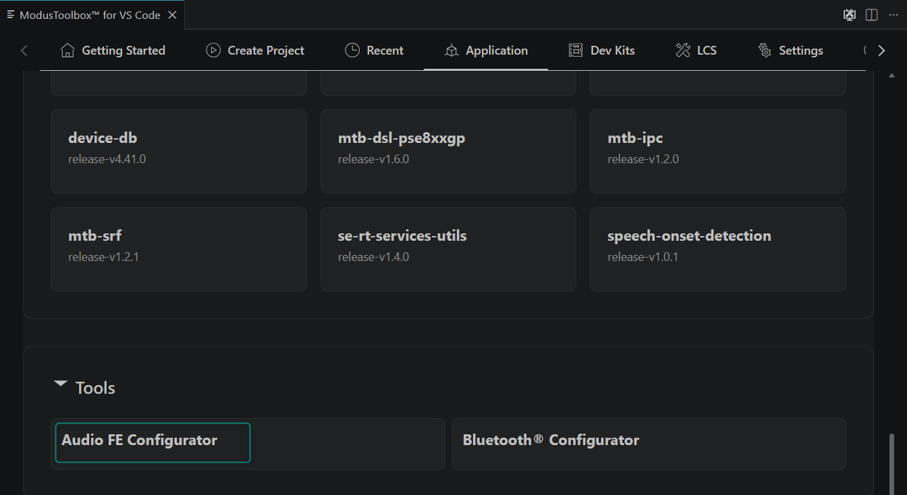

5. [INFO] Observe the different settings. For example, the figure below highlights the options to select between mono/stereo and the input source.  
   This training is not intended to delve into AFE parameters since these topics will be covered in advanced training.

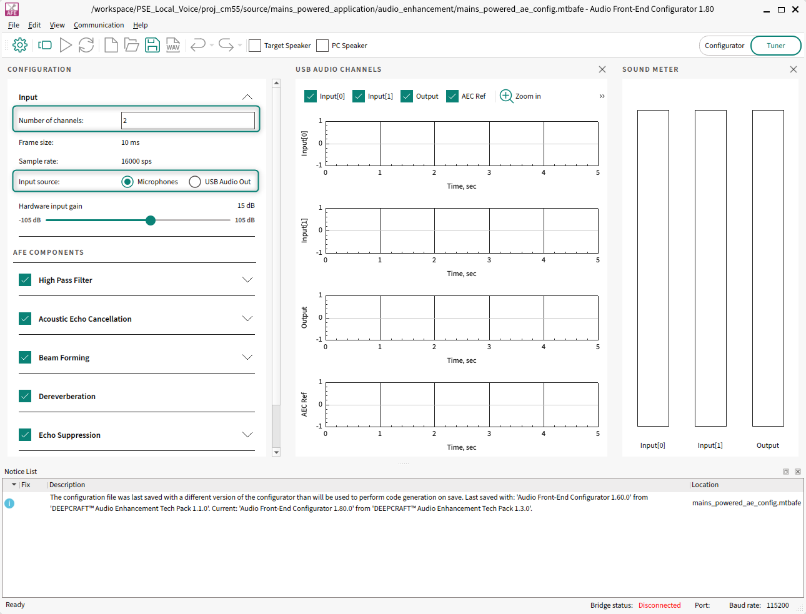

6. Build and program the application
 > [!NOTE] This project uses the LLVM Compiler. Make sure the compiler is configured correctly as described in [Appendix A: Creating a PSOC™ Edge application in ModusToolbox™](pse84-technical-intro-features-training-manual-appendix-a.md#using-llvm-compiler-in-visual-studio-code)

### Output

Once running, you should observe the music player on the display. The terminal will display a message and the supported commands.

> [!NOTE] Note that the BOOT switch must be set to OFF as mentioned in the* Hardware overview *section.

Say the wake word “**OK Infineon**”, followed by one of the supported commands, such as “**Play Music**”.

Observe the output in the terminal and the application.
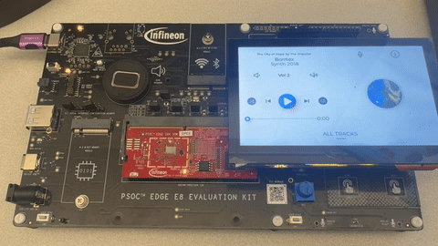


### Modify application

The default mains powered local voice code example uses the wake word “OK Infineon”. This section explains how to use [DEEPCRAFT™ Voice Assistant](https://deepcraft-voice-assistant.infineon.com/) to change the wake word, and how to add a new command.

**Hints for the advanced modification**

- Use the [DEEPCRAFT™ Voice Assistant](https://deepcraft-voice-assistant.infineon.com/) to modify the wake word
- A new project can be created, or the voice assistant project included in the code example can be reused
- Update the va\_model
- Add any new intent macros and command IDs

**Solution**

1. Log in to [DEEPCRAFT™ Voice Assistant](https://deepcraft-voice-assistant.infineon.com/)
2. Click **Import Project**

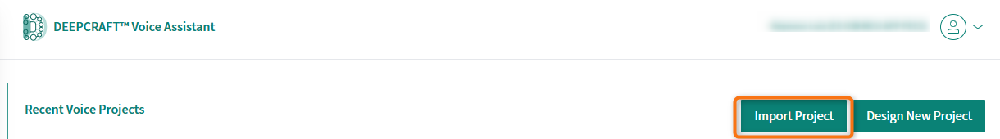

3. Click **Browse file**, then navigate to the location of the voice assistant project:
`proj_cm55\source\mains_powered_application\inferencing_interface\COMPONENT_VOICE_ASSISTANT\va_proj\localvoice_music_nonum.vaproj`

4. Add a **Voice Project Name** and click **Import**
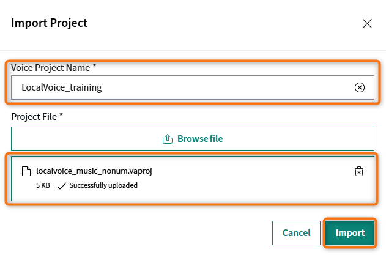

5. After the project is imported, click on **Edit**
   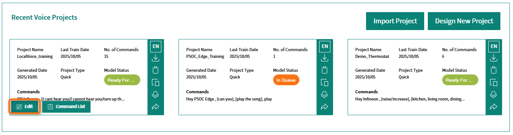

6. [INFO] Observe the default structure of the voice assistant project used for this code example.  
   Note that the **wake word** is on the left side in green, and it connects to multiple **text commands** in orange, which trigger individual **intents** in purple.
   Some of the commands are **required** while others are **optional**, so the following commands will trigger the same intent:
	   - OK Infineon, [can you] play [the] music → (play music)
	   - OK Infineon, [can you] start [the] music → (play music)
	   - OK Infineon, [can you] play [the] track → (play music)
	   - OK Infineon, [can you] start [the] track → (play music)
   
7. Zoom in on the wake word on the left side, click on it to open the **Properties**. Change the **Interjection** to “Hey”. Then delete the current **wake word** “Infineon” and replace it with a word of your choice, like “Edge”. Press Enter to add the wake word
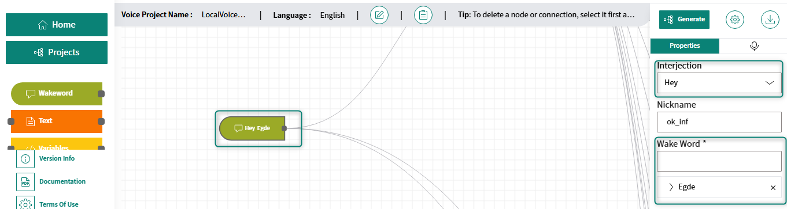

8. Navigate to the first commands at the top to play music. Add “my” as optional text, and “song” to the list of supported text.
   This will add support for the following command:
	- Hey Edge, [can you] play [my] song→ (play music)
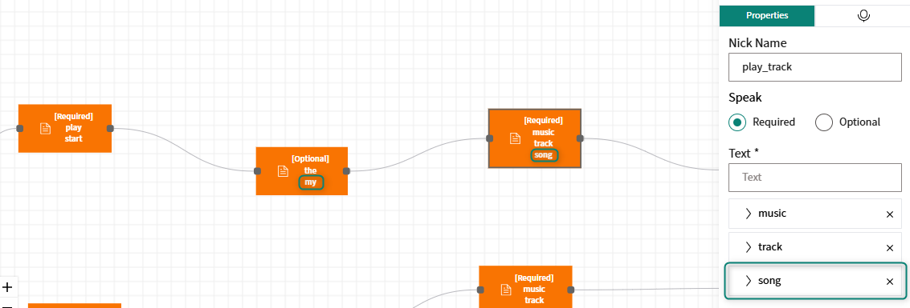

9. Navigate to the intent connected to this command and modify the **Intent Name** to “play\_song”
> [!NOTE] This step is not necessary to change the command, but will be used to explain how to change the intent in the source code.
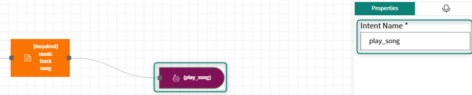

10. Open Settings to confirm that the project is set for **PSOC™ Edge E84: CM55 + U55** and click on **Generate**
> [!NOTE] This step can take several minutes.
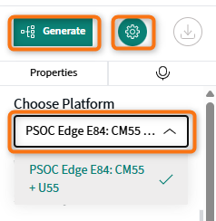

11. Once the model is generated, download the files
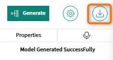

12. Unzip, and copy-paste the files to your ModusToolbox™ project in the following location:
`<PROJ_DIR>/PSOC_Edge_Mains_Powered_Local_Voice.proj_cm55/source/mains_powered_application/inferencing_interface/COMPONENT_VOICE_ASSISTANT/va_model`
> [!NOTE] Delete previous contents or overwrite any files as needed.
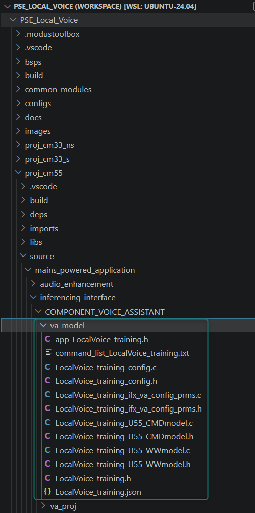

13. In `proj_cm55/Makefile`, set *`DEEPCRAFT_PROJECT_NAME=[name of your VA project]`*, using the VA cloud project name prefixed for the downloaded files
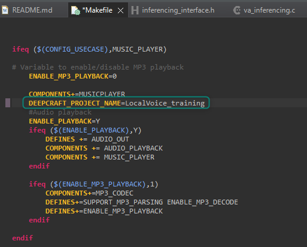

14. The intent name was modified, so the corresponding macro must also be updated.
   Change the lines in red for the ones in green at the following file:
   `proj_cm55\source\mains_powered_application\inferencing_interface\inferencing_interface.h`
   
```diff
typedef enum cy_grp_2_asr_cmds_music
{
-    PLAY_MUSIC_CMD_ID = 401,
+    PLAY_SONG_CMD_ID = 401,  
    STOP_MUSIC_CMD_ID,
```

```diff
#define INF_WAKE_WORD                "WAKEWORD"

-#define INTENT_PLAY_MUSIC            "play_music"
+#define INTENT_PLAY_SONG            "play_song"
#define INTENT_STOP_MUSIC            "end_music"
#define INTENT_INCREASE_VOLUME       "raise_volume"
```

```diff
#define INF_OK_INFINEON              "Okay Infineon"
-#define INF_PLAY_MUSIC               "play music"\
+#define INF_PLAY_SONG               "play song"
#define INF_STOP_MUSIC               "stop music"
#define INF_INCREASE_VOLUME          "increase volume"
#define INF_DECREASE_VOLUME          "decrease volume"
```

15. [INFO]  [DEEPCRAFT™ Voice Assistant](https://deepcraft-voice-assistant.infineon.com/) generates intent macros that can be used in the application; however, in this case, we are only showing how to modify the macros for demonstration purposes. 
    The macros generated by the tool are available at:
   `proj_cm55\source\mains_powered_application\inferencing_interface\ COMPONENT_VOICE_ASSISTANT\va_model\app_[project_name].h`
   
16. Open `proj_cm55\source\mains_powered_application\inferencing_interface\ COMPONENT_VOICE_ASSISTANT\va_inferencing.c` and make the modifications shown below. 
```diff
void va_intent_to_id (char *intent)
{
    int map_id=0;
    
    app_log_print("Detected intent %s \r\n",intent);

    if (!strcmp(intent,INF_WAKE_WORD))
    {
        map_id = WAKEWORD_CMD_ID;
    }
-    else if (!strcmp(intent,INTENT_PLAY_MUSIC))
+    else if (!strcmp(intent,INTENT_PLAY_SONG))  
    {
-        map_id = PLAY_MUSIC_CMD_ID;
+        map_id = PLAY_SONG_CMD_ID;
    }
    else if (!strcmp(intent,INTENT_STOP_MUSIC))
    {
        map_id = STOP_MUSIC_CMD_ID;
    }
```

```diff
void va_command_to_id (char *command)
{
    int map_id=0;
    
    app_log_print("Detected %s \r\n",command);

    if (!strcmp(command,INF_WAKE_WORD))
    {
        map_id = WAKEWORD_CMD_ID;
    }
-    else if (!strcmp(command,INF_PLAY_MUSIC))
+    else if (!strcmp(command,INF_PLAY_SONG))  
    {
-        map_id = PLAY_MUSIC_CMD_ID;
+        map_id = PLAY_SONG_CMD_ID;  
    }
```

17. Open `proj_cm55\source\mains_powered_application\control_task.c` and update as shown below
```diff
-                case PLAY_MUSIC_CMD_ID:
+                case PLAY_SONG_CMD_ID:  
                case STOP_MUSIC_CMD_ID:
                case NEXT_TRACK_CMD_ID:
                case PREVIOUS_TRACK_CMD_ID:
                case PAUSE_MUSIC_CMD_ID:
                case INCREASE_VOL_CMD_ID:
                case DECREASE_VOL_CMD_ID:
                case VOL_LEVEL_0_CMD_ID:
                case VOL_LEVEL_1_CMD_ID:
                case VOL_LEVEL_2_CMD_ID:
                case VOL_LEVEL_3_CMD_ID:
                case VOL_LEVEL_4_CMD_ID:
                case VOL_LEVEL_5_CMD_ID:
                {
#ifdef AUDIO_OUT
                    music_player_q_data.data = NULL;
                    music_player_q_data.data_len = 0;
#endif
                    app_log_print("ASR command detected \r\n");
-                    if (map_id==PLAY_MUSIC_CMD_ID)
+                    if (map_id==PLAY_SONG_CMD_ID)  
                    {
                        app_log_print("Play Music \r\n");
#ifdef AUDIO_OUT
                        i2s_control_flag = I2S_PLAYBACK_PLAY_MUSIC;
                        asr_flag=1;
#endif /* AUDIO_OUT */
                    }
```

18. Update `proj_cm55\source\use_case\COMPONENT_MUSICPLAYER\ COMPONENT_GFX_UI\music_player_gfx_task.c` to handle the new intent in the music player demo

```diff
    for (;;)
    {
        /* Check if there's a message in the queue */
        if (xQueueReceive(mp_gfx_queue_handle, &mp_gfx_queue_data, 0) == pdTRUE)
        {
            switch(mp_gfx_queue_data.command)
            {
                case OK_INFINEON_CMD_ID:
                {
                    lv_obj_clear_flag(g_spinner, LV_OBJ_FLAG_HIDDEN);
                    lv_obj_add_flag(g_img, LV_OBJ_FLAG_HIDDEN);
                    lv_demo_music_pause();
                    break;
                }
-                case PLAY_MUSIC_CMD_ID:
+                case PLAY_SONG_CMD_ID:  
                {
                    lv_obj_clear_flag(g_img, LV_OBJ_FLAG_HIDDEN);
                    lv_obj_add_flag(g_spinner, LV_OBJ_FLAG_HIDDEN);
                    lv_demo_music_resume();
                    break;
                }
```

19. Lastly, update `proj_cm55\source\mains_powered_application\mains_powered_local_voice.c` to show the modified wake-word and command in the terminal

```diff
-    app_log_print("Wake word: Okay Infineon\r\n"
+    app_log_print("Wake word: Hey Edge\r\n"  
           "Commands:\r\n"
-           "    Play music\r\n"
+           "    Play song\r\n"  
           "    Next track\r\n"
           "    Previous track\r\n"
           "    End music\r\n"
           "    Pause music \r\n"
           "    Raise volume\r\n"
           "    Lower volume\r\n"
           "    Set volume to level <0-5> \r\n"

```

20. Rebuild and reprogram the device. Use the new wake word "Hey Edge" followed by the command "[can you] play [my] song" to observe the changes.

### Revision history

| Document revision | Date       | Description of changes                                |
| ----------------- | ---------- | ----------------------------------------------------- |
| \*A               | 2026-09-26 | Updated to latest tools and using Visual Studio Code. |
| **                | 2025-01-15 | Initial release.                                      |

### Disclaimer
All referenced product or service names and trademarks are the property of their respective owners.

The Bluetooth&reg; word mark and logos are registered trademarks owned by Bluetooth SIG, Inc., and any use of such marks by Infineon is under license.

PSOC&trade;, formerly known as PSOC&trade;, is a trademark of Infineon Technologies. Any references to PSOC&trade; in this document or others shall be deemed to refer to PSOC&trade;.

---------------------------------------------------------

© Cypress Semiconductor Corporation, 2023-2026. This document is the property of Cypress Semiconductor Corporation, an Infineon Technologies company, and its affiliates ("Cypress").  This document, including any software or firmware included or referenced in this document ("Software"), is owned by Cypress under the intellectual property laws and treaties of the United States and other countries worldwide.  Cypress reserves all rights under such laws and treaties and does not, except as specifically stated in this paragraph, grant any license under its patents, copyrights, trademarks, or other intellectual property rights.  If the Software is not accompanied by a license agreement and you do not otherwise have a written agreement with Cypress governing the use of the Software, then Cypress hereby grants you a personal, non-exclusive, nontransferable license (without the right to sublicense) (1) under its copyright rights in the Software (a) for Software provided in source code form, to modify and reproduce the Software solely for use with Cypress hardware products, only internally within your organization, and (b) to distribute the Software in binary code form externally to end users (either directly or indirectly through resellers and distributors), solely for use on Cypress hardware product units, and (2) under those claims of Cypress's patents that are infringed by the Software (as provided by Cypress, unmodified) to make, use, distribute, and import the Software solely for use with Cypress hardware products.  Any other use, reproduction, modification, translation, or compilation of the Software is prohibited.
<br>
TO THE EXTENT PERMITTED BY APPLICABLE LAW, CYPRESS MAKES NO WARRANTY OF ANY KIND, EXPRESS OR IMPLIED, WITH REGARD TO THIS DOCUMENT OR ANY SOFTWARE OR ACCOMPANYING HARDWARE, INCLUDING, BUT NOT LIMITED TO, THE IMPLIED WARRANTIES OF MERCHANTABILITY AND FITNESS FOR A PARTICULAR PURPOSE.  No computing device can be absolutely secure.  Therefore, despite security measures implemented in Cypress hardware or software products, Cypress shall have no liability arising out of any security breach, such as unauthorized access to or use of a Cypress product. CYPRESS DOES NOT REPRESENT, WARRANT, OR GUARANTEE THAT CYPRESS PRODUCTS, OR SYSTEMS CREATED USING CYPRESS PRODUCTS, WILL BE FREE FROM CORRUPTION, ATTACK, VIRUSES, INTERFERENCE, HACKING, DATA LOSS OR THEFT, OR OTHER SECURITY INTRUSION (collectively, "Security Breach").  Cypress disclaims any liability relating to any Security Breach, and you shall and hereby do release Cypress from any claim, damage, or other liability arising from any Security Breach.  In addition, the products described in these materials may contain design defects or errors known as errata which may cause the product to deviate from published specifications. To the extent permitted by applicable law, Cypress reserves the right to make changes to this document without further notice. Cypress does not assume any liability arising out of the application or use of any product or circuit described in this document. Any information provided in this document, including any sample design information or programming code, is provided only for reference purposes.  It is the responsibility of the user of this document to properly design, program, and test the functionality and safety of any application made of this information and any resulting product.  "High-Risk Device" means any device or system whose failure could cause personal injury, death, or property damage.  Examples of High-Risk Devices are weapons, nuclear installations, surgical implants, and other medical devices.  "Critical Component" means any component of a High-Risk Device whose failure to perform can be reasonably expected to cause, directly or indirectly, the failure of the High-Risk Device, or to affect its safety or effectiveness.  Cypress is not liable, in whole or in part, and you shall and hereby do release Cypress from any claim, damage, or other liability arising from any use of a Cypress product as a Critical Component in a High-Risk Device. You shall indemnify and hold Cypress, including its affiliates, and its directors, officers, employees, agents, distributors, and assigns harmless from and against all claims, costs, damages, and expenses, arising out of any claim, including claims for product liability, personal injury or death, or property damage arising from any use of a Cypress product as a Critical Component in a High-Risk Device. Cypress products are not intended or authorized for use as a Critical Component in any High-Risk Device except to the limited extent that (i) Cypress's published data sheet for the product explicitly states Cypress has qualified the product for use in a specific High-Risk Device, or (ii) Cypress has given you advance written authorization to use the product as a Critical Component in the specific High-Risk Device and you have signed a separate indemnification agreement.
<br>
Cypress, the Cypress logo, and combinations thereof, ModusToolbox, PSOC, CAPSENSE, EZ-USB, F-RAM, and TRAVEO are trademarks or registered trademarks of Cypress or a subsidiary of Cypress in the United States or in other countries. For a more complete list of Cypress trademarks, visit www.infineon.com. Other names and brands may be claimed as property of their respective owners.
