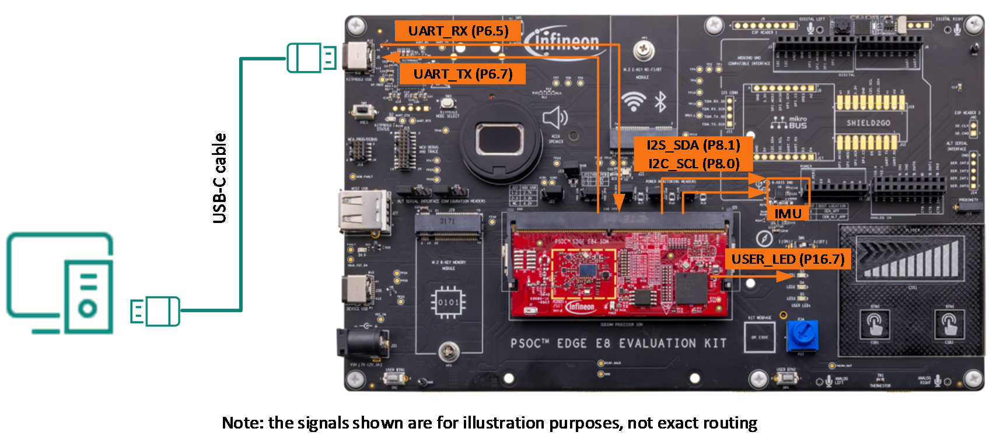
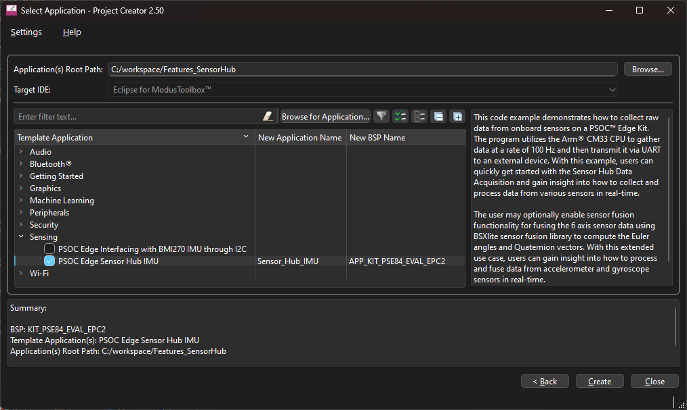
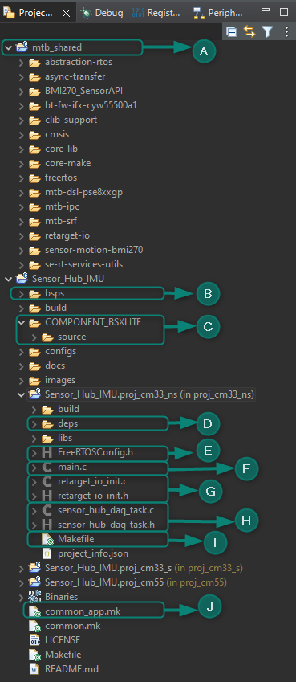
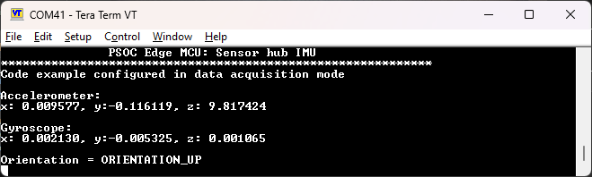
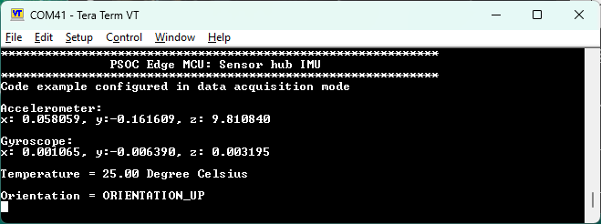
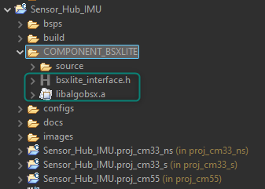
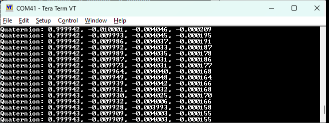
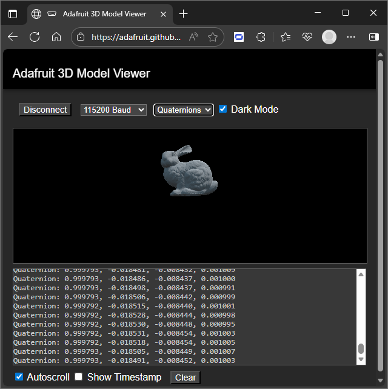
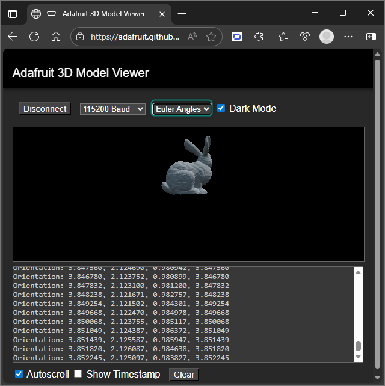
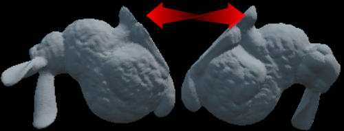

# Chapter 3: Sensor Hub (pending update)

### About this document

## Scope and purpose

This document is the training manual for the technical introduction to PSOC™ Edge E84 features. This manual helps in getting started with different applications leveraging key features for PSOC™ Edge, using ModusToolbox™ software.

The training is divided into multiple chapters covering topics like audio, graphics, machine learning, among others.

Chapter 3 discusses PSOC™ Edge’s sensor hub features.

## Intended audience

The document is intended for design engineers, technicians, and developers of electronic systems.

## Introduction

This manual provides detailed instructions to create, configure, build, and run several application code examples on the PSOC™ Edge E84 MCU.

## Prerequisites

See the [**Prerequisites** section](pse84-technical-intro-features-training-manual-ch1-intro.md#prerequisites) in the [**Chapter 1 training manual**](pse84-technical-intro-features-training-manual-ch1-intro.md). for a complete list of prerequisites and development tools.

## Code example: Sensor hub IMU

### Objective

This code example explains how to collect raw data from onboard sensors on a PSOC™ Edge E84 evaluation kit (EVK). The program uses the Arm® Cortex®‑M33 CPU (CM33) to gather data at a rate of 100 Hz and then transmit it via UART to an external device. With this example, you can quickly get started with sensor hub data acquisition and gain insight into how to collect and process data from various sensors in real‑time.

The user may optionally enable sensor fusion functionality for fusing the 6-axis sensor data using BSXlite sensor fusion library to compute the Euler angles and Quaternion vectors. With this extended use case, users can gain insight into how to process and fuse data from accelerometer and gyroscope sensors in real-time.

### Description

In this code example, resource initialization is performed by the CM33 non-secure (CM33\_NS) code. It configures the system clocks, pins, clock-to-peripheral connections, and other platform resources. It then enables the Arm® Cortex®‑M55 CPU (CM55) using the Cy\_SysEnableCM55() function. The CM55 is then put into its CPU Deep Sleep power mode.

The **BMI270** motion sensor is a low-power device that provides 3-axis accelerometer and 3-axis gyroscope measurements. This sensor is located on the EVK baseboard. The PSOC™ Edge E84 MCU uses I2C to communicate with the sensor and then converts the data into metric units. After conversion, the data is sent to UART. To interface with the BMI270 motion sensor, the PSOC™ Edge E84 MCU uses the BMI270-Sensor-API from Bosch Sensortec.

In the CM33 non-secure application, the clocks and system resources are initialized by the BSP initialization function. The retarget-io middleware is configured to use the debug UART, and the user LED is initialized. The debug UART prints a “Sensor Hub Data Acquisition” message on a terminal emulator. The on-board KitProg3 acts as a USB-UART bridge to create a virtual COM port.

In the second part of this lab, the BSXlite sensor fusion library is integrated to show how to fuse the data from the accelerometer and gyroscope to compute Euler angles and Quaternion vectors.

**Quaternions vectors** are a more robust way to represent orientation. They use a four-dimensional unit vector to represent rotations in 3D space, and they do not suffer from gimbal lock. They are also more computationally efficient than Euler angles because they do not require trigonometric functions like sine and cosine.

**Euler angles** represent the orientation of an object in 3D space as a combination of three rotations around the X, Y, and Z axes. While they are easy to understand and interpret, they suffer from a problem called "gimbal lock" where certain configurations can cause the calculation to break down.

### Flow chart

This following flow chart explains the code flow of this code example:

1. Start
2. Initialize clocks and system resources in CM33_S
3. Pass control to CM33_NS
4. Enable CM55 CPU
5. Start FreeRTOS Scheduler
6. Put CM55 CPU into its CPU Deep Sleep power mode
7. Initialize board and peripherals
8. Create sensor hub data acquisition task

### Hardware overview

- UART pins:
   - P6\_7 (UART\_TX)
   - P6\_5 (UART\_RX)
- I2C:
   - P8\_1 (SDA)
   - P8\_0 (SCL)

> [!NOTE] This example requires BOOT SW in ON position.

See [Appendix B: KIT\_PSE84\_EVAL details](pse84-technical-intro-features-training-manual-appendix-b.md) for more details.



1. Follow steps in [Appendix A: Creating a PSOC™ Edge application in ModusToolbox™](pse84-technical-intro-features-training-manual-appendix-a.md) to create a new application
   When creating the application, select the **PSOC™ Edge Sensor Hub IMU** application under the **Sensing** section.

   > [!NOTE] To prevent issues with Windows path length, it’s recommended to rename the project if your workspace path is long.



2. **Note**: The following figure shows the key files and folders in this application



3. `mtb_shared`: The mtb\_shared directory is a folder that contains libraries that can be shared across projects in the workspace
   Observe that the project includes libraries to access the BMI270 IMU. These libraries can be included in other projects using the IMU.
4. `bsps/TARGET_APP_KIT_PSE84_EVAL_EPC2` folder: The files provided by the board support package (BSP) are present here and are listed under the TARGET\_APP\_KIT\_PSE84\_EVAL\_EPC2 sub-folders. All the input files for the device and peripheral configurators are in the “config” folder inside the TARGET\_APP\_KIT\_PSE84\_EVAL\_EPC2 folder

   The “GeneratedSource” folder for the BSP contains the files that are generated by the configurators and are prefixed with cycfg\_. These files contain the design configurations as defined by the BSP. From ModusToolbox™ 3.x or later, you can directly customize BSP configurator files for the application, rather than overriding the default files with custom files, since BSPs are completely owned by the application.
   The TARGET\_APP\_KIT\_PSE84\_EVAL\_EPC2 folder also contains the linker scripts and the start-up code for the PSOC™ Edge E84 MCU used on the board.

5. `components/COMPONENT_BSXLITE`: This directory contains files to be used with the sensor fusion library, which will be added in the second part of this training
6. **deps**: The deps folder is short for dependencies and contains the `.mtb` files for the application's direct dependencies. The `.mtb` files include a link to the library repository and the release tag that needs to be cloned for the application
7. `proj_cm33_ns/FreeRTOSConfig.h`: The FreeRTOSConfig.h file is a configuration file that customizes the FreeRTOS kernel. It specifies application-specific configuration settings for the kernel and configures the FreeRTOS source code used in a project. A FreeRTOS application must have a FreeRTOSConfig.h header file in its pre-processor include path
8. `proj_cm33_ns/main.c`: This file contains the logic for the main function. See Flow chart
9. `proj_cm33_ns/retarget_io_init.c, .h`: These files initialize the retarget-io middleware to use the debug UART port
10. `proj_cm33_ns/sensor_hub_daq_task.c, .h`: The .c file contains the function that initializes the I2C and BMI270 sensor, reads the sensor values, and prints them on the UART terminal
    The .h file contains the macros that configures sensor hub data acquisition task priority, stack size and delay for the sensor hub task.
11. `proj_cm33_ns/Makefile`: The makefile enables required components such as FREERTOS and RTOS\_AWARE. It includes:

    - Variables used to specify flags and pre-build and post-build commands.
    - Path information for source code discovery, shared repo location, and path to the compiler
    - The `common.mk` file for the application
    - Path information to the `start.mk` file in the installation tools directory.

12. **common.mk**: This makefile is shared across all the projects. It enables a component to include configuration in all three projects
13. Build and program the application

#### Output

After programming, the application automatically starts.

A welcome message should be displayed, followed by accelerometer, gyroscope, and orientation data printed at a rate of 100 Hz.



Notice that the data from the accelerometer and gyroscope changes as you move the kit. The sensors measure motion and orientation, so any movement or change in the device's orientation affects their output.

### Modify application – read temperature

As an exercise, you may extend this application and use the BMI270 sensor to read and display the temperature data in degrees celsius.

#### Hints for the advanced modification

- ModusToolbox™ includes a library supporting BMI270
- Use available APIs to gather and process data in the sensor hub task

#### Solution

> [!NOTE] The solution is also available in the included source folder.

1. Declare the variables needed to store relevant data in `cm33_ns/sensor_hub_daq_task.c`:

```c
/* Global Variables */
static mtb_hal_i2c_t CYBSP_I2C_CONTROLLER_hal_obj;
static cy_stc_scb_i2c_context_t CYBSP_I2C_CONTROLLER_context;
static mtb_bmi270_data_t bmi270_data;
static mtb_bmi270_t bmi270;
static cy_en_scb_i2c_status_t initStatus;
static cy_rslt_t result;

/* To store the temperature data */
float temp_data_float;
uint16_t temp_data = 0;
```

2. Observe the BMI270 API guide available [here](https://github.com/Infineon/sensor-motion-bmi270/blob/master/api_reference.md). The function mtb\_bmi270\_read\_temp reads temperature data
3. Add code to fetch and process the data from the temperature sensor in the sensor\_hub\_daq\_task() function:

```c
printf("Gyroscope: \n\rx:%9.6f, y:%9.6f, z:%9.6f \n\n",
       (double)x, (double)y, (double)z);

/* Advanced Modification to get temperature data Start */
result = mtb_bmi270_read_temp(&bmi270, &temp_data);
if (CY_RSLT_SUCCESS != result)
{
    handle_app_error();
}
temp_data_float = (float)((((float)((int16_t)temp_data)) /
                  512.0) + 23.0);
printf("Temperature = %2.2f Degree Celsius \r\n\n", (double)temp_data_float);
/* Advanced Modification to get temperature data End */
```

4. Two new lines were added to the debug console, so the ANSI escape sequence must also be updated. Modify the following code:

```c
/* ANSI ESC sequence to get the cursor back to the start. */
-printf("\x1b[7A\x1b[42D");
+printf("\x1b[9A\x1b[42D");
```

5. Build, program, and run the application

You should observe the temperature information.



### Modify application – add sensor fusion

IMU data is useful for a wide variety of applications, but it can become more powerful when fused to obtain additional information.

As a second exercise, you can add the [Bosch BSXlite sensor fusion library](https://community.infineon.com/gfawx74859/attachments/gfawx74859/modustoolboxforum/8113/1/Integration_guide.pdf) to the application and use it to obtain quaternion vectors.

#### Hints for the advanced modification

- Download the [Bosch BSXlite sensor fusion library](https://community.infineon.com/gfawx74859/attachments/gfawx74859/modustoolboxforum/8113/1/Integration_guide.pdf) and place it in the COMPONENT\_BSXLITE folder.
- Enable sensor fusion in project configuration files.

#### Solution

> [!NOTE] The solution is also available in the included source folder.

1. Download the [Bosch BSXlite sensor fusion library](https://community.infineon.com/gfawx74859/attachments/gfawx74859/modustoolboxforum/8113/1/Integration_guide.pdf)

   Enter the requested details on the website, read and agree to the license terms and proceed to download and unzip the library. Note that the BSXlite library for CM33 CPU is only available for GCC\_ARM toolchain. The fusion functionality is therefore not supported by other toolchains.

2. Copy the following files from the unzipped folder to the `COMPONENT_BSXLITE` folder at the root of the project

   - `./genericbsxlite_v1-0-2/[Generic]BSXlite_v1.0.2/lib/GCC_OUT/libalgobsxm33/libalgobsx.a`
   - `./genericbsxlite_v1-0-2/[Generic]BSXlite_v1.0.2/bsxlite_interface.h`




3. Open `common.mk` and modify `CONFIG_APP_MODE` to `ENABLE_FUSION`:

```diff
 # Ex:
 # CONFIG_APP_MODE = ENABLE_ACQUISITION
 # or
 # CONFIG_APP_MODE = ENABLE_FUSION
 #
-CONFIG_APP_MODE = ENABLE_ACQUISITION
+CONFIG_APP_MODE = ENABLE_FUSION
```

4. Build and reprogram the device. You should observe the quaternion vectors in the terminal



5. Disconnect the serial terminal and go to [Adafruit Web Serial 3D Model Viewer](https://adafruit.github.io/Adafruit_WebSerial_3DModelViewer/). Select the corresponding port at 115,200 bps and enable **Quaternions**
6. Rotate the kit to observe the 3D image in motion, illustrating the sensor fusion use case



### Modify application – enable Euler angles

The previous section showed how to use the sensor fusion library to calculate quaternion vectors, which are a robust way to represent rotations in 3D space, but the library can also be used to calculate Euler angles.

As a third exercise, modify the sensor fusion application to obtain Euler angles instead of quaternion vectors.

#### Hints for the advanced modification

- The sensor fusion application is available in `sensor_hub_fusion.c/h`.
- The BSXLite library outputs Euler angles in radians per second; however, the 3D model viewer expects these values to be in degrees per second.

#### Solution

> [!NOTE] The solution is also available in the included source folder.

1. Open `COMPONENT_BSXLITE/source/sensor_hub_fusion.c` and set `output_mode` as `OUTPUT_MODE_EULER`:

```diff
-static const output_mode_t output_mode = OUTPUT_MODE_QUATERNION;
+static const output_mode_t output_mode = OUTPUT_MODE_EULER;
```

2. The BSXLite library outputs Euler angles in radians per second; however, the 3D model viewer expects these values to be in degrees per second. To accommodate this, convert the Euler angles by multiplying them by a factor of 57.2958 (1 Rad × 180/π = 57.2958 Deg). To apply this conversion, make the following change in the same `sensor_hub_fusion.c` file:

```diff
 case OUTPUT_MODE_EULER:
     printf("Orientation: %f, %f, %f, %f\r\n",
-           bsxlite_fusion_out.orientation.heading,
-           bsxlite_fusion_out.orientation.pitch,
-           bsxlite_fusion_out.orientation.roll,
-           bsxlite_fusion_out.orientation.yaw);
+           bsxlite_fusion_out.orientation.heading * 57.2958,
+           bsxlite_fusion_out.orientation.pitch * 57.2958,
+           bsxlite_fusion_out.orientation.roll * 57.2958,
+           bsxlite_fusion_out.orientation.yaw * 57.2958);
     break;
```

3. Re-build, and program the updated application
4. In the 3D model viewer, select the Euler angles option and rotate your kit to observe a phenomenon known as gimbal lock



1. **Note**: **Gimbal** lock occurs when the Euler angles approach a singular configuration, typically near 90 degrees, causing the representation of 3D rotations to become unstable and lose a degree of freedom. This results in an incorrect visualization of the sensor data. Read more about gimble lock here

**Quaternion** vectors do not suffer from gimbal lock, providing a more robust and accurate representation of 3D rotations. By using Quaternion vectors, you can avoid the issues associated with gimbal lock and ensure a more reliable visualization of your sensor data.



### Conclusion

This exercise achieved three milestones. Firstly, it successfully created a PSOC™ Edge E84 MCU sensor hub application using ModusToolbox™, acquiring data from the sensor.

Secondly, the application's capabilities were expanded by fetching and printing the temperature data from the same sensor.

Thirdly, the application's capabilities were further expanded by adding support for the BSXlite sensor fusion library to calculate quaternion vectors and Euler angles.

### Revision history

| Document revision | Date       | Description of changes                                |
| ----------------- | ---------- | ----------------------------------------------------- |
| \*A               | 2026-09-26 | Updated to latest tools and using Visual Studio Code. |
|                   | 2025-01-15 | Initial release.                                      |

### Disclaimer
All referenced product or service names and trademarks are the property of their respective owners.

The Bluetooth&reg; word mark and logos are registered trademarks owned by Bluetooth SIG, Inc., and any use of such marks by Infineon is under license.

PSOC&trade;, formerly known as PSOC&trade;, is a trademark of Infineon Technologies. Any references to PSOC&trade; in this document or others shall be deemed to refer to PSOC&trade;.

---------------------------------------------------------

© Cypress Semiconductor Corporation, 2023-2026. This document is the property of Cypress Semiconductor Corporation, an Infineon Technologies company, and its affiliates ("Cypress").  This document, including any software or firmware included or referenced in this document ("Software"), is owned by Cypress under the intellectual property laws and treaties of the United States and other countries worldwide.  Cypress reserves all rights under such laws and treaties and does not, except as specifically stated in this paragraph, grant any license under its patents, copyrights, trademarks, or other intellectual property rights.  If the Software is not accompanied by a license agreement and you do not otherwise have a written agreement with Cypress governing the use of the Software, then Cypress hereby grants you a personal, non-exclusive, nontransferable license (without the right to sublicense) (1) under its copyright rights in the Software (a) for Software provided in source code form, to modify and reproduce the Software solely for use with Cypress hardware products, only internally within your organization, and (b) to distribute the Software in binary code form externally to end users (either directly or indirectly through resellers and distributors), solely for use on Cypress hardware product units, and (2) under those claims of Cypress's patents that are infringed by the Software (as provided by Cypress, unmodified) to make, use, distribute, and import the Software solely for use with Cypress hardware products.  Any other use, reproduction, modification, translation, or compilation of the Software is prohibited.
<br>
TO THE EXTENT PERMITTED BY APPLICABLE LAW, CYPRESS MAKES NO WARRANTY OF ANY KIND, EXPRESS OR IMPLIED, WITH REGARD TO THIS DOCUMENT OR ANY SOFTWARE OR ACCOMPANYING HARDWARE, INCLUDING, BUT NOT LIMITED TO, THE IMPLIED WARRANTIES OF MERCHANTABILITY AND FITNESS FOR A PARTICULAR PURPOSE.  No computing device can be absolutely secure.  Therefore, despite security measures implemented in Cypress hardware or software products, Cypress shall have no liability arising out of any security breach, such as unauthorized access to or use of a Cypress product. CYPRESS DOES NOT REPRESENT, WARRANT, OR GUARANTEE THAT CYPRESS PRODUCTS, OR SYSTEMS CREATED USING CYPRESS PRODUCTS, WILL BE FREE FROM CORRUPTION, ATTACK, VIRUSES, INTERFERENCE, HACKING, DATA LOSS OR THEFT, OR OTHER SECURITY INTRUSION (collectively, "Security Breach").  Cypress disclaims any liability relating to any Security Breach, and you shall and hereby do release Cypress from any claim, damage, or other liability arising from any Security Breach.  In addition, the products described in these materials may contain design defects or errors known as errata which may cause the product to deviate from published specifications. To the extent permitted by applicable law, Cypress reserves the right to make changes to this document without further notice. Cypress does not assume any liability arising out of the application or use of any product or circuit described in this document. Any information provided in this document, including any sample design information or programming code, is provided only for reference purposes.  It is the responsibility of the user of this document to properly design, program, and test the functionality and safety of any application made of this information and any resulting product.  "High-Risk Device" means any device or system whose failure could cause personal injury, death, or property damage.  Examples of High-Risk Devices are weapons, nuclear installations, surgical implants, and other medical devices.  "Critical Component" means any component of a High-Risk Device whose failure to perform can be reasonably expected to cause, directly or indirectly, the failure of the High-Risk Device, or to affect its safety or effectiveness.  Cypress is not liable, in whole or in part, and you shall and hereby do release Cypress from any claim, damage, or other liability arising from any use of a Cypress product as a Critical Component in a High-Risk Device. You shall indemnify and hold Cypress, including its affiliates, and its directors, officers, employees, agents, distributors, and assigns harmless from and against all claims, costs, damages, and expenses, arising out of any claim, including claims for product liability, personal injury or death, or property damage arising from any use of a Cypress product as a Critical Component in a High-Risk Device. Cypress products are not intended or authorized for use as a Critical Component in any High-Risk Device except to the limited extent that (i) Cypress's published data sheet for the product explicitly states Cypress has qualified the product for use in a specific High-Risk Device, or (ii) Cypress has given you advance written authorization to use the product as a Critical Component in the specific High-Risk Device and you have signed a separate indemnification agreement.
<br>
Cypress, the Cypress logo, and combinations thereof, ModusToolbox, PSOC, CAPSENSE, EZ-USB, F-RAM, and TRAVEO are trademarks or registered trademarks of Cypress or a subsidiary of Cypress in the United States or in other countries. For a more complete list of Cypress trademarks, visit www.infineon.com. Other names and brands may be claimed as property of their respective owners.
