# Chapter 4: Graphics

### About this document

## Scope and purpose

This document is the training manual for the technical introduction to PSOC™ Edge E84 features. This manual helps in getting started with different applications leveraging key features for PSOC™ Edge, using ModusToolbox™ software.

The training is divided into multiple chapters covering topics like audio, graphics, machine learning, among others.

Chapter 4 discusses PSOC™ Edge’s Graphics features.

## Intended audience

The document is intended for design engineers, technicians, and developers of electronic systems.

## Introduction

This manual provides detailed instructions to create, configure, build, and run application code examples on the PSOC™ Edge E84 MCU.

## Prerequisites

See the [**Prerequisites** section](pse84-technical-intro-features-training-manual-ch1-intro.md#prerequisites) in the [**Chapter 1 training manual**](pse84-technical-intro-features-training-manual-ch1-intro.md). for a complete list of prerequisites and development tools.

### Tools for graphics labs

Note that graphics labs utilize the following additional tools:

- [EEZ-Studio](https://www.envox.eu/studio/studio-introduction/) v0.29.0 or later
	- This tool is used in Code example: Graphics LVGL demo. It is not required to run the default code example, but it’s used to build a custom LVGL user interface (UI).
- [Python 3](https://www.python.org/downloads/), including “pypng” and “lz4” Python modules:
```python
python -m pip install pypng==0.20220715.0
python -m pip install lz4
```
- [Pngquant](https://pngquant.org/) v2.17.0 or later
	- Download binaries, unzip, and add folder to path environment variable

## Code example: Graphics using VGLite

### Objective

This code example demonstrates the utilization of Vivante® platform-independent VGLite graphics API to carry out hardware-accelerated 2D vector drawing operations and render the generated image on a 4.3” 800x480 display. The display is connected to the PSOC™ Edge E84 MCU via the MIPI Display Serial Interface (DSI). The code runs in a FreeRTOS environment.

### Description

Resource initialization for this example is performed by this CM33 non-secure project. It configures the system clocks, pins, the clock to peripheral connections, and other platform resources. It then enables the CM55 core using the Cy\_SysEnableCM55() function and allows the Idle task to put CM33 in DeepSleep mode.

In the CM55 application, the clocks and system resources are initialized by the BSP initialization function. The retarget-io middleware is configured to use the debug UART. The debug UART prints a message as shown in the Terminal output on program startup. The onboard KitProg3 acts as the USB-UART bridge to create the virtual COM port.

The CM55 application drives the LCD and renders the image using the PSOC™ Edge graphics subsystem, which houses an independent 2.5D GPU, a display controller (DC), and a MIPI DSI host controller with a MIPI D-PHY physical layer interface.

The GPU supports vector graphics (drawing circles, rectangles, quadratic curves) and font support. This code example implements operations like rotate/scale, color fill, and color conversion. After the GPU renders the frames, they are transferred to the MIPI DSI host controller via the DC and displayed on the LCD.

### Hardware setup

This example uses the 4.3” Raspberry Pi DSI 800x480 display included with the PSOC™ Edge E84 EVK. To use a different display, please see the code example README.

* Set BOOT SW in ON position

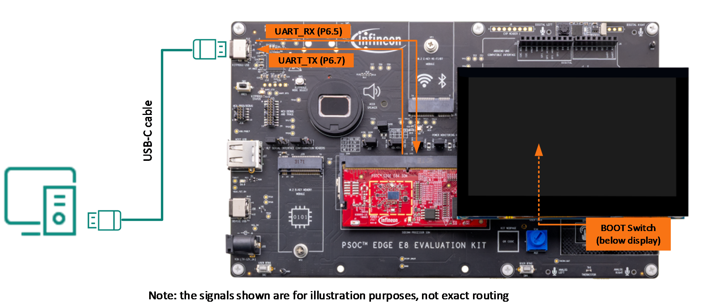

### Flow chart

The following flow chart shows the complete code flow of this code example.

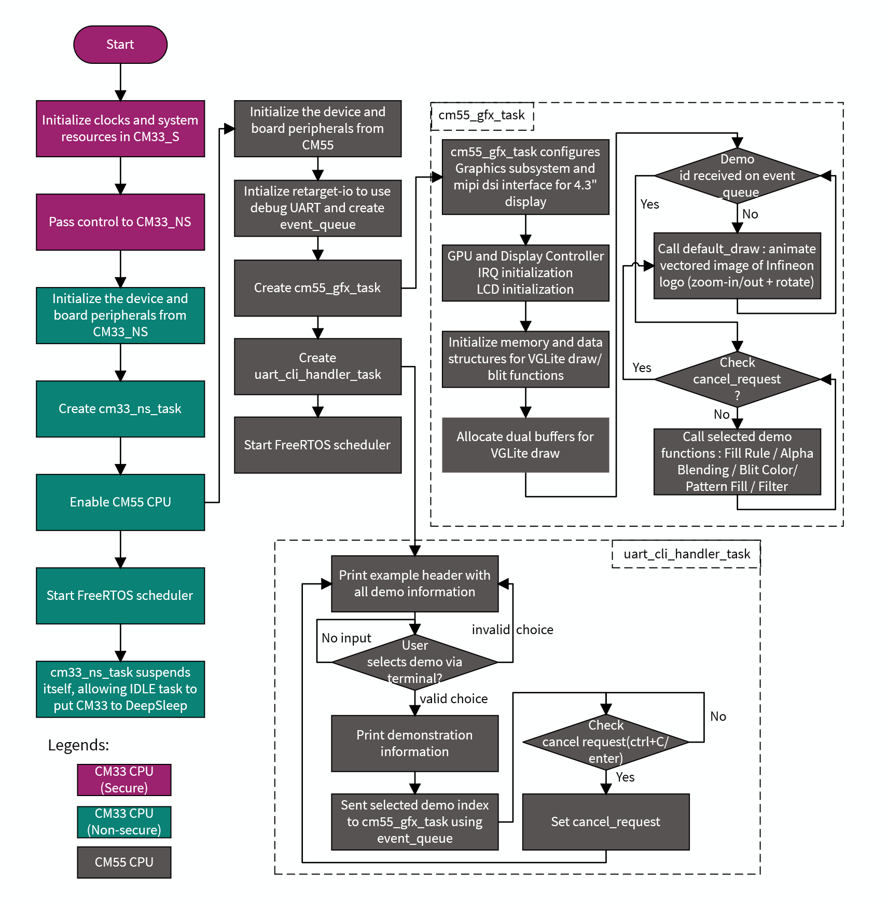

### Project creation

1. Follow steps in [Appendix A: Creating a PSOC™ Edge application in ModusToolbox™](pse84-technical-intro-features-training-manual-appendix-a.md) to create a new application
   When creating the application, select the **PSOC™ Edge Graphics using VGLite API** application under the **Graphics** section.

   > [!NOTE] To prevent issues with Windows path length, it’s recommended to rename the project if your workspace path is long.

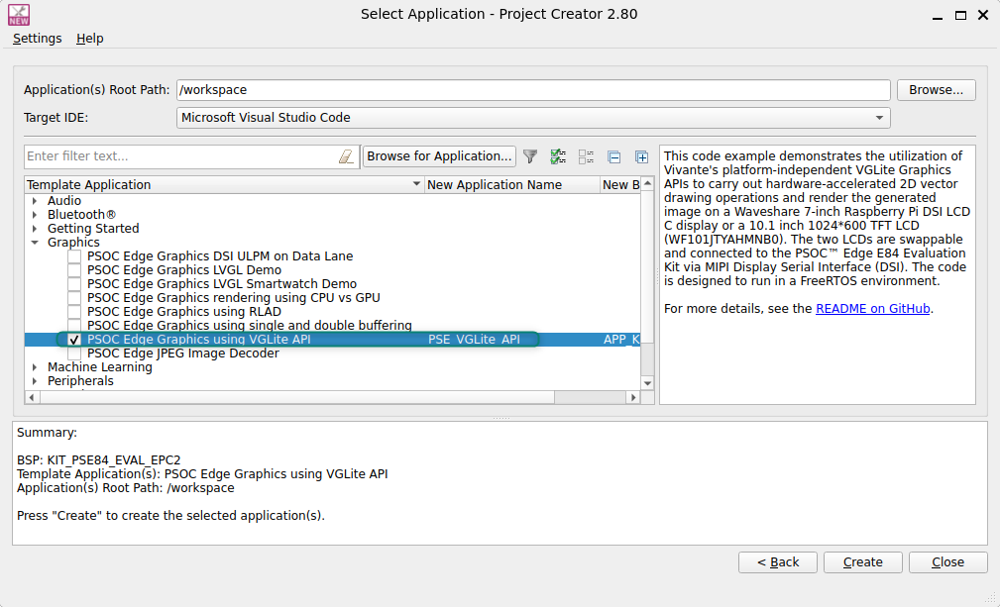
2. Build and program the application
3. [INFO] No modifications are needed to execute the default code example; however, some important files for this project are highlighted as shown in the following figure:
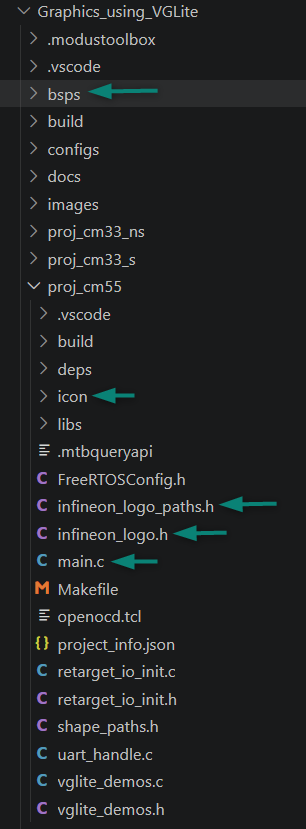

- `proj_cm55/infineon_logo_paths.h`: This file defines the vector path data for the Infineon logo, which is rendered using the `vg_lite_draw` API. The path data is manually extracted from `images/infineon_logo.svg` by mapping the vector path opcodes required for plotting. This vector path is used in the `default_draw` function to animate the logo with zoom-in/out and rotation effects, and it is also utilized in the blit color rendering demo, where the rectangle containing the logo (rendered via `vg_lite_draw`) is processed using the `vg_lite_blit_rect` API
- `proj_cm55/infineon_logo.h`: This file contains the C array holding the pixel data for the Infineon logo image. It is used in the Pattern Fill Demonstration to render the Infineon logo within four different shapes
- `icon/*.h`: These header files define the C arrays that hold pixel data for the four icons. They are used in the filter demo, where the VG_LITE_FILTER_LINEAR filter is applied to them
- **Application code**: The CM55 CPU utilizes the graphics subsystem and VGLite APIs to demonstrate five different use cases. The main function (`proj_cm55/main.c`) first initializes the BSP. It then performs retarget-io initialization to use the debug UART port and creates an event\_queue to receive notifications of selected demonstrations. After this, it creates the `cm55_gfx_task` and `uart_cli_handler` FreeRTOS tasks:
	- `cm55_gfx_task`: This task is responsible for initializing the graphics subsystem. It initializes the LCD panel through the I2C interface, initializes the VGLite engine, creates buffers, and configures the identity matrix. After initialization, it enters a loop where it checks the `event_queue`. If no events are received, it calls the `default_draw` function to display the Infineon logo with zoom and rotation effects as the default screen. When a demo number is received, the corresponding demo function is executed repeatedly until the `cancel_requested` flag is set. Once cancellation is triggered, the task exits the demo loop and returns to the main loop, continuing to check the event\_queue and call `default_draw`. It also logs FPS and CPU usage to the UART terminal throughout execution.
	- `uart_cli_handler`: This task manages user interaction through the UART terminal. It first displays the header "PSOC™ Edge MCU: Graphics using VGLite API" and lists five GPU operations to be demonstrated. When the user selects one of the listed operations by entering its corresponding number (1 to 5), it prints information about the selected operation and sends the operation serial number to `cm55_gfx_task` via the `event_queue`. To exit a running GPU operation and return to the default display, the user can press Ctrl+C or Enter. When this occurs, the task sets the `cancel_requested` flag to notify `cm55_gfx_task` to stop the active operation and resume the default loop.
- `bsps/TARGET_APP_KIT_PSE84_EVAL_EPC2/config/design.modus`: This file stores Device Configurator information, display parameters, and memory configuration, among other configurations

2. [INFO] To observe the graphics support configuration, open the **Device Configurator** tool by clicking the **Configure Device** button in the **ModusToolbox™ for VS Code** extension. 
   Navigate to the **Peripherals** tab and check the **Graphics** option under **System**.
   * Observe display parameters such as **Display Type**, **Width**, **Height**, **HSYNC**, and **VSYNC**. These parameters can be adjusted for other types of displays
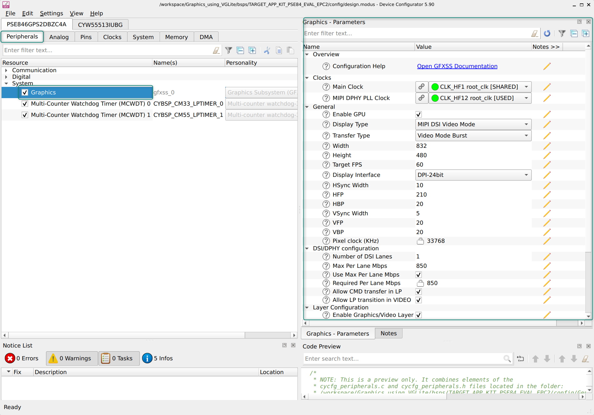
* Observe the reference clock for the MIPI DPHY PLL to 24 MHz
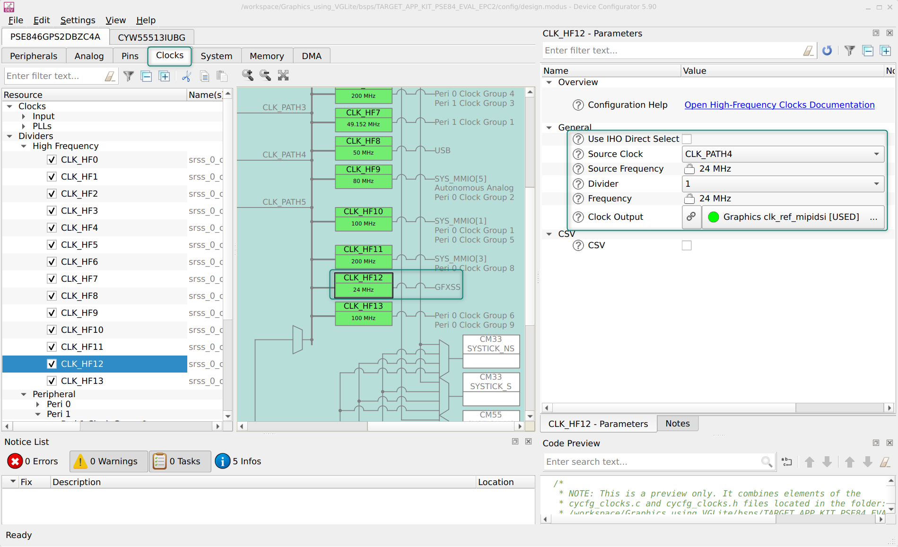
* Device Configurator  also defines the custom memory map for system SRAM with respect to the placement of the graphics frame buffer and other memory regions
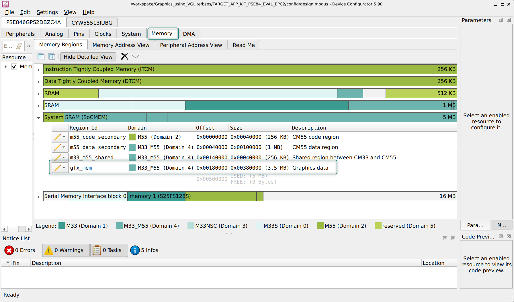

### Output

The application starts automatically after programming.

You should observe a message in the terminal, followed by a menu, frames-per-second information, and CPU usage:


You should also observe that the display shows an animated logo.
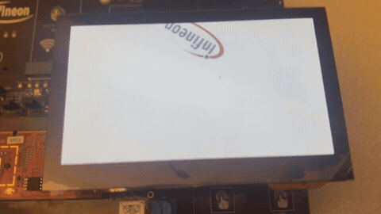

In addition to the logo display, the example allows you to run different demos:

- Fill rules
	- The display shows two shapes on the left side with the VG\_LITE\_FILL\_EVEN\_ODD filling rule and two shapes on the right side with the VG\_LITE\_FILL\_NON\_ZERO filling rule.
- Alpha blending
	- The display shows two shapes on the left side with the VG\_LITE\_BLEND\_SRC\_OVER blending mode and two shapes on the right side with the VG\_LITE\_BLEND\_MULTIPLY blending mode.
- Blit color rendering
	- The display shows two Infineon logos rectangularly blitted onto a TEAL\_COLOR frame.
- Pattern fill
	- The display shows the Infineon logo on four different shapes using the vg\_lite\_draw\_pattern.
- UI/filter demo
	- The display shows four different icons and a highlighted rectangle moving over all four icons with VG\_LITE\_FILTER\_LINEAR.

Input the corresponding number in the terminal to run each demo and press **Ctrl+C** to go back to the main menu.

### Modify the application

#### Render a different image

For this first modification, render a different image instead of the Infineon logo.

#### Hints for the advanced modification

- A sample image `tiger_paths.h` is available in the included source folder
- Adjust image to display properly

#### Solution

1. Copy the `tiger_paths.h` file from the included source files at `~/Graphics_using_VGLite/Render Different image/proj_cm55` and place it in the proj\_cm55 directory

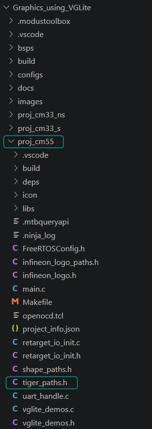

2. Open `proj_cm55/vglite_demos.c`, and replace `infineon_logo_paths.h` by the new `tiger_paths.h`. The original and updated lines are shown in red and green respectively below. 

```diff
 #include "icon/vision.h"
 #include "icon/wearable.h"
-#include "infineon_logo_paths.h"
+#include "tiger_paths.h"
 #include "infineon_logo.h"
 #include "shape_paths.h"
 #include "retarget_io_init.h"
```

3. The `tiger_paths.h` file includes a `color_data` array which conflicts with current definitions in `vglite_demos.c`
   Remove the `color_data` definition in `vglite_demos.c`:
```diff
 /* Global Variables */
 bool zoom_out = false;
 int scale_count = RESET_VAL;
-uint32_t color_data[] =
-{
-    0xff4018ec, /* path_data0 : blue */
-    0xffb36600, /* path_data1 : red */
-};
 vg_lite_buffer_t image_buffer;
```

4. The tiger image has a different size compared to the Infineon logo. Locate the location of the `load_images()`  call in `proj_cm55/main.c` and update the code snippet shown below. Note that the updated code snippet is shown to allow copy-pasting.
```c
    if (success)
    {
        vg_lite_identity(&matrix);
        if (!load_images())
        {
            printf("Failed to load icons\r\n");
            success = false;
        }
        else
        {
            /* Translate the matrix to the center */
            vg_lite_translate(DISP_W / 2 - 20 * DISP_W / 1024.0f,
                            DISP_H / 2 - 100 * DISP_H / 600.0f + 50, &matrix);
            /* Set the default scale of the matrix */
            vg_lite_scale(4, 4, &matrix);
        }
    }
```

5. Build and program the application code
   You should observe the tiger image animated on the display.
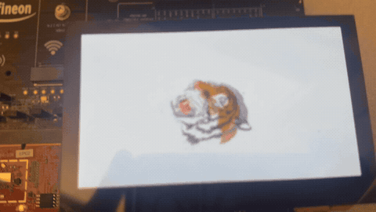

#### Draw polygons

For this second modification, explore how to use the `vg_lite_draw` function to draw polygons on the screen.

Modify the **Fill rules** demo to draw a cross instead of one of the default squares.

#### Hints for the advanced modification

- The two squares are drawn in `fill_rules_draw` inside `vglite_demos.c`
- The function `vg_lite_draw` draws the polygon using a set of coordinates defined in `shape_paths.h`
- The figure below shows the coordinates to draw a rectangle

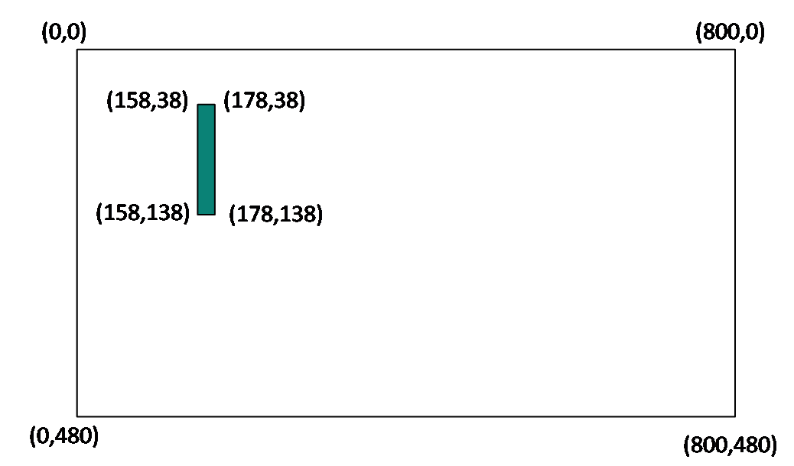

#### Solution

1. **Note**: Open `proj_cm55/vglite_demos.c` and observe that the squares are drawn by `vg_lite_draw` and located by `vg_lite_translate`
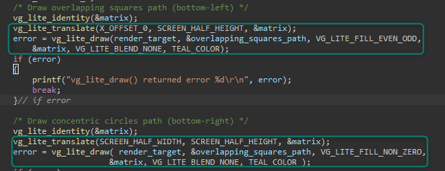

2. Replace the definition of `overlapping_squares` in `shape_paths.h`:
```c
int32_t overlapping_squares[] =
{
    /* Cross */
    2, 158, 38,
    4, 178, 38,
    4, 178, 138,
    4, 158, 138,
    4, 158, 38,
    2, 118, 78,
    4, 118, 98,
    4, 218, 98,
    4, 218, 78,
    4, 118, 78,
    /* Second square - Clockwise (shifted) */
    2, 183, 103,
    4, 283, 103,
    4, 283, 203,
    4, 183, 203,
    4, 183, 103,
    0, /* End of path */
};
```

3. Rebuild and reprogram the device
   Press **1** in the terminal to run the **Fill rules** demo and observe the changes.

Try drawing other shapes or playing with the parameters of `vg_lite_draw` to test other features.
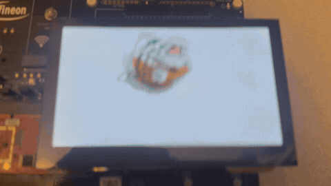
### Conclusion

This exercise successfully created a PSOC™ Edge E84 MCU graphics application using ModusToolbox™. It configured the graphics subsystem and the display and touch driver, and called VGLite API functions to draw using the GPU in the PSOC™ Edge E84 MCU.

## Code example: Graphics LVGL demo

### Objective

This code example demonstrates displaying graphics on a 4.3” 800x480, or 10.1-inch or 7-inch 1024x600 TFT LCD display using the **Light and Versatile Graphics Library (LVGL)** on PSOC™ Edge E84 MCU. The display shows a music player application, which is listed as one of the standard demos on the [LVGL page](https://lvgl.io/demos). The display is connected to the PSOC™ Edge E84 MCU via the **MIPI Display Serial Interface (DSI)**. The code runs in a FreeRTOS environment.

### Description

This code example performs the following major steps to display a GUI created using the LVGL library.

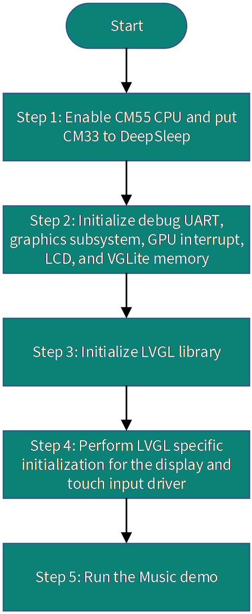

### Flow chart

The following flow chart explains the complete code flow of this code example.

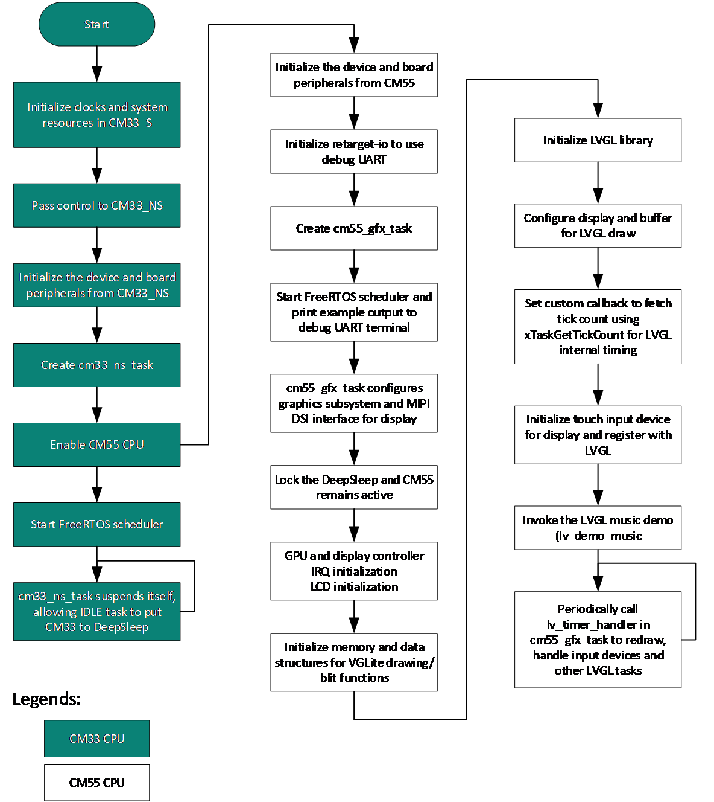

### Project creation

1. Follow steps in [Appendix A: Creating a PSOC™ Edge application in ModusToolbox™](pse84-technical-intro-features-training-manual-appendix-a.md) to create a new application
   When creating the application, select the **PSOC™ Edge Graphics LVGL Demo** application under the **Graphics** section.

   > [!NOTE] To prevent issues with Windows path length, it’s recommended to rename the project if your workspace path is long.

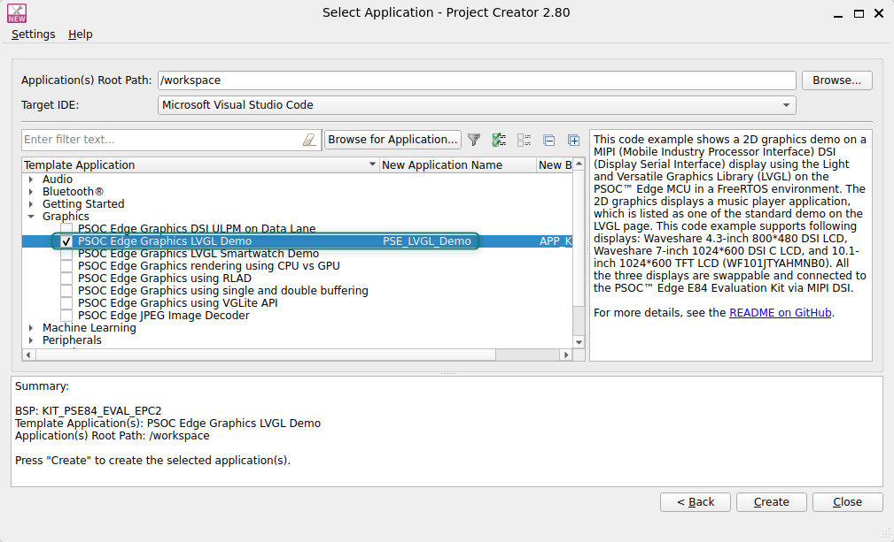
2. Build and program the application
3. [INFO] No modifications are needed to execute the default code example; however, some important files for this project are highlighted below:

* *`lv_port_disp.c`*
	- This file provides the implementation of a low-level display device driver for LVGL. It creates a new display device for LVGL with the given resolution, sets up the frame buffer for the display, initializes a custom callback to fetch the tick count, and provides functions for refreshing or updating the display.
	- The file also contains implementations of functions required by LVGL to get information about the display and how to draw pixels on the screen, such as disp\_flush(). The *`disp_flush()`* function is called by LVGL whenever a new frame is ready to be displayed, and it transfers the contents of the graphics frame buffer to the display controller.
	- This file is typically customized to work with specific display hardware. It may require modification of certain constants or register settings to properly configure the display. The specific implementation may also depend on the type of display being used, such as a TFT or OLED display.
	
* *`lv_port_indev.c`*
	- This file provides the implementation of a low-level input device driver for LVGL. It initializes the touch driver to the corresponding display panel using the I2C interface and handles user input such as touch or button presses. It provides functions that map input events to specific actions or GUI elements in your LVGL application.
	- The file also contains implementations of functions required by LVGL to get information from the input device, such as touchpad\_read(). The *`touchpad_read()`* function is called by LVGL to read input events from the input device and translate them into LVGL event types, such as LV\_EVENT\_PRESSED or LV\_EVENT\_RELEASED.
	- This file is typically customized to work with a specific input device. It may require modification of certain constants or register settings to properly configure the input device. The specific implementation may also depend on the type of input device being used, such as a touch screen or physical buttons.

* *`lv_conf.h`*
	- This is a configuration file for the LVGL graphics library. It allows you to customize various aspects of the library, such as the display driver, memory allocation, theme, font, and more.
	- The file provides a list of preprocessor directives that can be used to enable or disable certain features of the library. By modifying the directives in this file, you can tailor LVGL to suit your specific needs and hardware platform. It is typically included in your project along with the LVGL library files.

* *`lv_draw_vg_lite.c, lv_draw_vg_lite_img.c`*
	- These files provide implementation of LVGL's image related operations ported to the VGLite library to use GPU aided rendering.

* *`lv_vg_lite_utils.c`*
	- This file provides an implementation for LVGL's utility APIs ported to the VGLite library.

* ``proj_cm55/main.c``
	- This file defines the *`cm55_gfx_task`* which initializes the graphics subsystem and configures the GPU and display controller interrupts. After that, the file initializes the display panel driver for the selected display.
	- Once the panel is initialized, the required amount of memory is allocated for VGLite draw/blit functions to be consumed by the LVGL library.
	- The *`lv_init()`* function is used to initialize LVGL and set up the essential components required for LVGL to work correctly.
	- Low-level display and touch devices for LVGL are initialized using *`lv_port_disp_init()`* and *`lv_port_indev_init()`* functions respectively.
	- The LVGL demo music player is displayed by calling the LVGL demo widget API *`lv_demo_music()`*.

4.  [INFO] The libraries included in this example can also be observed by opening the **Library Manager** in the **ModusToolbox™ for VS Code** extension.
   Observe the added libraries in proj_cm55 for LVGL and displays. Note that the Library Manager can also be used to add support for this display and LVGL to other applications.
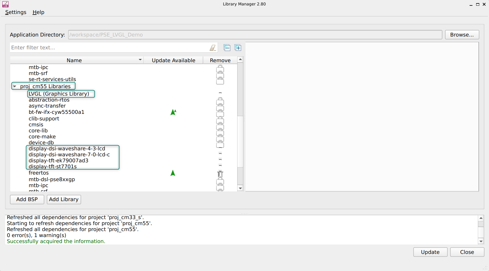

### Output

After programing is successful, open the serial terminal and set the serial port parameters to **8N1** and **115200** baud. Reset the EVK and observe that the terminal displays the header.

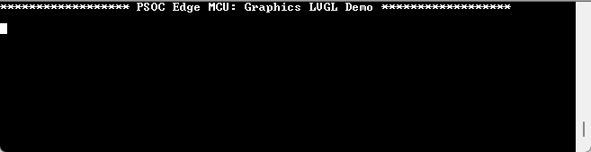

Observe that the LCD displays a music player demo application as shown below. You can use the touch screen to perform various actions such as playing or pausing a track, changing to the next or previous track, and viewing the playlist. 
Note that music is not played, only graphics actions are demonstrated in this code example.
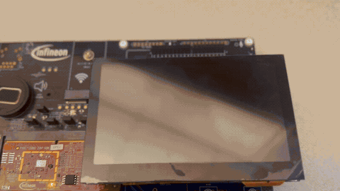

### Modify the application

#### Pre-built LVGL demos

For this first modification, try testing other pre-built LVGL demos, and enable CPU usage indicators.

#### Hints for the advanced modification

- LVGL demos and CPU usage indicators can be enabled in `lv_conf.h`
- Make sure the application calls the correct `lv_demo` function

#### Solution

1. To switch to other available LVGL demos, the corresponding `LV_USE_DEMO_<demo_name>` macro must be enabled in `proj_cm55\include\lv_conf.h`.
   Enable `LV_USE_DEMO_WIDGETS` and note that `LV_USE_DEMO_BENCHMARK` is disabled,

```diff
/*===================
 * DEMO USAGE
 ====================*/

#if LV_BUILD_DEMOS
    /** Show some widgets. This might be required to increase `LV_MEM_SIZE`. */
#if LV_USE_DEMO_BENCHMARK
    #define LV_USE_DEMO_WIDGETS 1
#else
-    #define LV_USE_DEMO_WIDGETS 0
+    #define LV_USE_DEMO_WIDGETS 1  
#endif
```

2. The system monitor component `LV_USE_SYSMON` allows CPU usage metrics to be observed in the display. Enabled it in the same `lv_conf.h` file. 

```diff
/*==================
 * OTHERS
 *==================*/
/* Documentation for several of the below items can be found here: https://docs.lvgl.io/master/auxiliary-modules/index.html . */

/** 1: Enable API to take snapshot for object */
#define LV_USE_SNAPSHOT 0

/** 1: Enable system monitor component */
#if LV_USE_DEMO_BENCHMARK
    #define LV_USE_SYSMON   1
#else
-    #define LV_USE_SYSMON   0
+    #define LV_USE_SYSMON   1
#endif
```

3. Open `proj_cm55/main.c` and observe that the application calls `lv_demo_music` when `DEMO_BENCHMARK` is disabled, and `lv_demo_benchmark` when the macro is enabled. 
   Modify the code to run `lv_demo_widgets` instead of the music demo.
   Note that you can enable and run other LVGL demos in this way.

```diff
#if LV_USE_DEMO_BENCHMARK
            /* Register our end callback - LVGL calls it when all scenes finish.
             * Touch is initialized there, so polling does not affect benchmark scores. */
            lv_demo_benchmark_set_end_cb(benchmark_end_cb);

            /* Run the Benchmark demo */
            lv_demo_benchmark();
#else
            /* Initialize touch input. Skipped during benchmark to avoid the
             * CPU overhead of polling-mode touch. */
            lv_port_indev_init();

            /* Run the Music demo */
-            lv_demo_music();
+            lv_demo_widgets();  
#endif
```

4. Rebuild and reprogram the application
5. You should observe the widgets demo together with CPU metrics in the bottom left corner.
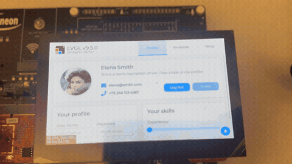

#### Custom UI using [EEZ Studio](https://www.envox.eu/studio/studio-introduction/)

LVGL is a widely used graphics library supported by the open-source community and many third parties. In this exercise, generate a custom UI using the [EEZ Studio](https://www.envox.eu/studio/studio-introduction/) tool.

#### Hints for the advanced modification

- Use [EEZ Studio](https://www.envox.eu/studio/studio-introduction/) to generate a new UI
- Add the generated UI files to the cm55 project
- Call the corresponding functions to initialize the custom UI and update it periodically

#### Solution

1. If [EEZ Studio](https://www.envox.eu/studio/studio-introduction/) is not already installed, install it now.
2. Open [EEZ Studio](https://www.envox.eu/studio/studio-introduction/) and click on **Examples**, select the **Change Screen** example under the LVGL category, select a **name**, add a **location**, and click **Edit Project**

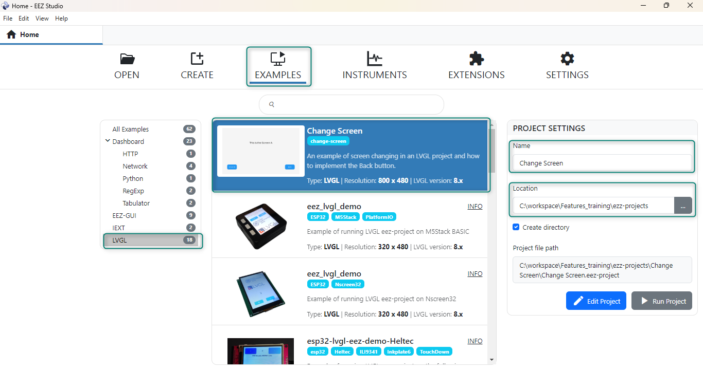

3. Click the **Settings** button

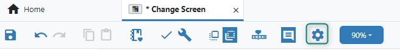

4. In the **General** tab, confirm that the **LVGL version** is 9.5 since ModusToolbox™ 3.9 uses LVGL 9.5.0, and that the **display resolution** is 800x480, since the 4.3” display included with the PSOC™ Edge E84 kit is used

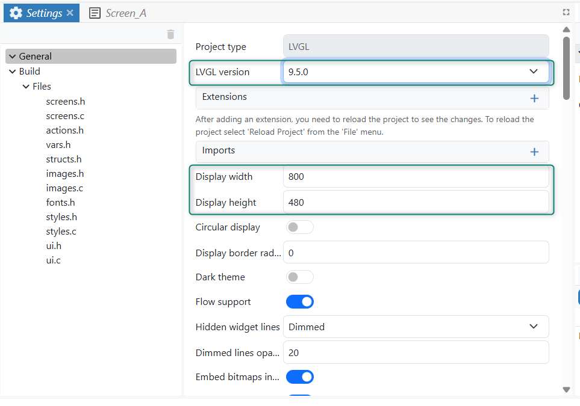

5. Go to the **Build** options and modify the **LVGL include** setting as `lvgl.h`, since the project is configuring a direct path to LVGL inside `mtb_shared`; and observe that the **Destination folder** is set to `src\ui` since this is where the output files will be generated

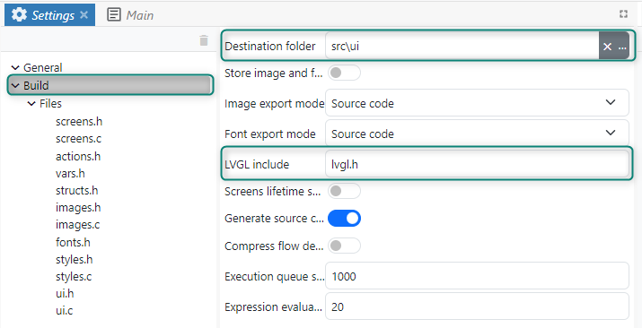

6. Modify the default GUI. Make sure the **Main page** is selected, then open the **Bitmaps** panel on the right side, and click the **plus (+) icon** to add a bitmap

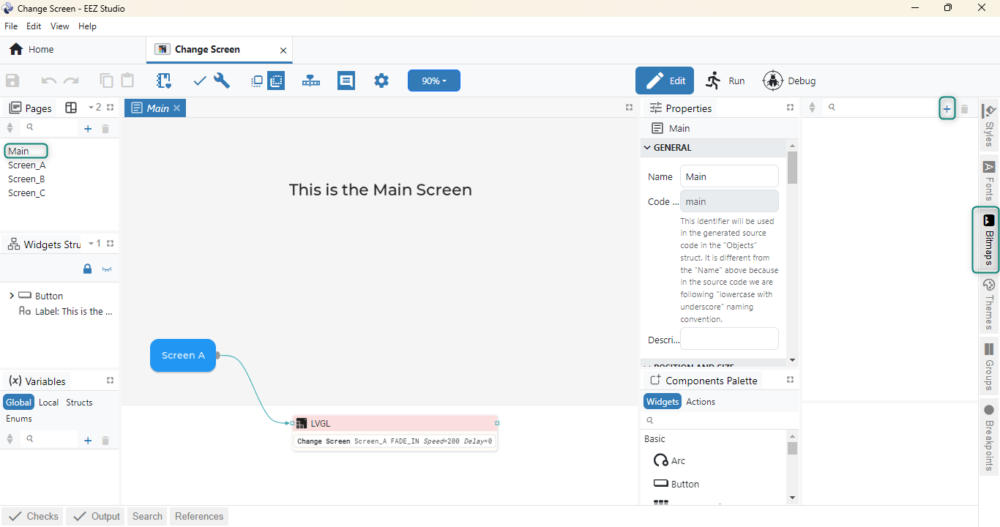

7. Click the image browse button, navigate to the lab source folder, and select the image located at `<lab_source_folder>\Graphics_LVGL_Demo\Custom UI using EEZStudio\PSE84.png`
   Add a **Name**, and select **Color format** as RGB565, then click **OK**.
   Feel free to add an image of your choice.

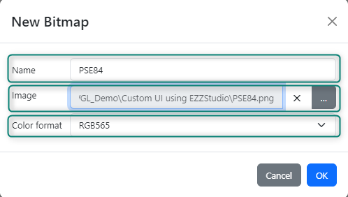

8. Drag-and-drop an **Image widget** from the **Components Palette** into the **Main Screen**

   Then, go to the **Properties** and select the **Image** corresponding to the bitmap added in the previous step.

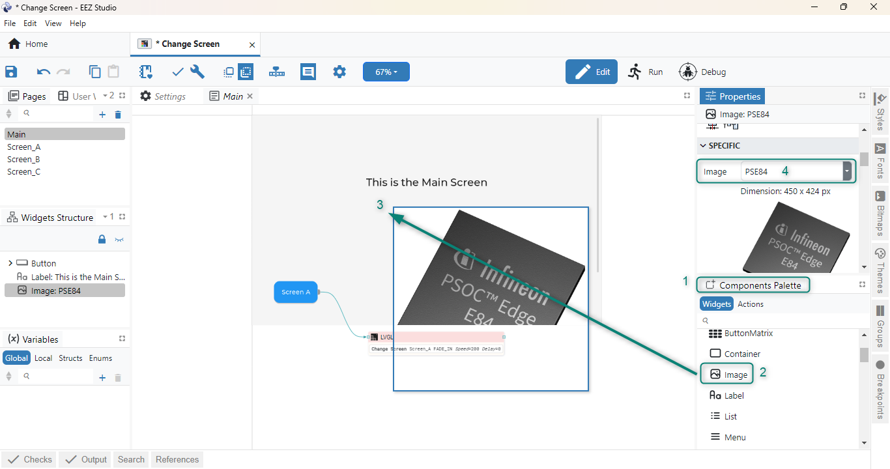

9. Adjust the label and image so that it fits properly in the page
10. Test one of the widgets on **Screen A**
    Go to the **Screen A** page and drag and drop an **Arc widget** from the **Components Palette**.
    Feel free to try other widgets.

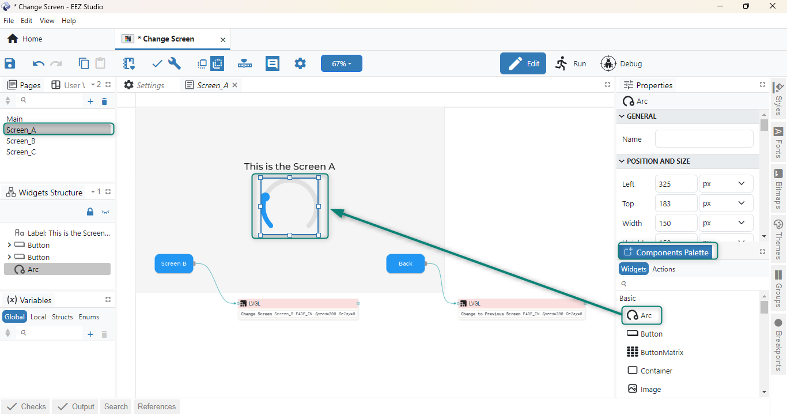

11. Save the project, click the **Check** button to validate the project, and then click the **Build** button to generate the output files
   > [!NOTE] [EEZ Studio](https://www.envox.eu/studio/studio-introduction/) will display any missing system requirements. The known requirements are listed in the [Prerequisites](#prerequisites) section.

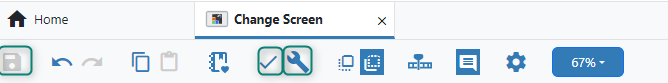

12. Copy the generated **UI folder** from `<EEZ_Project_path>/src/ui` to the `proj_cm55`. 
    Note that you can right-click on the EEZ Studio project tab to find and copy the project path.

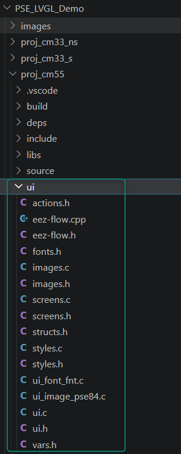


13. Open `proj_cm55/source/main.c` and make the following modifications to initialize the new GUI and to call a periodic tick function to handle UI events:

```diff
#include "lv_port_disp.h"
#include "lv_port_indev.h"
#include "demos/lv_demos.h"
#include "display_i2c_config.h"
+#include "ui.h"
```

```diff
#if LV_USE_DEMO_BENCHMARK
            /* Register our end callback - LVGL calls it when all scenes finish.
             * Touch is initialized there, so polling does not affect benchmark scores. */
            lv_demo_benchmark_set_end_cb(benchmark_end_cb);

            /* Run the Benchmark demo */
            lv_demo_benchmark();
#else
            /* Initialize touch input. Skipped during benchmark to avoid the
             * CPU overhead of polling-mode touch. */
            lv_port_indev_init();

-            /* Run the Music demo */
-            lv_demo_widgets();
+            /* Run the custom UI */
+            ui_init();
#endif
```

14. Then, add a call to `ui_tick()` in the main loop to periodically process UI events:

```diff
     for (;;)
    {
        /* LVGL's timer handler function, to be called periodically to handle
         * LVGL tasks.
         */
        time_till_next = lv_timer_handler();
        vTaskDelay(pdMS_TO_TICKS(time_till_next));

+       ui_tick(); /* Call UI tick to handle events */        
    }
```

14. Rebuild and program the example
15. You should observe the new GUI running on your PSOC™ Edge EVK. 
    Try the different screens and/or perform more customizations

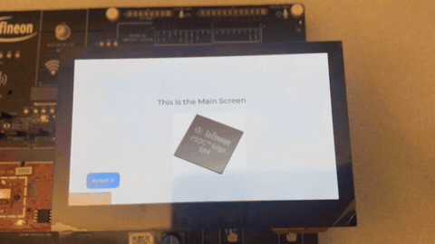

### Conclusion

This exercise successfully created a PSOC™ Edge E84 MCU graphics application using ModusToolbox™, figured out how to configure the graphics subsystem, and utilized the LVGL graphics library to develop a full-fledged UI application on the PSOC™ Edge E84 MCU platform.

### Revision history

| Document revision | Date       | Description of changes                                |
| ----------------- | ---------- | ----------------------------------------------------- |
| \*A               | 2026-09-26 | Updated to latest tools and using Visual Studio Code. |
| **                | 2025-01-15 | Initial release.                                      |

### Disclaimer
All referenced product or service names and trademarks are the property of their respective owners.

The Bluetooth&reg; word mark and logos are registered trademarks owned by Bluetooth SIG, Inc., and any use of such marks by Infineon is under license.

PSOC&trade;, formerly known as PSOC&trade;, is a trademark of Infineon Technologies. Any references to PSOC&trade; in this document or others shall be deemed to refer to PSOC&trade;.

---------------------------------------------------------

© Cypress Semiconductor Corporation, 2023-2026. This document is the property of Cypress Semiconductor Corporation, an Infineon Technologies company, and its affiliates ("Cypress").  This document, including any software or firmware included or referenced in this document ("Software"), is owned by Cypress under the intellectual property laws and treaties of the United States and other countries worldwide.  Cypress reserves all rights under such laws and treaties and does not, except as specifically stated in this paragraph, grant any license under its patents, copyrights, trademarks, or other intellectual property rights.  If the Software is not accompanied by a license agreement and you do not otherwise have a written agreement with Cypress governing the use of the Software, then Cypress hereby grants you a personal, non-exclusive, nontransferable license (without the right to sublicense) (1) under its copyright rights in the Software (a) for Software provided in source code form, to modify and reproduce the Software solely for use with Cypress hardware products, only internally within your organization, and (b) to distribute the Software in binary code form externally to end users (either directly or indirectly through resellers and distributors), solely for use on Cypress hardware product units, and (2) under those claims of Cypress's patents that are infringed by the Software (as provided by Cypress, unmodified) to make, use, distribute, and import the Software solely for use with Cypress hardware products.  Any other use, reproduction, modification, translation, or compilation of the Software is prohibited.
<br>
TO THE EXTENT PERMITTED BY APPLICABLE LAW, CYPRESS MAKES NO WARRANTY OF ANY KIND, EXPRESS OR IMPLIED, WITH REGARD TO THIS DOCUMENT OR ANY SOFTWARE OR ACCOMPANYING HARDWARE, INCLUDING, BUT NOT LIMITED TO, THE IMPLIED WARRANTIES OF MERCHANTABILITY AND FITNESS FOR A PARTICULAR PURPOSE.  No computing device can be absolutely secure.  Therefore, despite security measures implemented in Cypress hardware or software products, Cypress shall have no liability arising out of any security breach, such as unauthorized access to or use of a Cypress product. CYPRESS DOES NOT REPRESENT, WARRANT, OR GUARANTEE THAT CYPRESS PRODUCTS, OR SYSTEMS CREATED USING CYPRESS PRODUCTS, WILL BE FREE FROM CORRUPTION, ATTACK, VIRUSES, INTERFERENCE, HACKING, DATA LOSS OR THEFT, OR OTHER SECURITY INTRUSION (collectively, "Security Breach").  Cypress disclaims any liability relating to any Security Breach, and you shall and hereby do release Cypress from any claim, damage, or other liability arising from any Security Breach.  In addition, the products described in these materials may contain design defects or errors known as errata which may cause the product to deviate from published specifications. To the extent permitted by applicable law, Cypress reserves the right to make changes to this document without further notice. Cypress does not assume any liability arising out of the application or use of any product or circuit described in this document. Any information provided in this document, including any sample design information or programming code, is provided only for reference purposes.  It is the responsibility of the user of this document to properly design, program, and test the functionality and safety of any application made of this information and any resulting product.  "High-Risk Device" means any device or system whose failure could cause personal injury, death, or property damage.  Examples of High-Risk Devices are weapons, nuclear installations, surgical implants, and other medical devices.  "Critical Component" means any component of a High-Risk Device whose failure to perform can be reasonably expected to cause, directly or indirectly, the failure of the High-Risk Device, or to affect its safety or effectiveness.  Cypress is not liable, in whole or in part, and you shall and hereby do release Cypress from any claim, damage, or other liability arising from any use of a Cypress product as a Critical Component in a High-Risk Device. You shall indemnify and hold Cypress, including its affiliates, and its directors, officers, employees, agents, distributors, and assigns harmless from and against all claims, costs, damages, and expenses, arising out of any claim, including claims for product liability, personal injury or death, or property damage arising from any use of a Cypress product as a Critical Component in a High-Risk Device. Cypress products are not intended or authorized for use as a Critical Component in any High-Risk Device except to the limited extent that (i) Cypress's published data sheet for the product explicitly states Cypress has qualified the product for use in a specific High-Risk Device, or (ii) Cypress has given you advance written authorization to use the product as a Critical Component in the specific High-Risk Device and you have signed a separate indemnification agreement.
<br>
Cypress, the Cypress logo, and combinations thereof, ModusToolbox, PSOC, CAPSENSE, EZ-USB, F-RAM, and TRAVEO are trademarks or registered trademarks of Cypress or a subsidiary of Cypress in the United States or in other countries. For a more complete list of Cypress trademarks, visit www.infineon.com. Other names and brands may be claimed as property of their respective owners.
