# Chapter 5: Memories (SMIF) (Pending update)

### About this document

## Scope and purpose

This document is the training manual for the technical introduction to PSOC™ Edge E84 features. This manual helps in getting started with different applications leveraging key features for PSOC™ Edge, using ModusToolbox™ software.

The training is divided into multiple chapters covering topics like audio, graphics, machine learning, among others.

Chapter 5 discusses PSOC™ Edge’s SMIF and external memory support.

**Intended audience**

The document is intended for design engineers, technicians, and developers of electronic systems.

## Introduction

This manual provides detailed instructions to create, configure, build, and run several application code examples on the PSOC™ Edge E84 MCU.

## Prerequisites

See the [**Prerequisites** section](pse84-technical-intro-features-training-manual-ch1-intro.md#prerequisites) in the [**Chapter 1 training manual**](pse84-technical-intro-features-training-manual-ch1-intro.md). for a complete list of prerequisites and development tools.

## Code example: Serial flash read/write

### Objective

This code example demonstrates how to interface with and perform read/write/erase operations on an external NOR flash memory, using the serial flash library with the PSOC™ Edge E84 MCU.

### Description

This code example shows how the serial memory interface (SMIF) block in the PSOC™ Edge E84 MCU is used to access an external flash memory device.

The SMIF block in the PSOC™ Edge E84 MCU supports accessing memory in two modes:

- MMIO (Memory-Mapped I/O) mode: This mode accesses memory using offset addresses (assuming a start address of 0x0000 0000). To read data from memory, a serial-flash API function must be used
- XIP (eXecute-In-Place) mode: This mode directly accesses memory using MCU addresses (the start address is as mentioned in the linker). No API is required to read data from memory. The data can be accessed through direct addresses mapped to the CPU (for example, 0x6034 0400)

This code example mainly focuses on reading, writing, and erasing operations using MMIO mode.

In addition, this code example covers how to use the Serial Flash Discoverable Parameters (SFDP) standard, which allows for auto-discovery of flash parameters, as well as commands for read, program, and erase operations.

### Application flow

The example has a two-CPU (Arm® Cortex® M33 CPU (CM33) and Arm® Cortex® M55 CPU (CM55)), three-project structure, including CM33 Secure, CM33 Non-Secure, and CM55 projects. All three projects are programmed to the external QSPI flash and executed in XIP mode.

This example uses a SMIF hardware block for interfacing with the external memory through a SPI interface, with four data lines and one slave select line. This example writes 64-bytes of data to the end sector of external memory. The written data is read back to check its integrity.

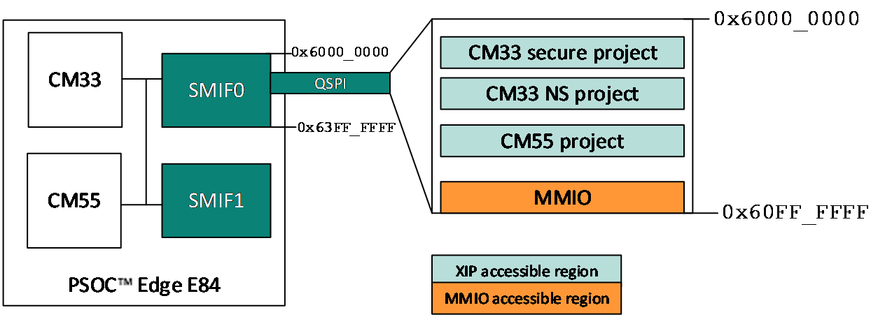

This example uses the serial-memory library along with a memory configuration generated using the **QSPI Configurator** tool. This tool can be accessed through the **ModusToolbox™ for VS Code extension**. This tool generates the configuration filescycfg\_qspi\_memslot.c/.hunder the directory bsps/TARGET\_APP\_KIT\_PSE84\_EVAL\_EPC2/config/GeneratedSource/based on the memory part selected.

By default, the example comes with a fixed configuration of the **Memory Part Number** (MPN) used in the BSP. But you can change it by selecting the MPN of your choice from a dropdown under the Memory Part Number column.

The following figure shows the default configuration for the example used in this lab:

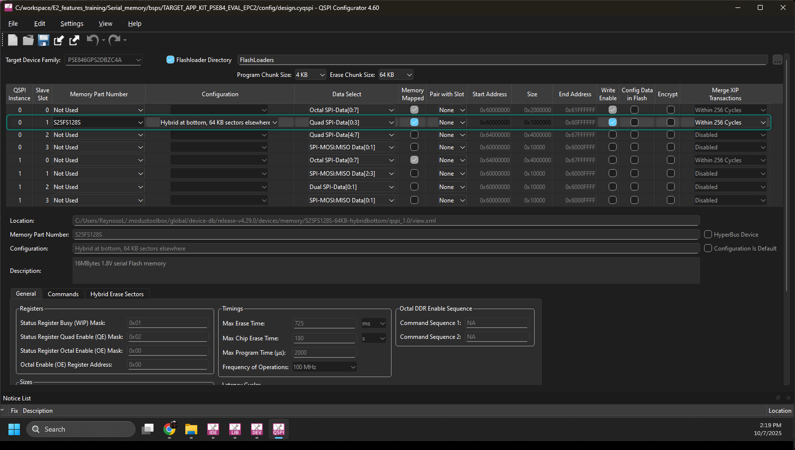

Observe the following fields:

- **QSPI Instance**: This memory is using SMIF0
- **Slave slot**: Using SMIF0\_select1
- **Memory Part Number**: Example is using S25FS128S QSPI flash included in SOM. Other memories are supported by the QSPI Configurator, or developers can use the SFDP feature
- **Configuration:** For some memories, there’s additional configuration information, such as 3-byte or 4-byte addressing mode
- **Data select:** Selects the data lines for the corresponding slot. This memory is implemented in QSPI configuration
- **Memory Mapped:** Enables XIP mode
- **Pair with Slot:** Determines the paired slot for dual quad operation. Not used in this case
- **Start Address/Size/End Address:** This memory is placed from 0x6000\_0000-0x60FF\_FFFF
- **Write Enable**: Write access is enabled
- **Config Data in Flash**: Determines whether a specific memory slot’s configuration structures are to be placed in Flash or SRAM. This configuration uses SRAM
- **Encrypt:** Encryption is not used by default on this memory
- **Merge XIP Transactions**: Specifies how many cycles can pass between memory accesses while still skipping the overhead of re-sending commands

### Hardware overview

SMIF0:

- SMIF0.CLKP
- P2.0/SPIF0.select1
- P1[0:3]/SMIF0[0:3]

> [!NOTE] This example requires BOOT SW in ON position.

See

[Appendix B: KIT\_PSE84\_EVAL details](pse84-technical-intro-features-training-manual-appendix-b.md) for more details.

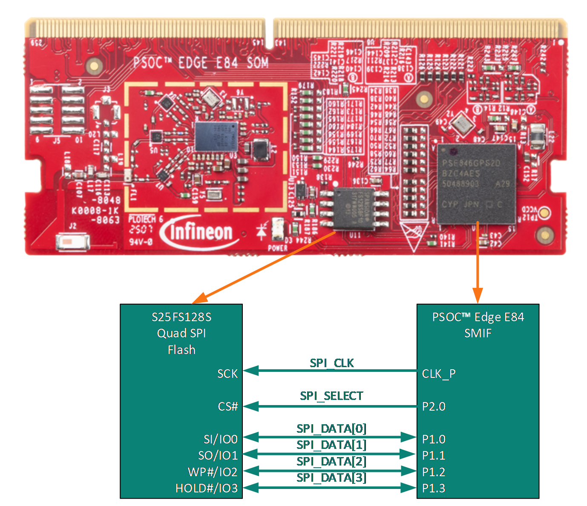

### Project creation

1. Follow steps in [Appendix A: Creating a PSOC™ Edge application in ModusToolbox™](pse84-technical-intro-features-training-manual-appendix-a.md) to create a new application
   When creating the application, select the **PSOC™ Edge Serial Flash Read and Write and XIP** application under the **Peripherals** section.

   Note: To prevent issues with Windows path length, it’s recommended to rename the project if your workspace path is long.

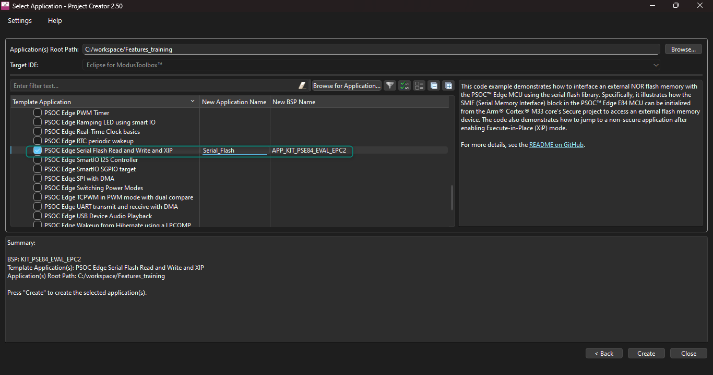

1. **Note**: This code example utilizes the **serial-memory** library

Open the **Library Manager** from the ModusToolbox™ Tools view, and observe the library being included for the cm33\_ns project. You can observe other libraries included in the project, like mtb-dsl-pse8xxgp support, CMSIS, and so on.

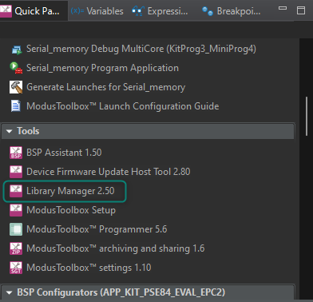

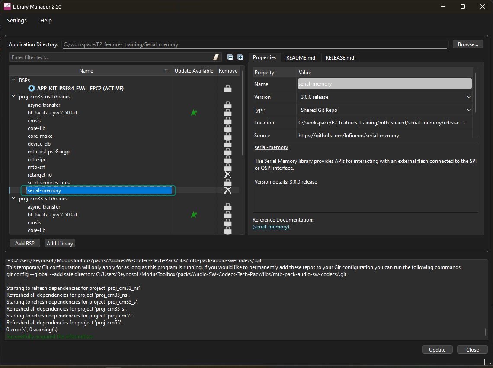

1. **Note**: No modifications are performed before running the default code example, but feel free to open `proj_cm33_ns/main.c` to analyze the application flow

Observe the implementation of the following APIs, which are documented in the [serial memory API guide](https://infineon.github.io/serial-memory/html/index.html):

- *`mtb_serial_memory_setup`*: initializes and sets up the serial memory
- *`mtb_serial_memory_erase`*: the application erases memory using this API
- *`mtb_serial_memory_read`*: the application reads memory to confirm that memory is erased and programmed correctly
- *`mtb_serial_memory_write`*: the application uses this API to write a buffer to memory

1. Build and program the application

### Output

After successful programming, the application starts automatically. Confirm that the UART terminal displays the following terminal output:

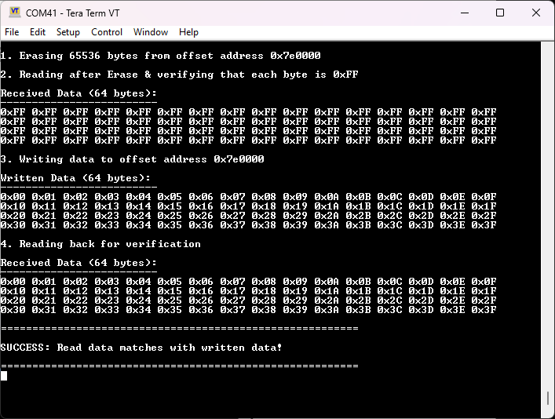

### Modify the application

#### Change the external flash address

Try changing the default address used for the read / write operation.

#### Hints for the advanced modification

- Check the APIs used by the application and modify the address parameter to use a different location

#### Solution

1. **Note**: The application uses the variable `ext_mem_address` to define the address used by the application, and by default, it simply uses the last sector which corresponds to address 0x7E\_0000 as observed in the application output

   > [!NOTE] This is an offset, so the mapped address really corresponds to 0x607E\_0000.

```c
/* Use last sector to erase for flash operation */
ext_mem_address = (smifMemConfigs[MEM_SLOT_NUM]->deviceCfg->memSize /
                   MEM_SLOT_DIVIDER -
                   smifMemConfigs[MEM_SLOT_NUM]->deviceCfg->eraseSize *
                   MEM_SLOT_MULTIPLIER);
```

2. In `proj_cm33_ns/main.c`, replace the default assignment of `ext_mem_address`, and write to 0xB00000, which corresponds to mapped location 0x60B0\_0000:

```diff
 check_status("Serial memory setup failed", result);

 /* Use last sector to erase for flash operation */
-ext_mem_address = (smifMemConfigs[MEM_SLOT_NUM]->deviceCfg->memSize /
-                   MEM_SLOT_DIVIDER -
-                   smifMemConfigs[MEM_SLOT_NUM]->deviceCfg->eraseSize *
-                   MEM_SLOT_MULTIPLIER);
+//ext_mem_address = (smifMemConfigs[MEM_SLOT_NUM]->deviceCfg->memSize/
+// MEM_SLOT_DIVIDER -
+// smifMemConfigs[MEM_SLOT_NUM]->deviceCfg->eraseSize *
+// MEM_SLOT_MULTIPLIER);
+
+/* Write address 0x60B0_0000 */
+ext_mem_address = 0xB00000;

 sectorSize = mtb_serial_memory_get_erase_size(&serial_memory_obj, ext_mem_address);
```

3. Build and program the modified application

The terminal should show the corresponding modification.

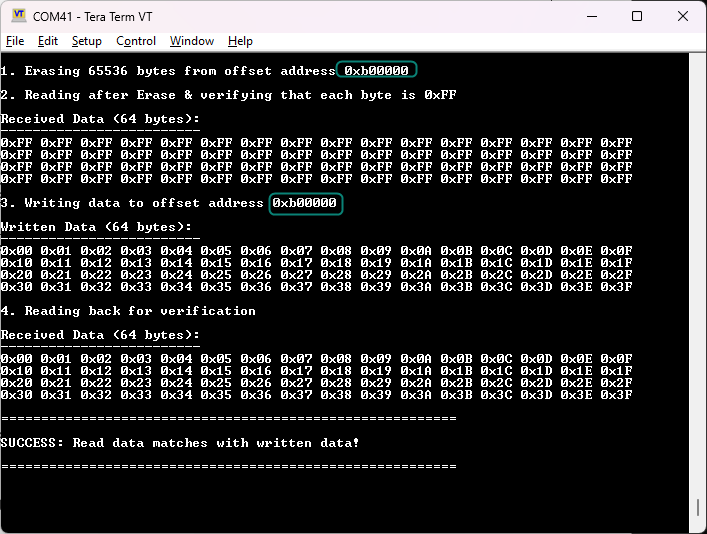

#### Place code or data at a desired memory location in external flash

Try modifying the application to place a code or data to a specific memory location in external flash

#### Hints for the advanced modification

- Create new sections for code and data using Memory Configurator
- Define the sections in the linker file
- Place code and data using CY_SECTION

#### Solution

1. Open **Device Configurator** from the ModusToolbox™ Tools view
2. Select the **Memory** tab and expand the SMIF block 0, memory 1

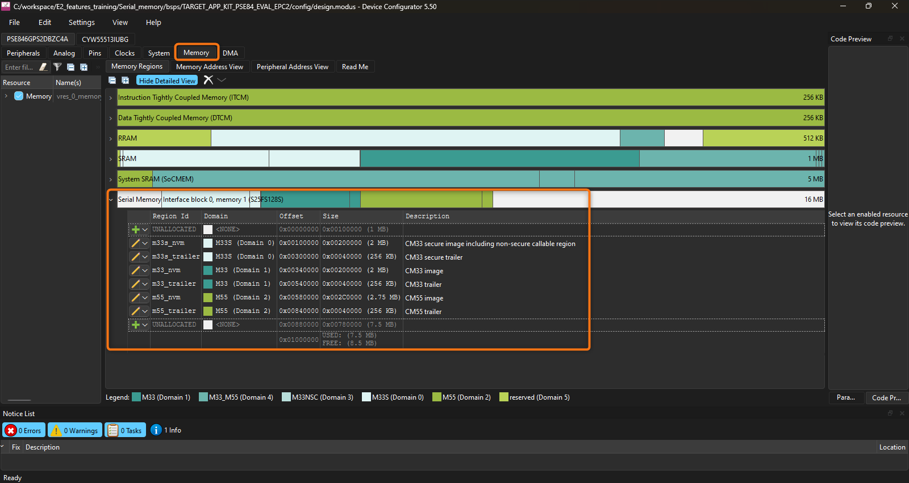

3. Click the plus sign on the last region and select **Add region**
4. Type "custom" as **Region id**, select "M33 (Domain 1)" as **Domain**, and define the **Offset** and **Size** as "0x00A00000" and "0x00100000" respectively

   > [!NOTE] This will create a custom 1 MB region accessible for the non-secure CM33 core from 0x60A00000-0x60AFFFFF.

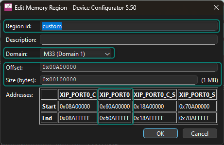

5. Click **OK** to save the new region. The Memory Regions will update as shown below:

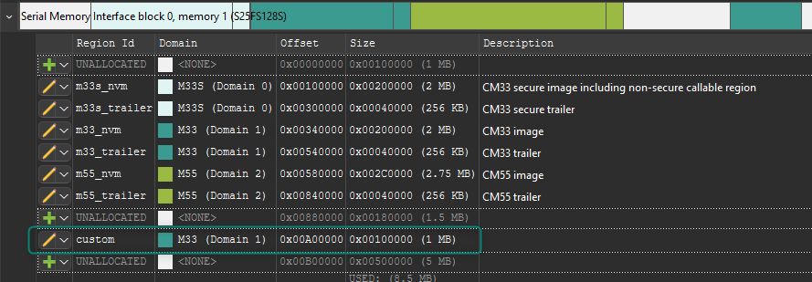

6. **Note**: Open the **Memory Address View** to observe the new section in the memory map

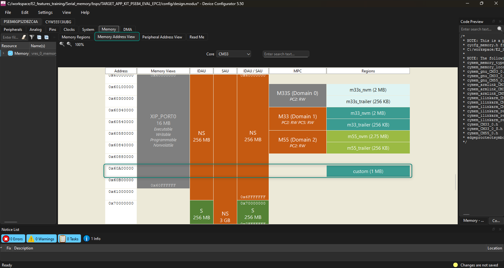

7. Save and close the device configurator. This will generate updated files for the application
8. Open the GCC linker file located at `<project_path>\bsps\TARGET_APP_KIT_PSE84_EVAL_EPC2\COMPONENT_CM33\TOOLCHAIN_GCC_ARM\pse84_ns_cm33.ld` and add the new sections:

```diff
 /* Define the sections */
 SECTIONS
 {
+    .custom_code_section :
+    {
+        KEEP(*(.custom_code_section))
+    } > custom
+
+    .custom_const_section :
+    {
+        KEEP(*(.custom_const_section))
+    } > custom
+
     /* This section reserves a space for MCUBoot header */
```

9. In `proj_cm33_ns/main.c`, add the following code to add a variable and a function in the new sections and to print their locations:

```c
/* Global Variables */
/* Objects for serial memory middleware */
static mtb_serial_memory_t serial_memory_obj;
static cy_stc_smif_mem_context_t smif_mem_context;
static cy_stc_smif_mem_info_t smif_mem_info;

CY_SECTION(".custom_const_section") __attribute__((used)) const char hi_word[] = "Hello string from the custom data section!\n";

/* Function Definitions */
CY_SECTION(".custom_code_section") __attribute__((used)) void print_from_custom_address(const char *buf);
void print_from_custom_address(const char *buf)
{
    printf("%s", buf);
}
```

10. Then add the following code to print the location of the variable and function:

```c
/* Check if the transmitted and received arrays are equal */
check_status("Read data does not match with written data. Read/Write "
             "operation failed.", memcmp(tx_buf, rx_buf, PACKET_SIZE));

/* Advanced Modification Start */
uint32_t addr = (uint32_t)&hi_word;

/* Print the string from external memory */
printf("\nString in the external memory at address: 0x%08"PRIx32"\n", addr);
printf("\n-------------------------------------------------------\n%s", (char *) &hi_word);

addr = (uint32_t)&print_from_custom_address;

/* Print by calling function that lives in external memory */
printf("\nFunction call from external memory address: 0x%08"PRIx32"\n", addr);
printf("\n-------------------------------------------------------");
print_from_custom_address("\nHello from function stored in the custom code section!\n");
/* Advanced Modification End */

printf("\r\n=========================================================\r\n");
printf("\r\nSUCCESS: Read data matches with written data!\r\n");
printf("\r\n=========================================================\r\n");
```

11. Rebuild and reprogram the application. Observe that the new function and constant data are placed in the custom region located from 0x60A0\_0000 to 0x60AF\_FFFF as shown in the figure below

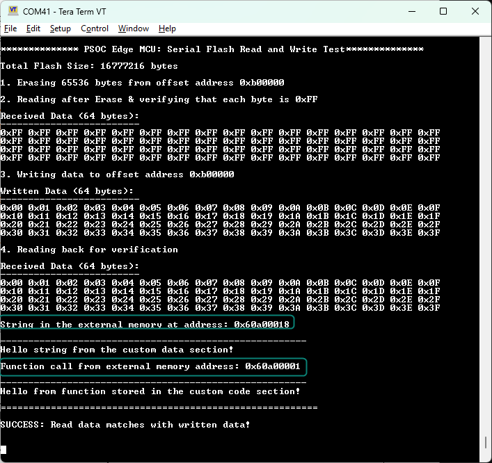

### Conclusion

This exercise successfully enabled the PSOC™ Edge E84 MCU to interface with memory using the SMIF block, and performed erase, read, and write operations using serial flash, in ModusToolbox™.

## Code example: PSRAM read and write in XIP mode

### Objective

This code example demonstrates how to interface an external PSRAM with the serial memory interface (SMIF) in the PSOC™ Edge E84 MCU. The example also shows how to perform read and write operations while in eXecute-In-Place (XIP) mode.

### Description

This code example uses an external PSRAM interfaced with the SMIF1 block in the PSOC™ Edge E84 MCU. First, the example initializes the SMIF1 block using serial-flash API functions. Next, it initializes the memory slot for the PSRAM based on the memory configuration done inside the QSPI configurator using PDL API functions.

An SMIF block supports accessing memory in two modes:

- MMIO (Memory-Mapped I/O) mode (**normal mode**): This mode accesses memory using offset addresses (assuming a start address of 0x0000 0000). To read / write data from memory, serial-flash API functions must be used
- XIP (eXecute-In-Place) mode (**memory mode**): This mode directly accesses memory using MCU addresses (the start address is as mentioned in the linker). No API is required to read data from memory. The data can be accessed through direct addresses mapped to the CPU (for example, 0x6034 0400)

This code example mainly focuses on read and write operations using XIP mode.

Then, the example configures the SMIF1 block to enter XIP mode to use the PSRAM as extended memory.

Finally, the example performs read and write operations on the PSRAM to demonstrate its functionality.

### Application flow

The example has a two-CPU (Arm® Cortex® M33 CPU (CM33) and Arm® Cortex® M55 CPU (CM55)), three-project structure, including CM33 Secure, CM33 Non-Secure, and CM55 projects. All three projects are programmed to the external QSPI flash interfaced to SMIF0 and executed in XIP mode.

The CM33 Non‑Secure project code starts with initializing clock and system resources in the BSP initialization function. Then, Retarget-IO is initialized to enable print logs for the example's output. Next, the SMIF1 HW block and memory slot are initialized to communicate with the external PSRAM.

After setting up the memory interface, the example sends a write enable command to the PSRAM, enabling write operations. Then, SMIF1 is set to XIP mode, allowing the PSOC™ Edge E84 MCU to execute code directly from the external PSRAM.

Finally, the example can perform read and write operations by directly pointing to PSRAM addresses mapped to the CPU.

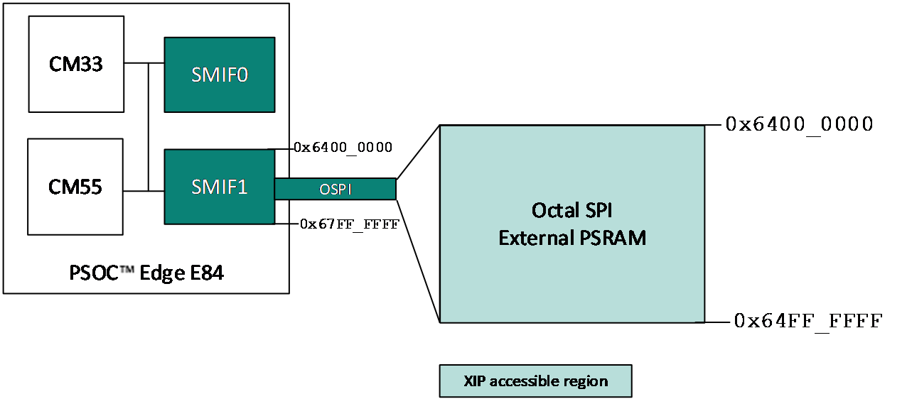

### Hardware overview

SMIF1:

- SMIF1.CLKP
- SMIF1.RWDS
- P0.1/SMIF1.select2
- P4[0:7]/SMIF1[0:7]
- P21.5/MEMORY\_RST

> [!NOTE] This example requires BOOT SW in ON position.

See [Appendix B: KIT\_PSE84\_EVAL details](pse84-technical-intro-features-training-manual-appendix-b.md) for more details.

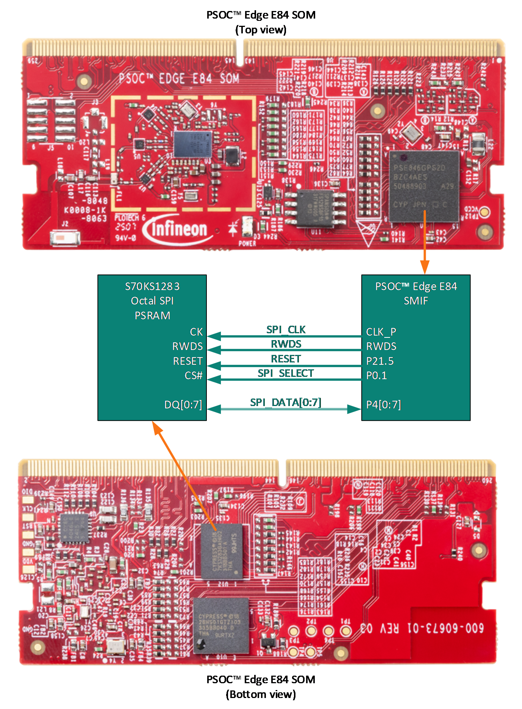

### Project creation

1. Follow steps in [Appendix A: Creating a PSOC™ Edge application in ModusToolbox™](pse84-technical-intro-features-training-manual-appendix-a.md) to create a new application
   When creating the application, select the **PSOC™ Edge PSRAM Read and Write in XIP mode** application under the **Peripherals** section.

   Note: To prevent issues with Windows path length, it’s recommended to rename the project if your workspace path is long.

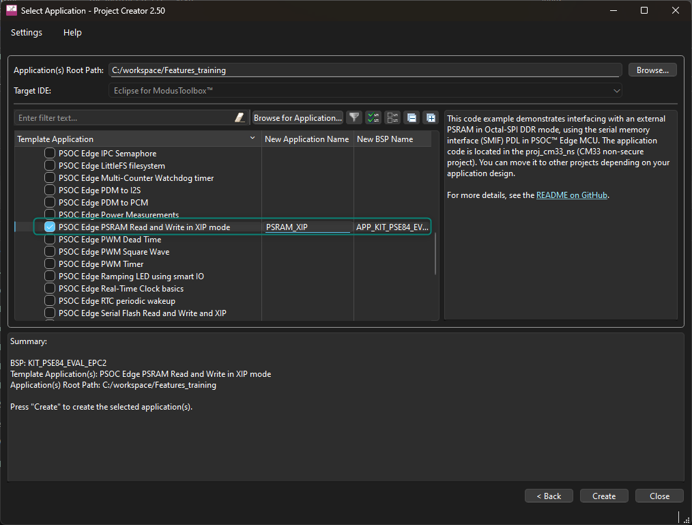

1. **Note**: The PSRAM example provides custom configurations to interface with the PSRAM in octal mode, which are stored in the ***design.cyqspi*** files under the templates directory. This file is copied to the BSPs directory during project creation and replaces the default configuration of the KIT\_PSOCE84\_EVK BSP. This updated configuration is necessary to ensure proper communication with the external PSRAM and enable the SMIF1 block to operate in octal mode

Open the **QSPI Configurator** from the ModusToolbox™ Tools view and observe the configuration of the octal SPI memory highlighted below:

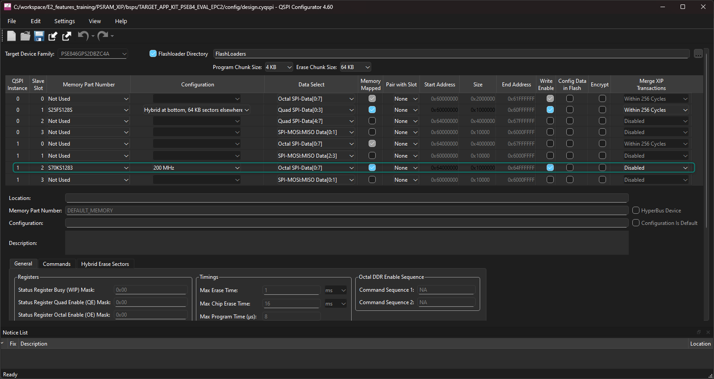

Observe the following fields:

- **QSPI Instance**: This memory is using SMIF1
- **Slave slot**: Using SMIF1\_select2
- **Memory Part Number**: Using the S70KS1283 Octal SPI PSRAM included in SOM
- **Configuration:** Memory is configured at 200MHz. Other frequencies are supported
- **Data select:** This memory is implemented in octal SPI configuration
- **Memory Mapped:** Enables XIP mode
- **Pair with Slot:** Dual quad operation is not used
- **Start Address/Size/End Address:** This memory is placed from 0x6400\_0000-0x64FF\_FFFF
- **Write Enable**: Write access is enabled
- **Config Data in Flash**: Configuration is placed in SRAM
- **Encrypt:** Encryption is not used
- **Merge XIP Transactions**: Transactions are not merged

1. From the Project Explorer window, expand the CM33 secure project and open the main.c file. `main.c` of the CM33_s project has application code for the PSRAM Read and Write in XIP
2. Open `proj_cm33_s/main.c` to observe the code flow. The initialization code is in four parts, as follows:
3. Initialize the SMIF1 using serial-flash and PDL APIs:

```c
static void smif_ospi_psram_init(void)
{
    cy_rslt_t result;

    /* Disable SMIF Block for reconfiguration. */
    Cy_SMIF_Disable(CYBSP_SMIF_CORE_1_PSRAM_HW);

    /* Initialize SMIF-1 Peripheral. */
    result = Cy_SMIF_Init((CYBSP_SMIF_CORE_1_PSRAM_hal_config.base),
                           (CYBSP_SMIF_CORE_1_PSRAM_hal_config.config),
                           SMIF_INIT_TIMEOUT_USEC, &smif_mem_context.smif_context);
    check_status("Cy_SMIF_Init failed", result);

    /* Configure Data Select Option for SMIF-1 */
    Cy_SMIF_SetDataSelect(CYBSP_SMIF_CORE_1_PSRAM_hal_config.base,
                          smif1BlockConfig.memConfig[0]->slaveSelect,
                          smif1BlockConfig.memConfig[0]->dataSelect);

    /* Enable the SMIF_CORE_1 block. */
    Cy_SMIF_Enable(CYBSP_SMIF_CORE_1_PSRAM_hal_config.base, &smif_mem_context.smif_context);

    /* Set-up serial memory. */
    result = mtb_serial_memory_setup(&serial_memory_obj,
                                      MTB_SERIAL_MEMORY_CHIP_SELECT_2,
                                      CYBSP_SMIF_CORE_1_PSRAM_hal_config.base,
                                      CYBSP_SMIF_CORE_1_PSRAM_hal_config.clock,
                                      &smif_mem_context,
                                      &smif_mem_info,
                                      &smif1BlockConfig);
    check_status("serial memory setup failed", result);
}
```

4. Configure SMIF1 to work in XIP mode (by default PDL configures SMIF in MMIO mode):

```diff
+/* Enable XIP mode for the SMIF memory slot associated with the PSRAM. */
+result = mtb_serial_memory_enable_xip(&serial_memory_obj, true);
+check_status("mtb_serial_memory_enable_xip: failed", result);
```

5. Send the command to enable write access:

```diff
+/* Enable write for the SMIF memory slot associated with the PSRAM. */
+result = mtb_serial_memory_set_write_enable(&serial_memory_obj, true);
+check_status("mtb_serial_memory_set_write_enable: failed", result);
```

6. Build and program the application

### Output

After successful programming, the application starts automatically. Confirm that the UART terminal displays the following terminal output:

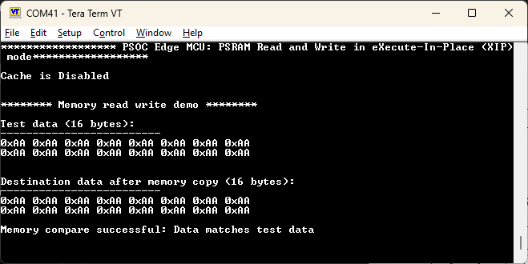

### Modify the application

#### Enable caching

The default example is not enabling the SMIF1 cache.

The cache can be enabled to make the SMIF1 region cacheable, with the attributes set to Write-Back and Read & Write Allocate, to demonstrate cache clean and invalidation operations.

When SMIF cache is enabled, the memory read / write operations pass through the SMIF cache and follows the cache properties and rules.

- **Cache clean:** When writing into the target memory in XIP mode, the data will be written to the cache first. Since cache is configured with the Write-back attribute, the data in cache and the target memory (MMIO read) will be different as seen from the terminal output. When the cache clean operation is carried out, the data is transferred from the cache to the target memory.
- **Cache invalidate:** Data is written to the target memory address using MMIO mode. Upon reading the same address using the XIP mode, the data will still be different from what was written. When performing cache invalidation, the data from the target memory now moves to the cache. The same can be observed from the terminal output.

#### Hints for the advanced modification

- The project includes a macro to enable cache in the main file

#### Solution

1. In `proj_cm33_s/main.c`, update the macro:

```diff
 /* Macros */
 #define CM33_NS_APP_BOOT_ADDR (CYMEM_CM33_0_m33_nvm_START + \
                                CYBSP_MCUBOOT_HEADER_SIZE)
-#define CACHE_ENABLE (0U)
+#define CACHE_ENABLE (1U)
 #define ADDRESS_SIZE_IN_BYTES (4U)
```

2. Rebuild and reprogram the application. Observe the cache clean and cache invalidate operations for the data written into the PSRAM with caching enabled

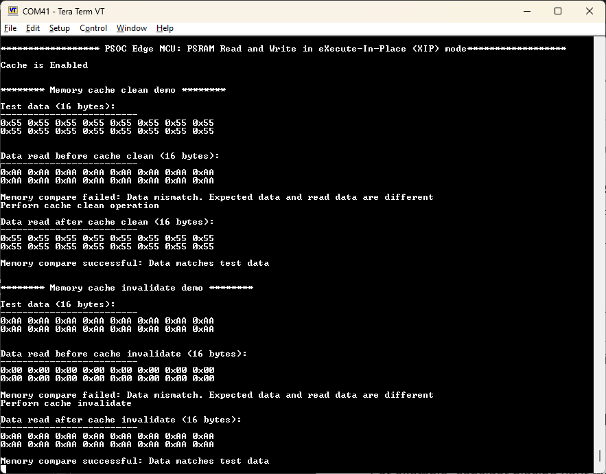

#### Placing an array to PSRAM

For this second modification, try modifying the application to place an array into the external PSRAM. This can be useful when requiring large chunks of data, such as a machine learning data model.

#### Hints for the advanced modification

- Use Memory Configurator to create a new section for data
- Modify the linker file to place data in the new section

#### Solution

1. Open **Device Configurator** from the ModusToolbox™ Tools view, then select the **Memory** tab, and expand the **SMIF block 1, memory 2** corresponding to the PSRAM memory

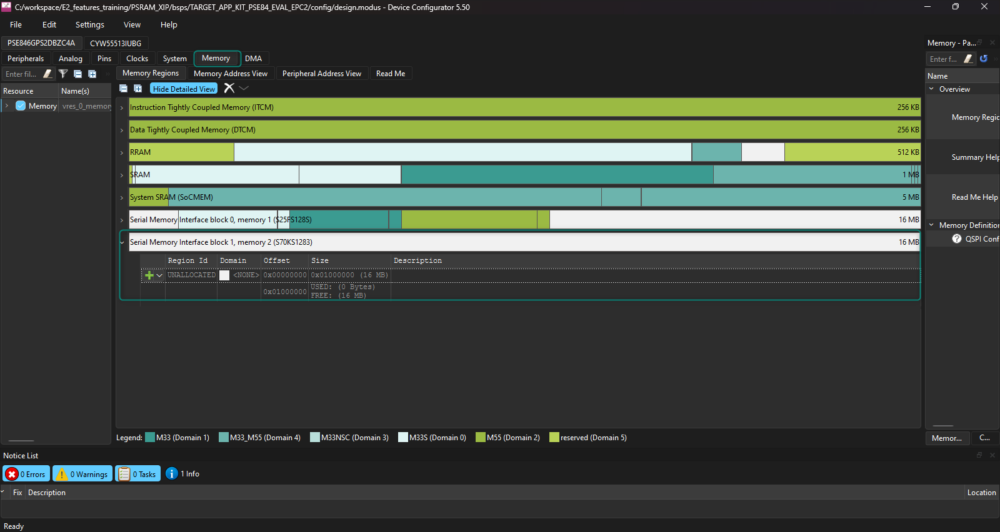

2. Click the plus sign in the unallocated region and select **Add region**
3. Type "data_psram" as **Region id**, select "M33S (Domain 0)" as the **Domain**, and select the **Offset** and **Size** to 0x0000000 and 0x01000000 respectively. This creates a custom 16 MB region accessible from the CM33 secure application from 0x74000000-0x74FFFFFF

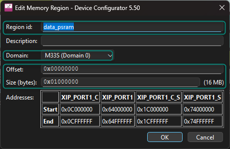

4. Click **OK** to save the new region. The Memory Regions will update as shown below:

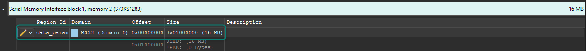

5. Open the **Memory Address View** panel and select the **CM33 (secure) core** to observe the new section in the memory map

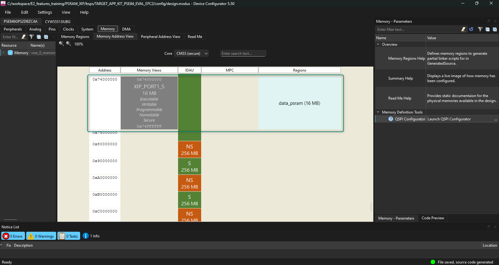

6. Save and close the device configurator. This will generate updated files for the project
7. Define new sections in the CM33_S linker file located at `<project_path>\bsps\TARGET_APP_KIT_PSE84_EVAL_EPC2\COMPONENT_CM33\TOOLCHAIN_GCC_ARM\pse84_s_cm33.ld`

   > [!NOTE] Observe that the prefix "_S" indicates that the memory is available in the secure domain.

```diff
 /* Define the sections */
 SECTIONS
 {
+    .psram_cm33_section (NOLOAD):
+    {
+        KEEP(*(.psram_cm33_section))
+    } > data_psram_S
+
     /* This section reserves a space for MCUBoot header */
```

8. In `proj_cm33_s/main.c`, add the following code to declare an array in the new section:

```diff
 /* Global Variables */
 static mtb_serial_memory_t serial_memory_obj;
 static cy_stc_smif_mem_context_t smif_mem_context;
 static cy_stc_smif_mem_info_t smif_mem_info;

+__attribute__((section(".psram_cm33_section"))) uint8_t data_array[100] = {0};
```

9. Then, add code to the main() function to view the array, modify it and read it back:

```c
#if (1U == CACHE_ENABLE)
    memory_cache_clean_demo(SMIF_1_PSRAM_SECURE_ADDRESS, TEST_DATA_2, NUM_BYTES_PER_LINE);
    memory_cache_invalidate_demo(SMIF_1_PSRAM_SECURE_ADDRESS, TEST_DATA_1, NUM_BYTES_PER_LINE);
#else
    memory_read_write_demo(SMIF_1_PSRAM_SECURE_ADDRESS, TEST_DATA_1, NUM_BYTES_PER_LINE);
#endif

/****** Modification Start ******/
printf("\n=========================\n\r");
printf("Modification\n\r");
printf("=========================\n\n\r");

printf("\r\nAddress of data_array = %p\n\r", (void *)data_array);
printf("data_array is populated with sequential numbers\n\r");
for (int i = 0; i < 16; i++)
{
    data_array[i] = i;
}
print_array("Read Data", data_array, 16);

printf("\r\nAddress of data_array = %p\n\r", (void *)data_array);
printf("Each element of data_array is incremented by 1\n\r");
for (int i = 0; i < 16; i++)
{
    data_array[i]++;
}
print_array("Read Data", data_array, 16);
/****** Modification End ******/

while (cy_retarget_io_is_tx_active());
```

10. Rebuild and reprogram the example. Observe that the array is placed in address 0x7400\_0000, which corresponds to the secure area in PSRAM accessed using SMIF1

A data array of 16 bytes has been populated in that region. Then, it is modified by adding 1 to each value, demonstrating successful read and write functionality of PSRAM.

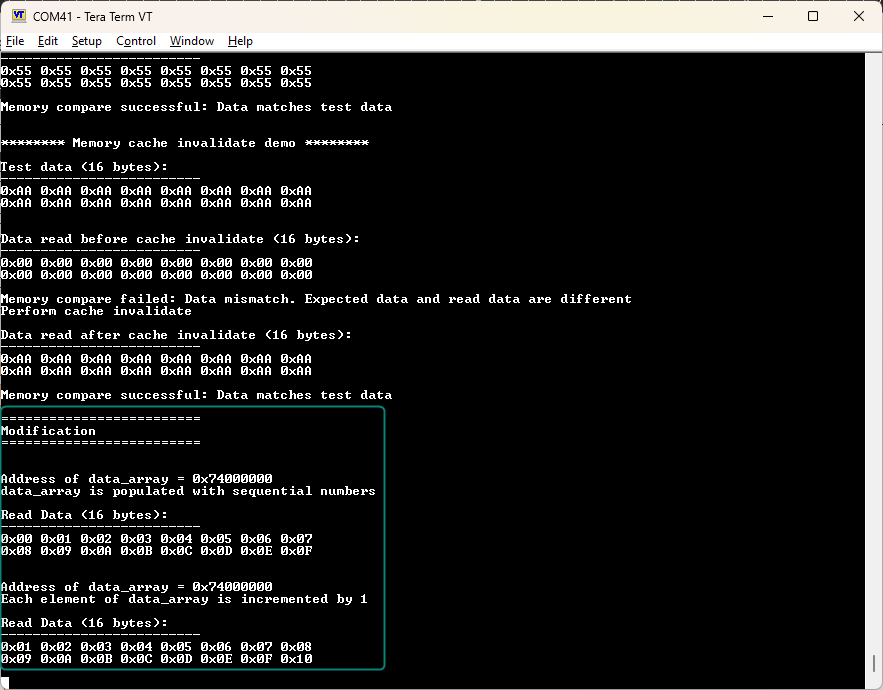

### Conclusion

This exercise successfully created an application to write and read PSRAM in XIP mode, using ModusToolbox™, demonstrating how to use the SMIF block of the PSOC™ Edge E84 MCU to interface PSRAM memory, and how to read and write in XIP mode.

### Revision history

| Document revision | Date       | Description of changes                                |
| ----------------- | ---------- | ----------------------------------------------------- |
| \*A               | 2026-09-26 | Updated to latest tools and using Visual Studio Code. |
|                   | 2025-01-15 | Initial release.                                      |

### Disclaimer
All referenced product or service names and trademarks are the property of their respective owners.

The Bluetooth&reg; word mark and logos are registered trademarks owned by Bluetooth SIG, Inc., and any use of such marks by Infineon is under license.

PSOC&trade;, formerly known as PSOC&trade;, is a trademark of Infineon Technologies. Any references to PSOC&trade; in this document or others shall be deemed to refer to PSOC&trade;.

---------------------------------------------------------

© Cypress Semiconductor Corporation, 2023-2026. This document is the property of Cypress Semiconductor Corporation, an Infineon Technologies company, and its affiliates ("Cypress").  This document, including any software or firmware included or referenced in this document ("Software"), is owned by Cypress under the intellectual property laws and treaties of the United States and other countries worldwide.  Cypress reserves all rights under such laws and treaties and does not, except as specifically stated in this paragraph, grant any license under its patents, copyrights, trademarks, or other intellectual property rights.  If the Software is not accompanied by a license agreement and you do not otherwise have a written agreement with Cypress governing the use of the Software, then Cypress hereby grants you a personal, non-exclusive, nontransferable license (without the right to sublicense) (1) under its copyright rights in the Software (a) for Software provided in source code form, to modify and reproduce the Software solely for use with Cypress hardware products, only internally within your organization, and (b) to distribute the Software in binary code form externally to end users (either directly or indirectly through resellers and distributors), solely for use on Cypress hardware product units, and (2) under those claims of Cypress's patents that are infringed by the Software (as provided by Cypress, unmodified) to make, use, distribute, and import the Software solely for use with Cypress hardware products.  Any other use, reproduction, modification, translation, or compilation of the Software is prohibited.
<br>
TO THE EXTENT PERMITTED BY APPLICABLE LAW, CYPRESS MAKES NO WARRANTY OF ANY KIND, EXPRESS OR IMPLIED, WITH REGARD TO THIS DOCUMENT OR ANY SOFTWARE OR ACCOMPANYING HARDWARE, INCLUDING, BUT NOT LIMITED TO, THE IMPLIED WARRANTIES OF MERCHANTABILITY AND FITNESS FOR A PARTICULAR PURPOSE.  No computing device can be absolutely secure.  Therefore, despite security measures implemented in Cypress hardware or software products, Cypress shall have no liability arising out of any security breach, such as unauthorized access to or use of a Cypress product. CYPRESS DOES NOT REPRESENT, WARRANT, OR GUARANTEE THAT CYPRESS PRODUCTS, OR SYSTEMS CREATED USING CYPRESS PRODUCTS, WILL BE FREE FROM CORRUPTION, ATTACK, VIRUSES, INTERFERENCE, HACKING, DATA LOSS OR THEFT, OR OTHER SECURITY INTRUSION (collectively, "Security Breach").  Cypress disclaims any liability relating to any Security Breach, and you shall and hereby do release Cypress from any claim, damage, or other liability arising from any Security Breach.  In addition, the products described in these materials may contain design defects or errors known as errata which may cause the product to deviate from published specifications. To the extent permitted by applicable law, Cypress reserves the right to make changes to this document without further notice. Cypress does not assume any liability arising out of the application or use of any product or circuit described in this document. Any information provided in this document, including any sample design information or programming code, is provided only for reference purposes.  It is the responsibility of the user of this document to properly design, program, and test the functionality and safety of any application made of this information and any resulting product.  "High-Risk Device" means any device or system whose failure could cause personal injury, death, or property damage.  Examples of High-Risk Devices are weapons, nuclear installations, surgical implants, and other medical devices.  "Critical Component" means any component of a High-Risk Device whose failure to perform can be reasonably expected to cause, directly or indirectly, the failure of the High-Risk Device, or to affect its safety or effectiveness.  Cypress is not liable, in whole or in part, and you shall and hereby do release Cypress from any claim, damage, or other liability arising from any use of a Cypress product as a Critical Component in a High-Risk Device. You shall indemnify and hold Cypress, including its affiliates, and its directors, officers, employees, agents, distributors, and assigns harmless from and against all claims, costs, damages, and expenses, arising out of any claim, including claims for product liability, personal injury or death, or property damage arising from any use of a Cypress product as a Critical Component in a High-Risk Device. Cypress products are not intended or authorized for use as a Critical Component in any High-Risk Device except to the limited extent that (i) Cypress's published data sheet for the product explicitly states Cypress has qualified the product for use in a specific High-Risk Device, or (ii) Cypress has given you advance written authorization to use the product as a Critical Component in the specific High-Risk Device and you have signed a separate indemnification agreement.
<br>
Cypress, the Cypress logo, and combinations thereof, ModusToolbox, PSOC, CAPSENSE, EZ-USB, F-RAM, and TRAVEO are trademarks or registered trademarks of Cypress or a subsidiary of Cypress in the United States or in other countries. For a more complete list of Cypress trademarks, visit www.infineon.com. Other names and brands may be claimed as property of their respective owners.
