# Chapter 6: Low Power (Pending update)

### About this document

## Scope and purpose

This document is the training manual for the technical introduction to PSOC™ Edge E84 features. This manual helps in getting started with different applications leveraging key features for PSOC™ Edge, using ModusToolbox™ software.

The training is divided into multiple chapters covering topics like audio, graphics, machine learning, among others.

Chapter 6 discusses PSOC™ Edge’s low-power features.

**Intended audience**

The document is intended for design engineers, technicians, and developers of electronic systems.

## Introduction

This manual provides detailed instructions to create, configure, build, and run several application code examples on the PSOC™ Edge E84 MCU.

## Prerequisites

See the [**Prerequisites** section](pse84-technical-intro-features-training-manual-ch1-intro.md#prerequisites) in the [**Chapter 1 training manual**](pse84-technical-intro-features-training-manual-ch1-intro.md). for a complete list of prerequisites and development tools.

## Code example: Power measurements

### Objective

This code example demonstrates how to configure and run low-power benchmarks for various PSOC™ Edge E84 MCU power modes such as Sleep, Deep Sleep, and Hibernate. Power measurements are done with different clock and power mode configurations matching the datasheet specifications.

### Description

The PSOC™ Edge E84 datasheet includes power specifications in various configurations of power mode, frequency, memories, and so on. Part of these specifications are shown in the following figure.

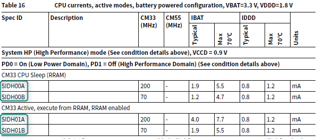

Note that PSOC™ Edge can be configured in two power distributions.

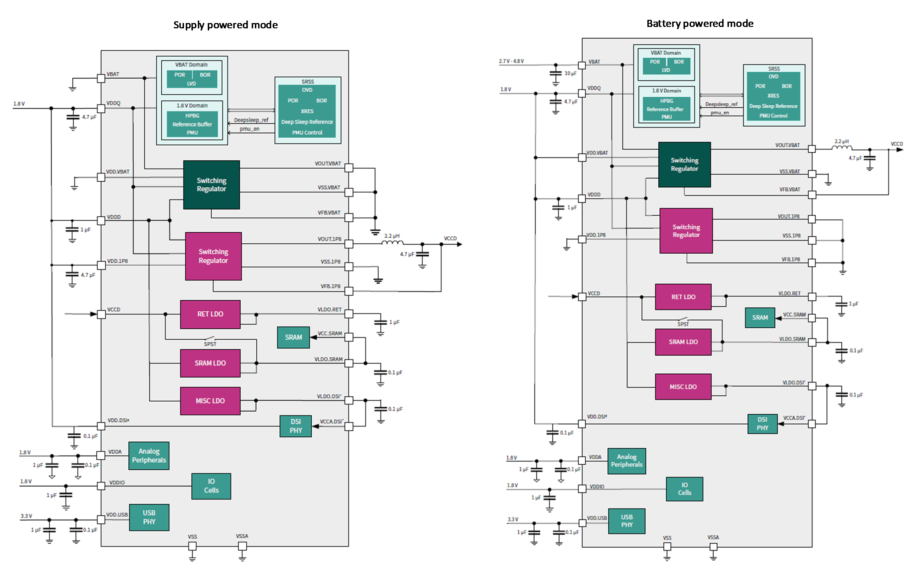

- Supply powered, only requires 1.8 V
- Battery powered, uses a battery (2.7 V-4.8 V) and 1.8 V

The SOM board included in the PSOC™ Edge EVK is configured in battery-powered mode, and thus, this configuration will be used for this training.

The code example used for this lab configures the clock frequencies and system power modes of the   
PSOC™ Edge E84 MCU for many of the configurations mentioned in the datasheet. You can select the desired configuration in the *specs.h* file.

After building and programming the application, you can measure the current consumed by the PSOC™ Edge E84 MCU. The code example uses both the Arm® Cortex®‑M33 CPU (CM33) and the Arm® Cortex®‑M55 CPU (CM55) to run the benchmark.

### Flow chart

In this code example, resource initialization is performed by the CM33 non-secure (CM33\_NS) code. It configures the system clocks, pins, clock-to-peripheral connections, and other platform resources. It then enables the CM55 core using the Cy\_SysEnableCM55() function.

The following flow chart explains the complete code flow of this code example:

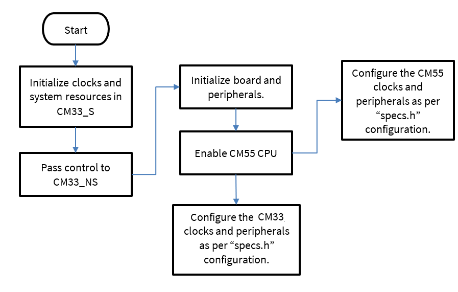

### Hardware overview

As mentioned in Description, the SOM board included with the PSOC™ Edge EVK is pre-configured in battery-powered mode, meaning that the device has a 3.3 V component (VBAT), and a 1.8 V component (VDDD, VDDQ, VDDIO, VCCD, and so on) .

The two power rails are measured using J25 and J26.

- J25 measures IDDD/IDDIO (1.8 V)
- J26 measures IBAT (3.3 V)

> [!NOTE] The code example README suggests measuring IDDD on FB1 and performing some hardware modifications to remove extra current from EVK. These suggestions give a more accurate measurement; however, they are not performed in this training since J25 provides an easier measurement for training purposes.

> [!NOTE] This example requires BOOT SW in OFF position.

See [Appendix B: KIT\_PSE84\_EVAL details](pse84-technical-intro-features-training-manual-appendix-b.md) for more details.

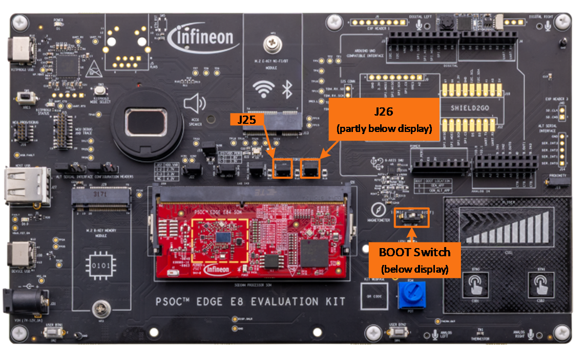

### Project creation

1. Follow steps in [Appendix A: Creating a PSOC™ Edge application in ModusToolbox™](pse84-technical-intro-features-training-manual-appendix-a.md) to create a new application
   When creating the application, select the **PSOC™ Edge Power Measurements** application under the **Peripherals** section.

   Note: To prevent issues with Windows path length, it’s recommended to rename the project if your workspace path is long.

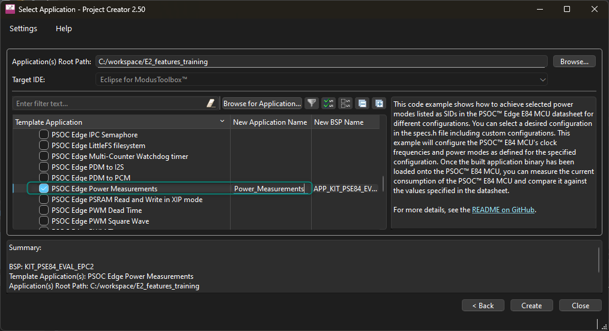

2. This code example supports different power configurations. Review the default device configuration in **Device Configurator**
3. Open Device Configurator from the ModusToolbox™ Tools view
4. Go to the **System** panel and select **System→Power** > **Power**

As observed below, the default settings set the device in High-performance (HP) mode which allows running the CM33 CPU up to 200MHz and the CM55 CPU up to 400MHz. The settings also show that System Deep Sleep is the default when going to low-power mode.

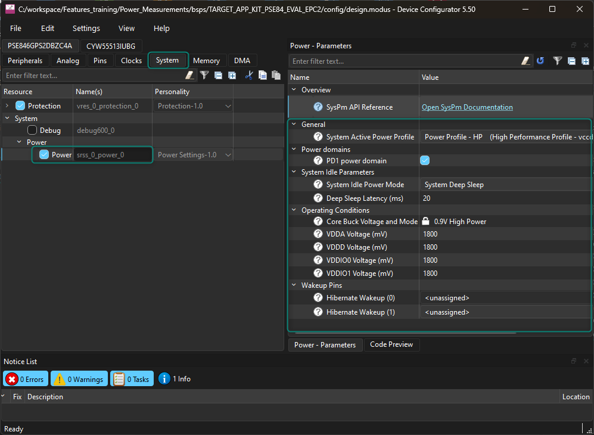

5. Now go to the **Clocks** panel
   As observed, the system uses DPLL\_LP0 at 400 MHz as the source for CM33 (CLK\_HF0) and for CM55 (CLK\_HF1); however, CLK\_HF0 has a divider to avoid exceeding its maximum frequency.

This view also shows the configuration of other clocks such as the other 2 DPLLs or CLK\_HF8, which are disabled by default.

The configuration for this code example is not necessarily the same as other examples. It’s important for a low-power application to configure clocks to the minimum viable frequency or disable them when unused.

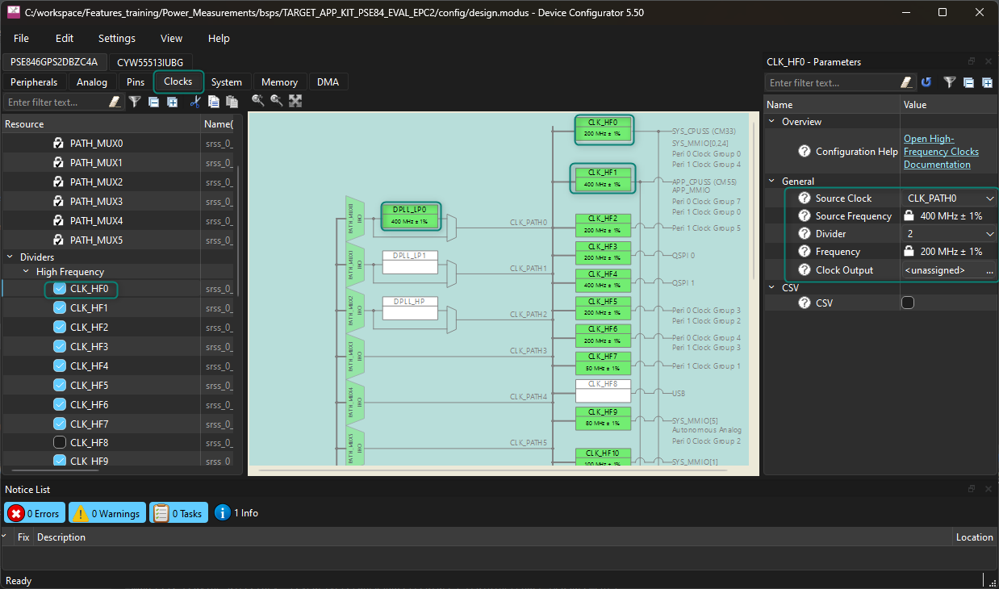

6. Now go to the **Peripherals** tab. Observe how this example disables most peripherals by default.
   It’s important to disable unnecessary peripherals when developing low-power applications.

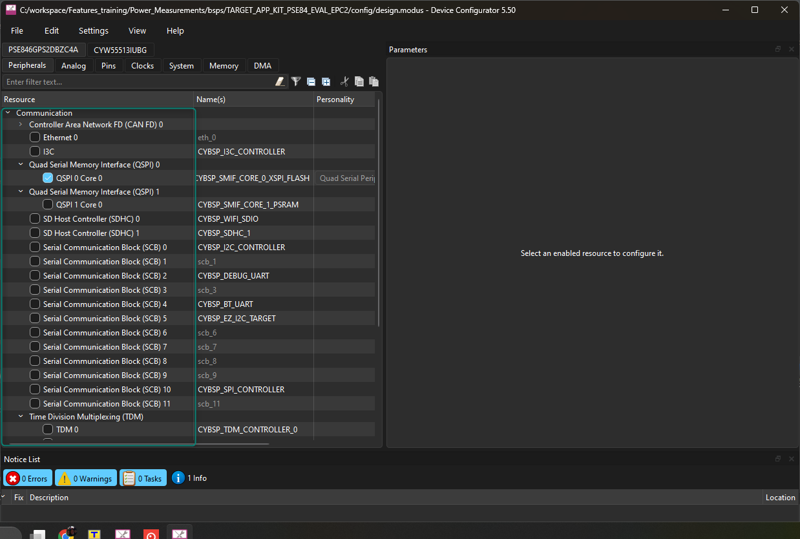

7. Lastly, go to the **Pins** tab and observe how this application only initializes minimal GPIOs. It’s important for applications to terminate pins properly to reduce power consumption
   The recommendation for PSOC™ Edge is that unused GPIOs should be configured in high-impedance drive mode with input buffer disabled, which is the default pin reset state.

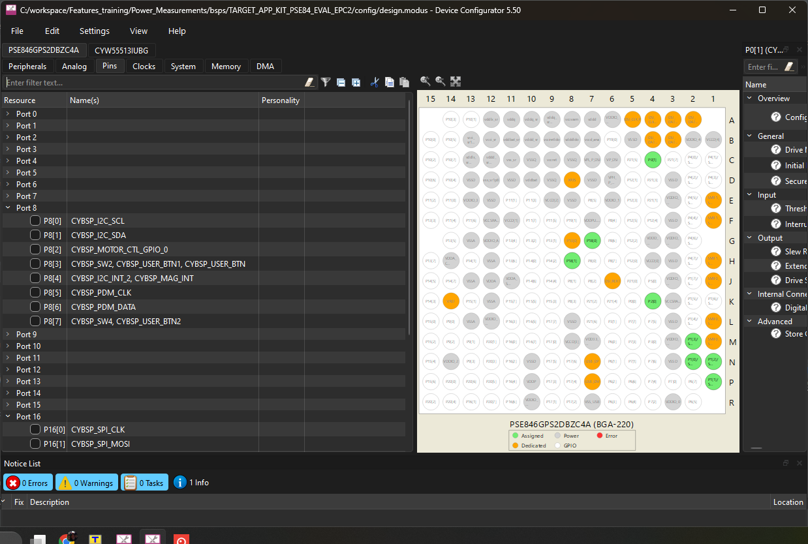

8. Now, analyze the default settings of the code example
9. Open `shared\include\specs.h`
10. Observe the definition of `SPEC_ID` which is set to 1, corresponding to **SIDH00A**.
   This configuration correlates to the datasheet spec SIDH00A, which, as observed below, is for the CM33 in sleep mode at 200 MHz, with the CM55 off.

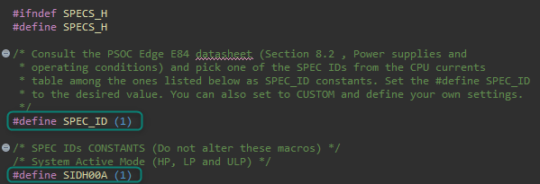

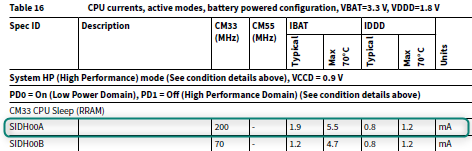

11. Build and program the application

### Output

After programming, the application starts automatically.

Use J25 and J26 to measure the current consumption with a multimeter.

**Table 1. Power calculation**

| Voltage (V) in volts | Current (I) in amps | Power (P) in watts |
| --- | --- | --- |
| VDDD = 1.8 V | IDDD = measure across J26 | PDDD = VDDD x IDDD |
| VBAT = 1.8 V | IBAT = measure across J25 | PBAT = VBAT x IBAT |

Total power = PDDD + PBAT. The EVK includes additional currents for external circuitry or the VDDIOx supplies. See the code example README for more details.

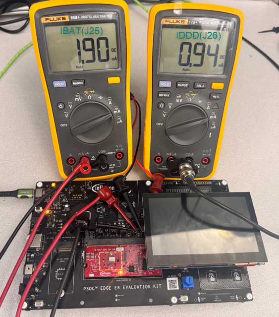

The power consumption should match the specification for SIDH00A, which sets CM33 in Sleep mode and the CM55 off. However, it’s important to note that the EVK includes some additional currents.

The code example README recommends some EVK modifications to reduce power consumption.

### Modify the application

#### Change system power mode

Try testing other power configurations.

#### Hints for the advanced modification

- `specs.h` includes definitions to configure the power modes

#### Solution

1. As observed previously, the example is configured to test SIDH00A by default; however, it's possible to test other configurations by simply modifying `SPEC_ID`
2. Modify `shared\include\specs.h` as shown below to test Hibernate mode:

```diff
 /* Consult the PSOC Edge E84 datasheet (Section 8.2, Power supplies and
  * operating conditions) and pick one of the SPEC IDs from the CPU currents
  * table among the ones listed below as SPEC_ID constants. Set the #define SPEC_ID
  * to the desired value. You can also set to CUSTOM and define your own settings. */
-#define SPEC_ID (1)
+#define SPEC_ID (20)
```

3. Rebuild, reprogram, and measure the power consumption

Note that the example is configured to match SIDHIBA, which configures the device in System Hibernate using no clocks.

As noted previously, the EVK includes some additional currents which are not considered in the datasheet; however, the measurement should be close.

The code example README recommends some EVK modifications to reduce power consumption.

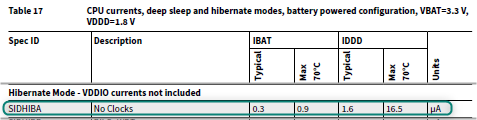

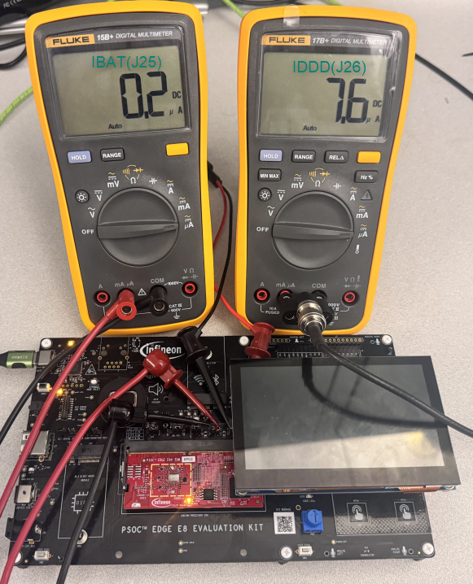

4. Try other macros in `spec.h`

Observe that a CUSTOM (21) configuration can also be used, allowing for more flexibility in the configuration.

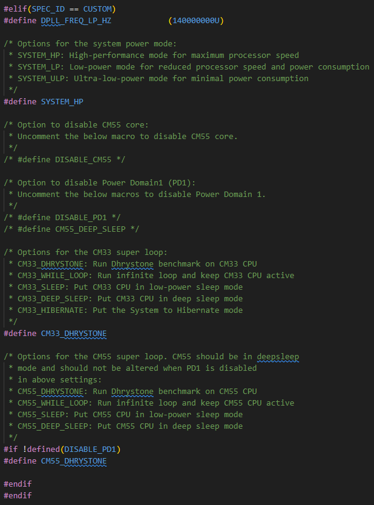

### Conclusion

This example develops a power measurement application for the PSOC™ Edge E84 MCU using ModusToolbox™. It configures the CM33 and CM55 in different power modes to measure power consumption.

## Code example: Switching power modes

### Objective

This code example demonstrates how to transition between the following system power modes in PSOC™ Edge E84 MCU:

- System High Performance (HP)
- System Low Power (LP)
- System Ultra Low Power (ULP)
- System Deep Sleep
- System Hibernate

This code example has a three-project structure: CM33 Secure, CM33 non-secure, and CM55. Extended Boot launches the CM33 Secure project present in RRAM from a fixed location, which then configures the external QSPI flash in XIP mode and launches the CM33 non-secure application. Additionally, CM33 non-secure application enables the CM55 CPU and launches the CM55 application in external flash.

### Description

In this code example, resource initialization is performed by this CM33 non-secure project. It configures the system clocks, pins, clock-to-peripheral connections, and other platform resources. It then enables the CM55 core using the Cy\_SysEnableCM55() function.

In the CM33 non-secure project, the clocks and system resources are initialized by the BSP initialization function.

The table below displays the configurations for different system power modes. It includes the VCCD voltage, the CM33 and the CM55 clock speeds.

**Table 2. System power modes**

| Power mode | VCCD | CM33 max clock | CM55 max clock |
| --- | --- | --- | --- |
| HP (System High Performance) | 0.9 V | 200 MHz | 400 MHz |
| LP (System Low Power) | 0.8 V | 70 MHz | 140 MHz |
| ULP (System Ultra Low Power) | 0.7 V | 50 MHz | 50 MHz |
| DS (System Deep Sleep) | 0.7 V | Off | Off |
| System Hibernate | Off | Off | Off |

### Hardware overview

As mentioned in Description, the SOM board included with the PSOC™ Edge EVK is pre-configured in battery-powered mode, meaning that the device has a 3.3 V component (VBAT), and a 1.8 V component (VDDD, VDDQ, VDDIO, VCCD, and so on) .

The two power rails are measured using J25 and J26.

- J25 measures IDDD/IDDIO (1.8 V)
- J26 measures IBAT (3.3 V)

> [!NOTE] The power measurements code example README suggests measuring IDDD on FB1 and performing some hardware modifications to remove extra current from EVK. These suggestions give a more accurate measurement; however, they are not performed in this training since J25 provides an easier measurement for training purposes.

> [!NOTE] This example requires BOOT SW in OFF position.

See [Appendix B: KIT\_PSE84\_EVAL details](pse84-technical-intro-features-training-manual-appendix-b.md) for more details.

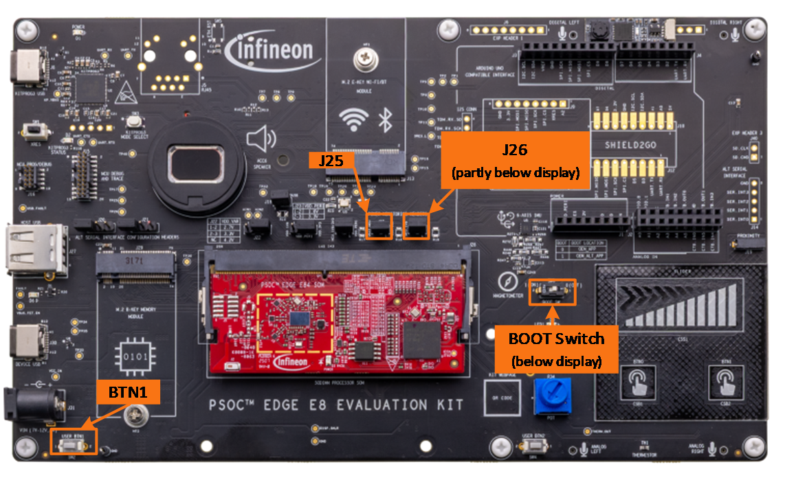

### Project creation

1. Follow steps in [Appendix A: Creating a PSOC™ Edge application in ModusToolbox™](pse84-technical-intro-features-training-manual-appendix-a.md) to create a new application
   When creating the application, select the **PSOC™ Edge Switching Power Modes** application under the **Peripherals** section.

   > [!NOTE] To prevent issues with Windows path length, it’s recommended to rename the project if your workspace path is long.

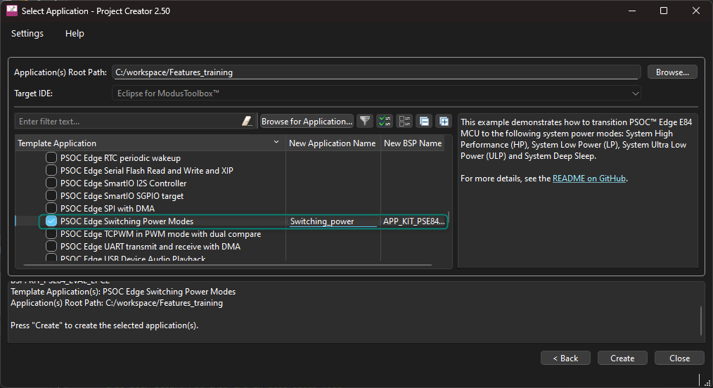

2. Build and program the application

### Output

After programming, the application automatically starts. To change the power mode, press USER BTN1 on the EVK. Measure the current consumption and note the difference in power consumption when the system changes power modes.

The following flow chart explains the complete code flow of this code example.

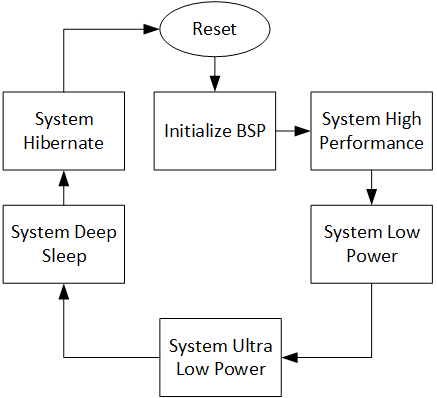

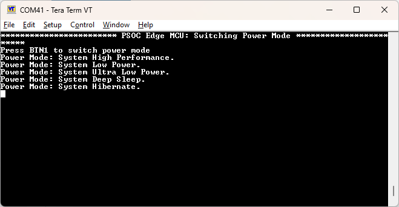

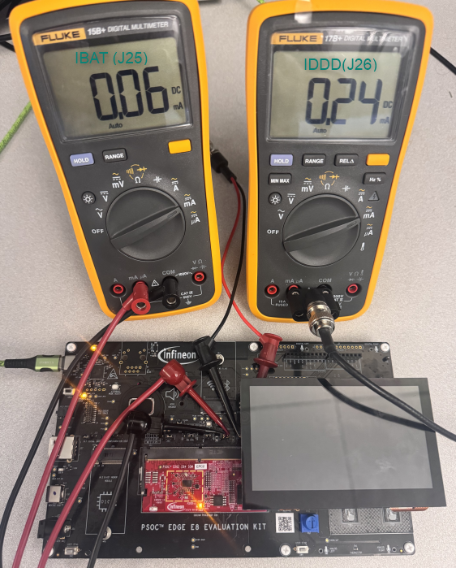

### Modify the application

#### Change the CPU frequency

The default code example is configuring the CM33 at 200 MHz in HP mode, 70 MHz in LP mode, and 50 MHz in ULP mode.

Try modifying the code to run the CM33 CPU at 100 MHz in HP mode and 25 MHz in ULP mode.

#### Hints for the advanced modification

- Use Device Configurator to check the clock configuration of the CPU
- Modify source code to configure clocks properly

#### Solution

1. The **Device Configurator** provides an easy way to observe the default clock configuration
   Open **Device Configurator** from the ModusToolbox™ Tools view and observe that the CPU is driven by CLK_HF0, which is derived from `DPLL_LP0/CLK_PATH0`.
   The DPLL\_LP0 is configured at 400 MHz, while the CLK\_HF0 has a divider of 2, resulting in 200 MHz for the CM33 CPU.

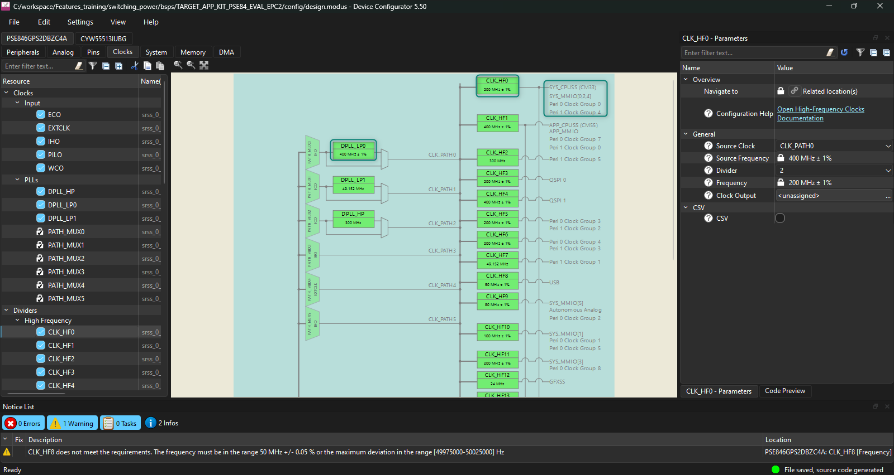

2. Now, observe how the code example is configuring the clocks in each mode

Open `cm33_ns/main.c` and observe the device configuration when HP mode is selected as shown in  

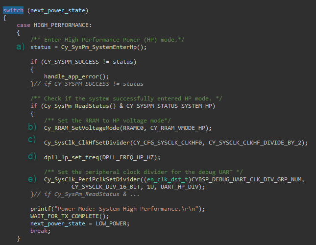

3. The system is placed into HP mode by calling `Cy_SysPm_SystemEnterHp`
4. The RRAM voltage is updated by calling `Cy_RRAM_SetVoltageMode`
5. `Cy_SysClk_ClkHfSetDivider` is called to set the CPU clock divider to 2
6. The local function `dpll_lp_set_freq` is called to set the DPLL frequency
7. Note that `DPLL_FREQ_HP_HZ` is set to 400 MHz (resulting in CPU frequency of 200 MHz after the divider)
8. Modifying the DPLL will also affect the UART clock, thus `Cy_SysClk_PeriPclkSetDivider` is used to configure the UART divider
9. In `cm33_ns/main.c`, modify the following code:

```diff
 /* Check if the system successfully entered HP mode. */
 if (Cy_SysPm_ReadStatus() & CY_SYSPM_STATUS_SYSTEM_HP)
 {
     /* Set the RRAM to HP voltage mode */
     Cy_RRAM_SetVoltageMode(RRAMC0, CY_RRAM_VMODE_HP);

-    Cy_SysClk_ClkHfSetDivider(CY_CFG_SYSCLK_CLKHF0, CY_SYSCLK_CLKHF_DIVIDE_BY_2);
+    Cy_SysClk_ClkHfSetDivider(CY_CFG_SYSCLK_CLKHF0, CY_SYSCLK_CLKHF_DIVIDE_BY_4);
     dpll_lp_set_freq(DPLL_FREQ_HP_HZ);

     /* Set the peripheral clock divider for the debug UART */
     Cy_SysClk_PeriPclkSetDivider((en_clk_dst_t)CYBSP_DEBUG_UART_CLK_DIV_GRP_NUM,
                                  CY_SYSCLK_DIV_16_BIT, 1U, UART_HP_DIV);
 }
 printf("Power Mode: System High Performance at %uMHz\r\n",
        Cy_SysClk_ClkHfGetFrequency(CY_CFG_SYSCLK_CLKHF0)/1000000);
 WAIT_FOR_TX_COMPLETE();
```

   > [!NOTE] Another option is to modify the DPLL0 frequency. This is optional; however, note that the UART clock divider must also be updated since the UART clock is derived from DPLL.

10. Now, divide the ULP clock as shown below:

```c
case ULTRA_LOW_POWER:
{
    /* Disable the high-performance DPLL and directly clock
     * from IHO (50 MHz) */
    Cy_SysClk_PllDisable(SRSS_DPLL_LP_0_PATH_NUM);

    /* Enter Ultra-Low Power (ULP) mode. */
    status = Cy_SysPm_SystemEnterUlp();
    if (CY_SYSPM_SUCCESS != status)
    {
        handle_app_error();
    }

    /* Check if the system successfully entered ULP mode. */
    if (Cy_SysPm_ReadStatus() & CY_SYSPM_STATUS_SYSTEM_ULP)
    {
        /* Set the RRAM to ULP voltage mode for lower consumption. */
        Cy_RRAM_SetVoltageMode(RRAMC0, CY_RRAM_VMODE_ULP);

        /* Set the high-frequency clock (CLKHF) to no divide */
        Cy_SysClk_ClkHfSetDivider(CY_CFG_SYSCLK_CLKHF0, CY_SYSCLK_CLKHF_DIVIDE_BY_2);

        /* Set the peripheral clock divider for the debug UART */
        Cy_SysClk_PeriPclkSetDivider((en_clk_dst_t)CYBSP_DEBUG_UART_CLK_DIV_GRP_NUM,
                                     CY_SYSCLK_DIV_16_BIT, 1U, UART_ULP_DIV);
    }
    printf("Power Mode: System Ultra Low Power at %uMHz\r\n",
           Cy_SysClk_ClkHfGetFrequency(CY_CFG_SYSCLK_CLKHF0)/1000000);
    WAIT_FOR_TX_COMPLETE();
    next_power_state = SYSTEM_DEEP_SLEEP;
    break;
}
```

    > [!NOTE] The DPLL is disabled in ULP mode and CLK\_HF0 is driven directly by the internal high frequency oscillator (IHO) at 50 MHz.

11. Rebuild, reprogram and test the results

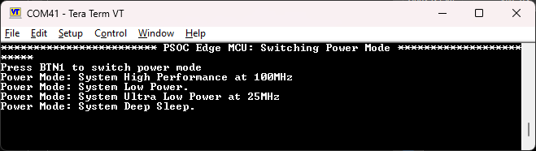

### Conclusion

This example successfully develops a PSOC™ Edge E84 MCU application to switch power modes using ModusToolbox™, and measures the power consumption in each mode.

Dynamic voltage and frequency scaling (DVFS) is a power management technique used in modern microcontrollers, including the PSOC™ Edge MCU, to optimize power consumption and performance. The concept of DVFS involves dynamically adjusting the voltage and frequency of the processor to match the required performance level, thereby reducing power consumption and heat generation.

> [!NOTE] Key principles of DVFS:

- **Voltage reduction**: Lowering the voltage supply to the processor reduces power consumption, as power is proportional to the square of the voltage
- **Frequency reduction**: Decreasing the processor frequency reduces power consumption, as power is proportional to the frequency
- **Voltage-frequency correlation**: To ensure stable operation, the frequency must be reduced before reducing the voltage, and the voltage must be increased before increasing the frequency. This is because a lower frequency requires a lower voltage to maintain stability, and a higher frequency requires a higher voltage to ensure reliable operation

**Why is this sequence important?**

If the voltage is reduced before reducing the frequency, the MCU may become unstable or even fail to operate correctly. Similarly, if the frequency is increased before increasing the voltage, the processor may stop working or even damage due to excessive voltage stress.

### Revision history

| Document revision | Date       | Description of changes                                |
| ----------------- | ---------- | ----------------------------------------------------- |
| \*A               | 2026-09-26 | Updated to latest tools and using Visual Studio Code. |
|                   | 2025-01-15 | Initial release.                                      |

### Disclaimer
All referenced product or service names and trademarks are the property of their respective owners.

The Bluetooth&reg; word mark and logos are registered trademarks owned by Bluetooth SIG, Inc., and any use of such marks by Infineon is under license.

PSOC&trade;, formerly known as PSOC&trade;, is a trademark of Infineon Technologies. Any references to PSOC&trade; in this document or others shall be deemed to refer to PSOC&trade;.

---------------------------------------------------------

© Cypress Semiconductor Corporation, 2023-2026. This document is the property of Cypress Semiconductor Corporation, an Infineon Technologies company, and its affiliates ("Cypress").  This document, including any software or firmware included or referenced in this document ("Software"), is owned by Cypress under the intellectual property laws and treaties of the United States and other countries worldwide.  Cypress reserves all rights under such laws and treaties and does not, except as specifically stated in this paragraph, grant any license under its patents, copyrights, trademarks, or other intellectual property rights.  If the Software is not accompanied by a license agreement and you do not otherwise have a written agreement with Cypress governing the use of the Software, then Cypress hereby grants you a personal, non-exclusive, nontransferable license (without the right to sublicense) (1) under its copyright rights in the Software (a) for Software provided in source code form, to modify and reproduce the Software solely for use with Cypress hardware products, only internally within your organization, and (b) to distribute the Software in binary code form externally to end users (either directly or indirectly through resellers and distributors), solely for use on Cypress hardware product units, and (2) under those claims of Cypress's patents that are infringed by the Software (as provided by Cypress, unmodified) to make, use, distribute, and import the Software solely for use with Cypress hardware products.  Any other use, reproduction, modification, translation, or compilation of the Software is prohibited.
<br>
TO THE EXTENT PERMITTED BY APPLICABLE LAW, CYPRESS MAKES NO WARRANTY OF ANY KIND, EXPRESS OR IMPLIED, WITH REGARD TO THIS DOCUMENT OR ANY SOFTWARE OR ACCOMPANYING HARDWARE, INCLUDING, BUT NOT LIMITED TO, THE IMPLIED WARRANTIES OF MERCHANTABILITY AND FITNESS FOR A PARTICULAR PURPOSE.  No computing device can be absolutely secure.  Therefore, despite security measures implemented in Cypress hardware or software products, Cypress shall have no liability arising out of any security breach, such as unauthorized access to or use of a Cypress product. CYPRESS DOES NOT REPRESENT, WARRANT, OR GUARANTEE THAT CYPRESS PRODUCTS, OR SYSTEMS CREATED USING CYPRESS PRODUCTS, WILL BE FREE FROM CORRUPTION, ATTACK, VIRUSES, INTERFERENCE, HACKING, DATA LOSS OR THEFT, OR OTHER SECURITY INTRUSION (collectively, "Security Breach").  Cypress disclaims any liability relating to any Security Breach, and you shall and hereby do release Cypress from any claim, damage, or other liability arising from any Security Breach.  In addition, the products described in these materials may contain design defects or errors known as errata which may cause the product to deviate from published specifications. To the extent permitted by applicable law, Cypress reserves the right to make changes to this document without further notice. Cypress does not assume any liability arising out of the application or use of any product or circuit described in this document. Any information provided in this document, including any sample design information or programming code, is provided only for reference purposes.  It is the responsibility of the user of this document to properly design, program, and test the functionality and safety of any application made of this information and any resulting product.  "High-Risk Device" means any device or system whose failure could cause personal injury, death, or property damage.  Examples of High-Risk Devices are weapons, nuclear installations, surgical implants, and other medical devices.  "Critical Component" means any component of a High-Risk Device whose failure to perform can be reasonably expected to cause, directly or indirectly, the failure of the High-Risk Device, or to affect its safety or effectiveness.  Cypress is not liable, in whole or in part, and you shall and hereby do release Cypress from any claim, damage, or other liability arising from any use of a Cypress product as a Critical Component in a High-Risk Device. You shall indemnify and hold Cypress, including its affiliates, and its directors, officers, employees, agents, distributors, and assigns harmless from and against all claims, costs, damages, and expenses, arising out of any claim, including claims for product liability, personal injury or death, or property damage arising from any use of a Cypress product as a Critical Component in a High-Risk Device. Cypress products are not intended or authorized for use as a Critical Component in any High-Risk Device except to the limited extent that (i) Cypress's published data sheet for the product explicitly states Cypress has qualified the product for use in a specific High-Risk Device, or (ii) Cypress has given you advance written authorization to use the product as a Critical Component in the specific High-Risk Device and you have signed a separate indemnification agreement.
<br>
Cypress, the Cypress logo, and combinations thereof, ModusToolbox, PSOC, CAPSENSE, EZ-USB, F-RAM, and TRAVEO are trademarks or registered trademarks of Cypress or a subsidiary of Cypress in the United States or in other countries. For a more complete list of Cypress trademarks, visit www.infineon.com. Other names and brands may be claimed as property of their respective owners.
