# Chapter 7: Machine Learning

### About this document

## Scope and purpose

This document is the training manual for the technical introduction to PSOC™ Edge E84 features. This manual helps in getting started with different applications leveraging key features for PSOC™ Edge, using ModusToolbox™ software.

The training is divided into multiple chapters covering topics like audio, graphics, machine learning, among others.

Chapter 7 discusses PSOC™ Edge’s machine learning (ML) features.

**Intended audience**

The document is intended for design engineers, technicians, and developers of electronic systems.

## Introduction

This manual provides detailed instructions to create, configure, build, and run several application code examples on the PSOC™ Edge E84 MCU.

## Prerequisites

See the [**Prerequisites** section](pse84-technical-intro-features-training-manual-ch1-intro.md#prerequisites) in the [**Chapter 1 training manual**](pse84-technical-intro-features-training-manual-ch1-intro.md). for a complete list of prerequisites and development tools.

### Tools for machine learning labs

Note that machine learning labs utilize the following additional tools:

- [DEEPCRAFT™ Studio](https://www.infineon.com/design-resources/embedded-software/deepcraft-edge-ai-solutions/deepcraft-studio) v5.14.5788 or later
- Create an [Imagimob account](https://account.imagimob.com/signup) to train models

## Code example: DEEPCRAFT™ ML data collection (IMU or PDM/PCM)

### Objective

To get started with the machine learning (ML) model, a ModusToolbox™ code example is used to collect data from sensors which can be imported into [DEEPCRAFT™ Studio](https://www.infineon.com/design-resources/embedded-software/deepcraft-edge-ai-solutions/deepcraft-studio).

This guide supports collecting data from two sources:

- Using an inertial measurement unit (IMU)
- Using a digital microphone via pulse-density modulation to pulse-code modulation (PDM/PCM)

> [!NOTE] Images and steps in this section are shown for IMU if the process between both flows is similar; otherwise, the guide explains the differences when using PDM/PCM.

### Description

The code example used in this guide demonstrates how to collect data by implementing the [DEEPCRAFT™ streaming protocol v2](https://developer.imagimob.com/deepcraft-studio/getting-started/tensor-streaming-protocol/registering-sensors-using-protocolv2), allowing the streaming of sensor data and other information from the PSOC™ Edge EVK into [DEEPCRAFT™ Studio](https://www.infineon.com/design-resources/embedded-software/deepcraft-edge-ai-solutions/deepcraft-studio) over USB.

The code example supports collecting data from different sources using the Cortex® M55 (CM55) CPU, including:

- Inertial measurement unit (IMU-BMI270),
- Magnetometer (BMM350),
- XENSIV™ digital MEMS microphones (IM73D122V01) using PDM/PCM,
- XENSIV™ digital barometric air pressure sensor (DPS368),
- Digital humidity and temperature sensor (SHT40T), and,
- XENSIV™ 60 GHz radar sensor (BGT60TR13C)

This guide will provide the steps to use IMU and microphone using PDM/PCM.

Data is transmitted over USB and will be used in subsequent steps to generate a model.

When using the IMU:

- The code example collects data from the IMU BMI270 included in the PSOC™ Edge EVK
- Data consists of the 3-axis accelerometer and 3-axis gyroscope data obtained from the IMU
- Data is read from IMU over I2C and then transmitted to the PC over USB
- The following configurations are supported by DEEPCRAFT™

The following table shows the supported configurations for IMU:

| Configuration | Ranges/Options |
| --- | --- |
| Frequency | 50 Hz, 100 Hz, 200 Hz, 400 Hz |
| Accelerometer | 2 G, 4 G, 8 G, 16 G |
| Gyroscope | 125 dps, 250 dps, 500 dps, 1000 dps, 2000 dps |
| Mode | Combined, Split, Only Accelerometer, Only Gyroscope |

When using the digital microphone:

- Data is collected from a digital microphone included in the PSOC™ Edge EVK using PDM to PCM
- Data is sampled at the rate configured in [DEEPCRAFT™ Studio](https://www.infineon.com/design-resources/embedded-software/deepcraft-edge-ai-solutions/deepcraft-studio) and transmitted over USB

The following table shows the supported configurations for PDM/PCM:

| Configuration | Ranges/Options |
| --- | --- |
| Gain | 83 dB, 77 dB, 71 dB, 65 dB, 59 dB, 53 dB, 47 dB, 41 dB, 35 dB, 29 dB, 23 dB, 17 dB, 11 dB, 5 dB, -1 dB, -7 dB, -13 dB, -19 dB, -25 dB, -31 dB, -37 dB, -43 dB, -49 dB, -55 dB, -61 dB, -67 dB, -73 dB, -79 dB, -85 dB, -91 dB, -97 dB, -103 dB |
| Frequency | 8 kHz, 16 kHz, 22.05 kHz, 44.1 kHz, 48 kHz |
| Stereo (Mode) | Yes, No |

### Hardware overview

- UART (transmit data)
	- P6\_7 (UART\_TX)
	- P6\_5 (UART\_RX)
- I2C (IMU)
	- P8.1 (SDA)
	- P8.0 (SCL)
- PDM/PCM (Audio)
	- P8\_6 (PDM\_Data)
	- P8\_5 (PDM\_CLK)
- USB device

* This example requires BOOT SW in ON position.

See [Appendix B: KIT\_PSE84\_EVAL details](pse84-technical-intro-features-training-manual-appendix-b.md) for more details.

### Project creation

1. Follow steps in [Appendix A: Creating a PSOC™ Edge application in ModusToolbox™](pse84-technical-intro-features-training-manual-appendix-a.md) to create a new application
   When creating the application, select the **PSOC™ Edge Machine Learning DEEPCRAFT Data Collection** application under the **Machine Learning** section.

   > [!NOTE] To prevent issues with Windows path length, it’s recommended to rename the project if your workspace path is long.

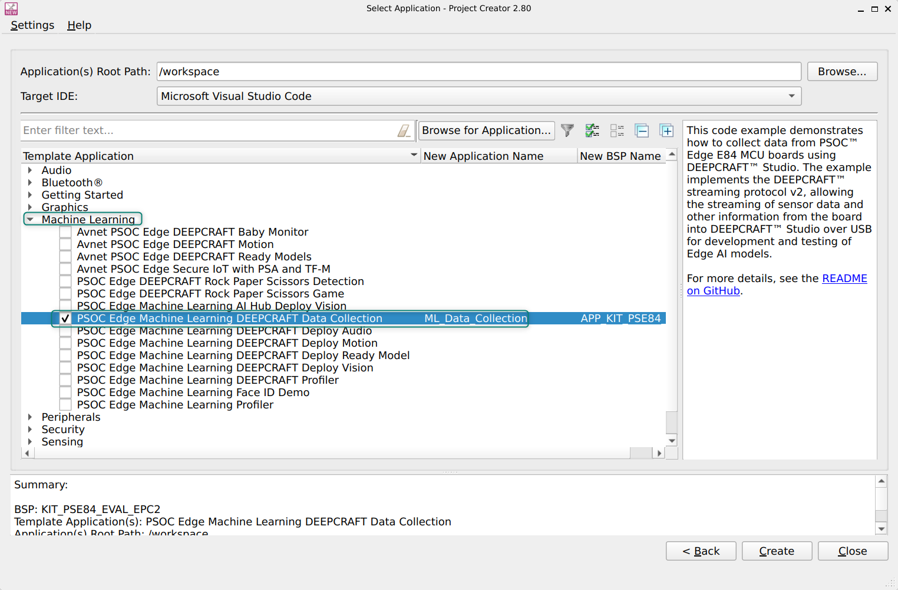
2. Build and program the application
3. The application will start running and you should observe the following output on a terminal connected to the kitProg USB (J8)

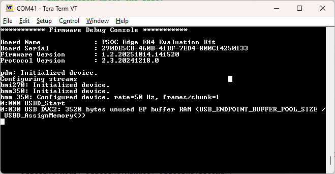

4. Connect a second USB cable to the USB device port available at J30.   
   This will enable the serial port for sensor data collection, and the following will be shown in the terminal.   
> [!NOTE] The terminal should be connected to the kitProg USB port, not to the USB device port, but it shows then a USB host is connected to the PSOC™ Edge USB device interface.

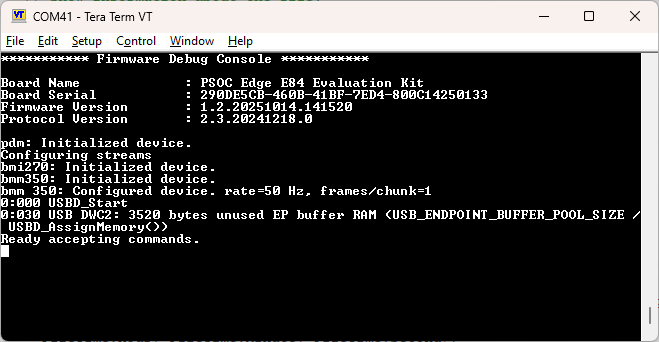

The device is ready to transmit data to [DEEPCRAFT™ Studio](https://www.infineon.com/design-resources/embedded-software/deepcraft-edge-ai-solutions/deepcraft-studio).

### Data collection with [DEEPCRAFT™ Studio](https://www.infineon.com/design-resources/embedded-software/deepcraft-edge-ai-solutions/deepcraft-studio) using Graph UX

[DEEPCRAFT™ Studio](https://www.infineon.com/design-resources/embedded-software/deepcraft-edge-ai-solutions/deepcraft-studio) includes Graph UX, an intuitive interface used to visualize end-to-end machine learning workflow as graphs. Graph UX is used here to perform live data collection using the IMU or microphone.

1. Open [DEEPCRAFT™ Studio](https://www.infineon.com/design-resources/embedded-software/deepcraft-edge-ai-solutions/deepcraft-studio) and start a new project by clicking on **File** > **New Project** or clicking the **New Project** button in the Welcome window

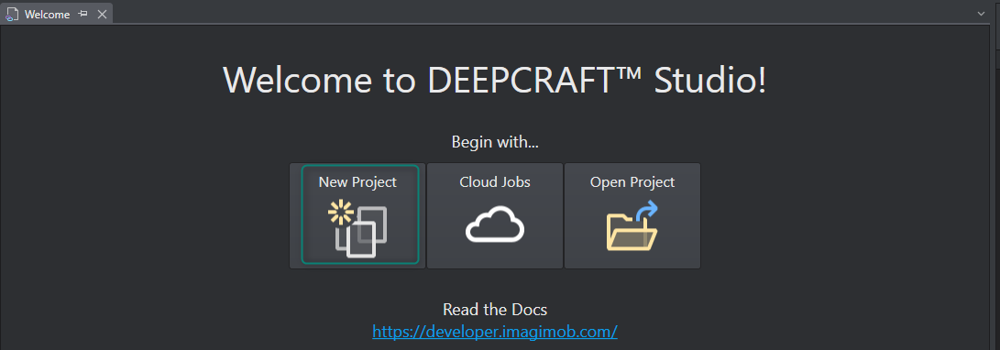

2. Select the **Templates** > **Graph UX** > **Generic** folder, click on **Empty Project**, add a **New Project Name** of your preference, and select a workspace **Location**

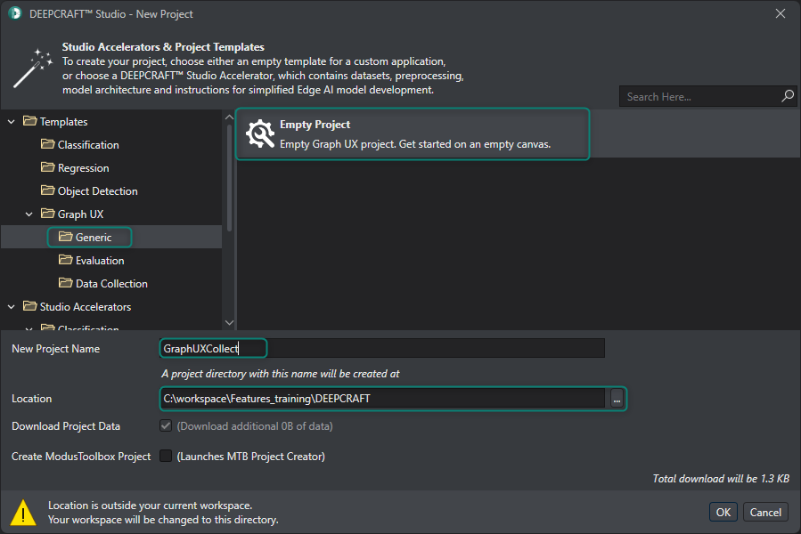

3. With the EVK programmed and running the DEEPCRAFT™ machine learning data collection example as explained earlier in this section, open the canvas *Main.imunit* and expand the **Boards** folder in the **Node explorer** panel

> [!NOTE] Observe how [DEEPCRAFT™ Studio](https://www.infineon.com/design-resources/embedded-software/deepcraft-edge-ai-solutions/deepcraft-studio) recognizes the PSOC™ Edge EVK and lists the sensors supported by this board.

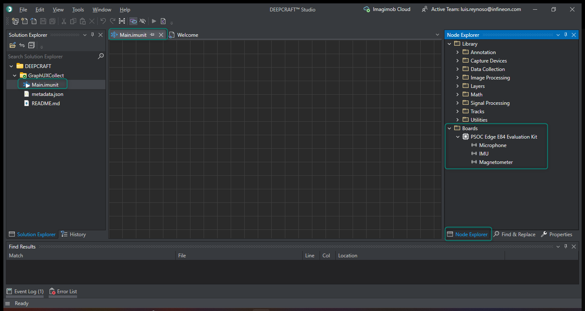

4. Drag-and-drop one of the corresponding sensors into the canvas
5. For IMU project, select the **IMU** component.   
   The sensor is preconfigured to 50Hz frequency, 8G range, 500dps and Combined mode, which is how the deploy project in the next steps expects it.

> [!NOTE] Note that the deploy example only expects accelerometer data without gyroscope.

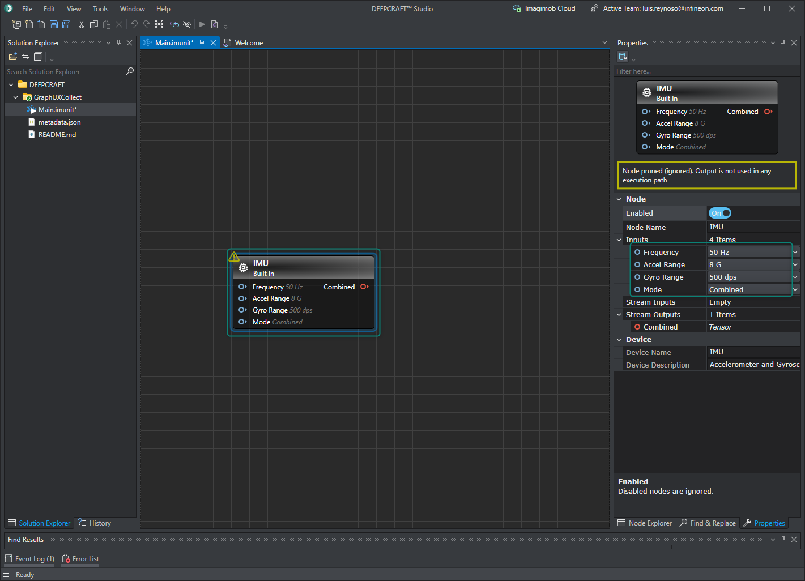

6. For PDM/PCM project, select the **microphone** component.  
   The sensor is preconfigured to 16kHz, 5dB gain, and mono mode, which is how the deploy project in the next steps expects it.

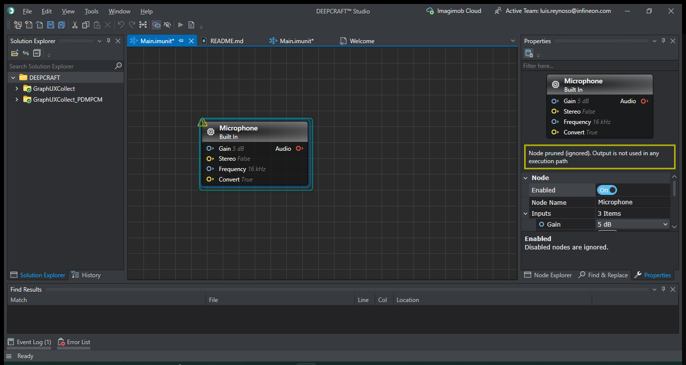

7. Streaming video data is not necessary to build a model, but it can be helpful in labeling data. Go to the **Node Explorer** and drag-and-drop the **Library** > **Capture Device** > **Local Camera** component

> [!NOTE] Note that [DEEPCRAFT™ Studio](https://www.infineon.com/design-resources/embedded-software/deepcraft-edge-ai-solutions/deepcraft-studio) allows to select the corresponding camera device if multiple cameras are connected to your PC.

8. For IMU project:

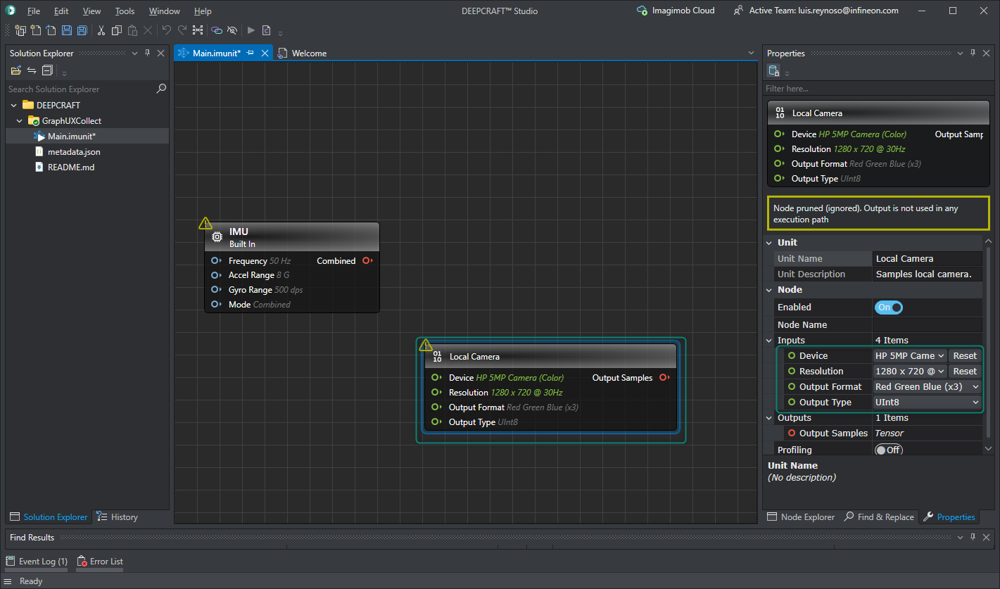

9. For PDM/PCM project, skip this step since capturing video is not as useful when labeling data
10. Visualization nodes help visualize data collected from sensors in the form of tracks in the session file.   
   Drag-and-drop corresponding **Tracks** from **Node Explorer** inside the **Library** > **Tracks** folder.
11. For IMU, drag-and-drop a **Data Track** and connect it to **IMU**; and a **Video Track** which must be connected to the **Local** **Camera** component

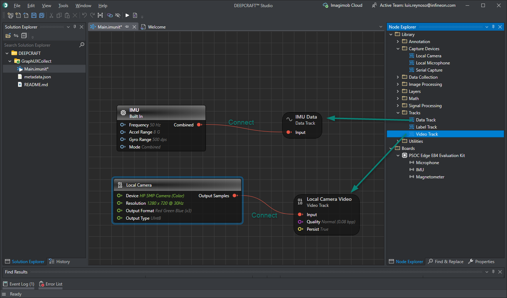

12. For PDM/PCM, drag-and-drop a **Data Track** and connect it to the **Microphone** component

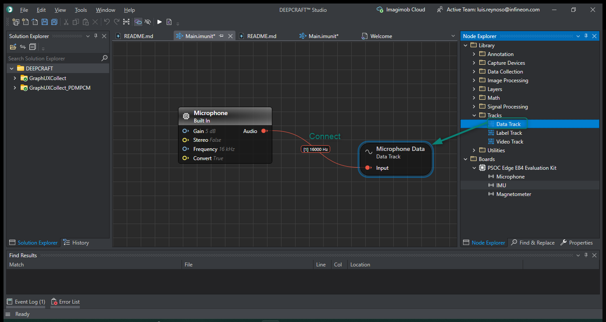

13. Real-time data can be labeled by adding a **Predefined Labels** component into the canvas. From the **Node Explorer**, drag-and-drop **the Library** > **Annotation** > **Predefined Labels** component into your canvas. Then, select it and label
14. For IMU, add the labels: **shaking and circle.** These labels are expected by the machine learning model used in the next steps

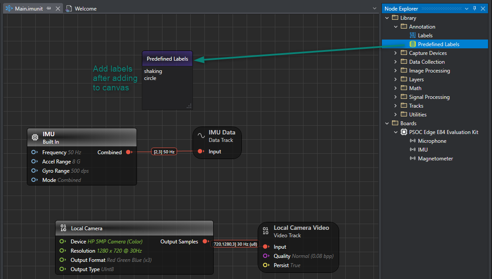

15. For PDM/PCM, add the label *`baby_cry`*. This label is expected by the machine learning model utilized in the next steps

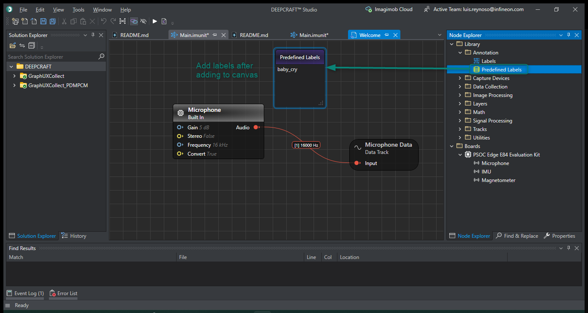

16. Now that data collection is ready, click the **Start** button to start the Graph UX live recording session

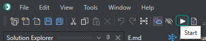

17. In the newly opened **live.imsession** window, click the **Start** button and observe the data. Select a predefined label to make it easier to detect each activity

> [!NOTE] You can use Alt+number to select different labels.

18. For IMU, perform the movement activities: **shaking** or **circle**

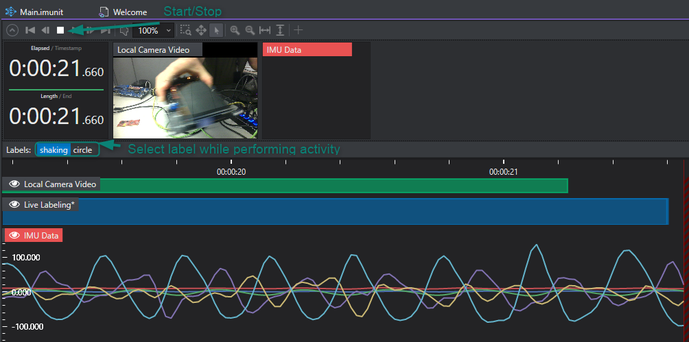

19. For PDM/PCM, play baby-crying sounds and click on the *`baby_cry`* label when sound is playing

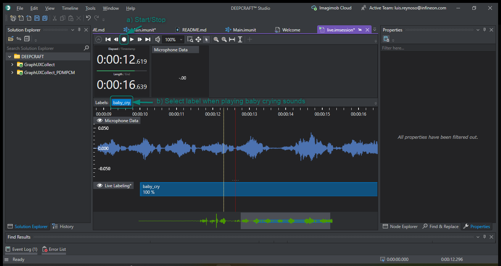

20. Click **Ctrl+S** or **File** > **Save**. A window will appear with information about the session. Select a **location**, **Session Name**, and modify **Track Options** if needed
21. For IMU, you should observe tracks for label, video and data:

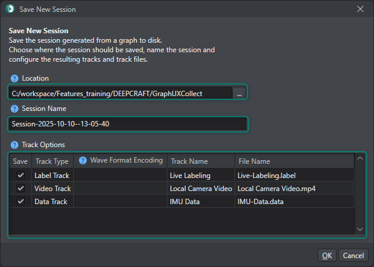

22. For PDM/PCM, you should observe tracks for audio data and label:

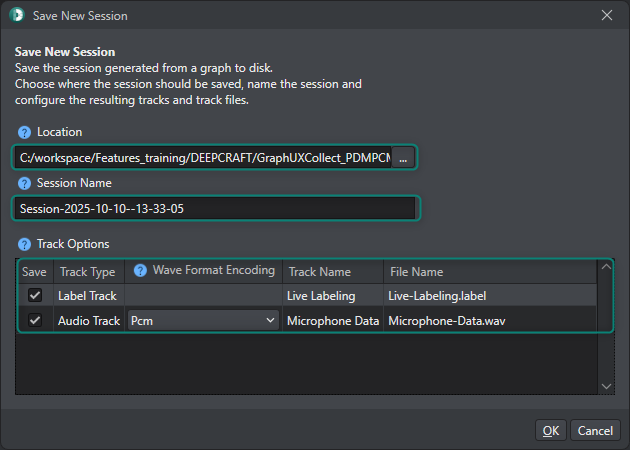

23. Repeat the process to record more data

These output files will be imported into [DEEPCRAFT™ Studio](https://www.infineon.com/design-resources/embedded-software/deepcraft-edge-ai-solutions/deepcraft-studio).

### Conclusion

This exercise successfully created a PSOC™ Edge E84 MCU application using ModusToolbox™ to collect data and transmit it to [DEEPCRAFT™ Studio](https://www.infineon.com/design-resources/embedded-software/deepcraft-edge-ai-solutions/deepcraft-studio) using Graph UX.

You should now have IMU and/or PDM/PCM data which will be used to train a machine learning model using [DEEPCRAFT™ Studio](https://www.infineon.com/design-resources/embedded-software/deepcraft-edge-ai-solutions/deepcraft-studio).

## [DEEPCRAFT™ Studio](https://www.infineon.com/design-resources/embedded-software/deepcraft-edge-ai-solutions/deepcraft-studio): Model creation and generation

### Objective

The previous section collected data to detect either different motion activities using IMU, or for baby crying detection using a microphone via PDM/PCM. This section goes through the steps of creating a model, data labeling, pre-processing, model generation, validation, and deployment using the data collected in the previous example.

> [!NOTE] Images and steps in this section are shown for IMU if the process between both flows is similar; otherwise, the guide explains the differences when using PDM/PCM.

### [DEEPCRAFT™ Studio](https://www.infineon.com/design-resources/embedded-software/deepcraft-edge-ai-solutions/deepcraft-studio) project creation

[DEEPCRAFT™ Studio](https://www.infineon.com/design-resources/embedded-software/deepcraft-edge-ai-solutions/deepcraft-studio) provides different templates for custom applications and accelerators, which contain datasets, pre-processing, model architecture, and instructions for simplified Edge AI model development. This session uses the **[DEEPCRAFT™ Studio](https://www.infineon.com/design-resources/embedded-software/deepcraft-edge-ai-solutions/deepcraft-studio) Accelerators** to detect movement types from IMU data and baby cry detection from audio data.

Follow the next steps to create the [DEEPCRAFT™ Studio](https://www.infineon.com/design-resources/embedded-software/deepcraft-edge-ai-solutions/deepcraft-studio) machine learning project:

1. In [DEEPCRAFT™ Studio](https://www.infineon.com/design-resources/embedded-software/deepcraft-edge-ai-solutions/deepcraft-studio), start a new project by clicking on **File** > **New Project** or clicking the **New Project** button in the Welcome window
2. Select the corresponding accelerator project in the **New Project** window, provide a **New Project Name,** and select the **Location.** Make sure **Download Project Data** is selected
3. For IMU, select Studio Accelerators > Classification > IMU and Vibration > Movement Type Detection

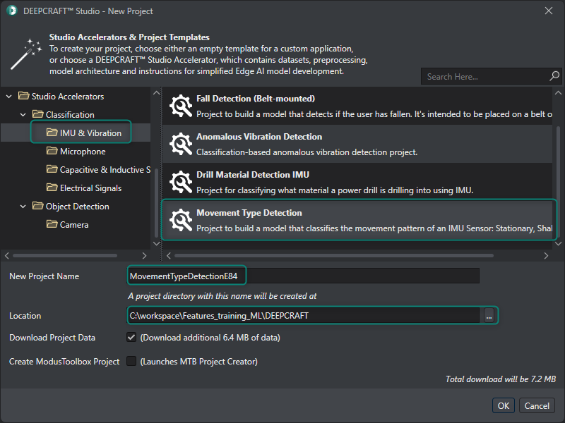

4. For PDM/PCM, select **Studio Accelerator** > **Classification** > **Microphone** > **Baby Cry Detection** **(Studio Accelerator)**

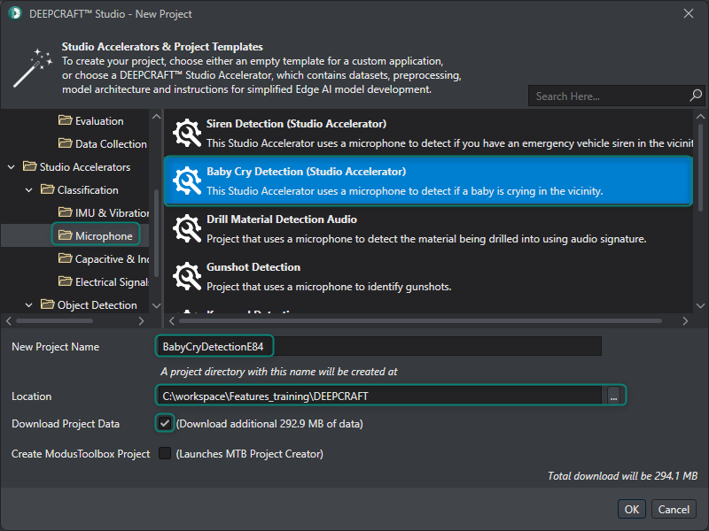

5. Observe that [DEEPCRAFT™ Studio](https://www.infineon.com/design-resources/embedded-software/deepcraft-edge-ai-solutions/deepcraft-studio) will download data in the background. This is an essential step since adding more data enables the project to generate a more accurate model. Click **OK** to close the window

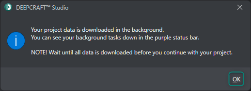

The project will be created, and the collected data can then be imported.

### [DEEPCRAFT™ Studio](https://www.infineon.com/design-resources/embedded-software/deepcraft-edge-ai-solutions/deepcraft-studio) data import

[DEEPCRAFT™ Studio](https://www.infineon.com/design-resources/embedded-software/deepcraft-edge-ai-solutions/deepcraft-studio) allows for easy importing of new data into a project. [DEEPCRAFT™ Studio](https://www.infineon.com/design-resources/embedded-software/deepcraft-edge-ai-solutions/deepcraft-studio) supports importing the file types in the following table.

**Table 3. Data formats supported in [DEEPCRAFT™ Studio](https://www.infineon.com/design-resources/embedded-software/deepcraft-edge-ai-solutions/deepcraft-studio)**

| Data type | File type |
| --- | --- |
| Audio | .wav |
| Data | .csv, .data, .label |
| Video | .mp4 |

Follow the next steps to import the previously collected data into [DEEPCRAFT™ Studio](https://www.infineon.com/design-resources/embedded-software/deepcraft-edge-ai-solutions/deepcraft-studio).

1. Open the corresponding project file (.improj) present in the Solutions Explorer tab

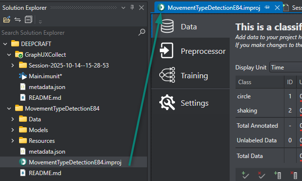

> [!NOTE] Select the* ***Data*** *tab and observe that the project already contains data to make it easier to generate a more accurate model. Double-click the files and observe the data. All imported data is labeled and classified.

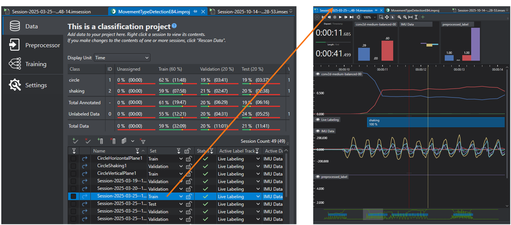

2. In the **improj** panel, go to the **Data** tab and click the **Add Data** button

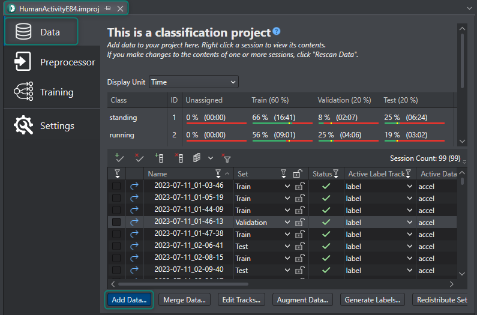

3. In the **Add Data** window, select the folder where the recorded data was stored. [DEEPCRAFT™ Studio](https://www.infineon.com/design-resources/embedded-software/deepcraft-edge-ai-solutions/deepcraft-studio) will show the number of detected tracks. Click **Next**

> [!NOTE] The image below shows steps for IMU which includes tracks for data, label, and optionally video if a camera was used. PDM/PCM data only includes the data and label tracks.

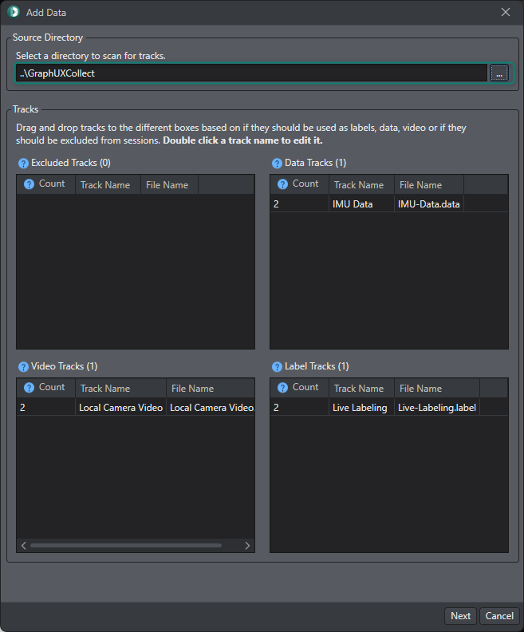

4. A new window will appear with a summary of the data. Click **OK.**

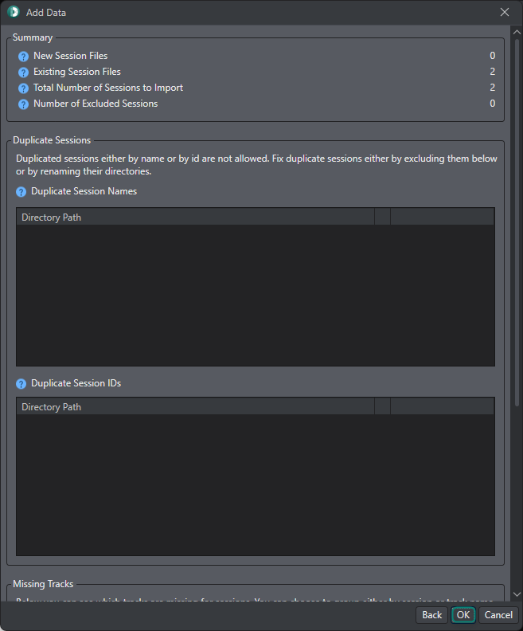

### Data labeling and set assignment

Data labeling allows labeling of raw data with expected classifications. When the model is being trained, the data is used, and the model gives a classification, which is then compared to the label given by the user. The model weights are then adjusted depending on whether the correct classification was achieved.

1. The data was previously labeled while collecting; however, [DEEPCRAFT™ Studio](https://www.infineon.com/design-resources/embedded-software/deepcraft-edge-ai-solutions/deepcraft-studio) allows adding and adjusting labels after data is imported

To observe and adjust or add labels of the newly imported data, follow the next steps:

1. In the data window, click on the **Set** filter, and select **Unassigned**. This will allow us to easily observe the newly added data

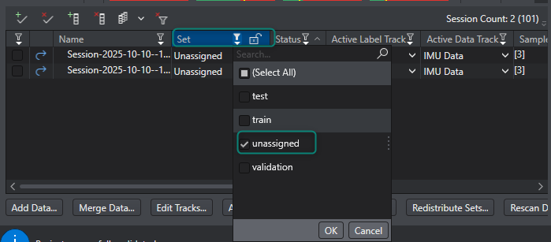

2. Double-click in any data entry
3. This will open the corresponding session, and the data and labels can be observed
4. Labels can be adjusted simply by dragging them to match the sensor data; or, they can be added by right-clicking on the data window and selecting **Add label**
5. When adding a new label, the following window will appear

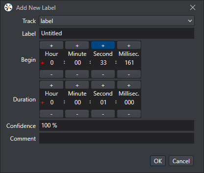

6. Configure the following parameters:

**Table 4. Parameters for new labels**

| Parameter | Description |
| --- | --- |
| Track | Select the label track in which you want to add the labels |
| Label | Enter the name of the label to add for that specific piece of data in the track |
| Begin | Set the timestamp from where the label starts |
| Duration | Set the timestamp for how long the label lasts |
| Confidence | Enter the confidence percentage for the input label |
| Comment | Comment for label, if required |

> [!NOTE] For IMU, the supported labels are:* ***circle and shaking**``; For PDM/PCM, only the` `*`baby_cry`** *label is implemented.

7. After a new label is created, it can then be manually adjusted by dragging the sides to make it longer or grabbing the middle of the label to move it
8. After labeling all the data, go back to the project file (\*.improj). Select **Save All**, then select **Rescan Data**, and then **Quick Scan** to ensure all labeling is registered by the project as shown in the figure below

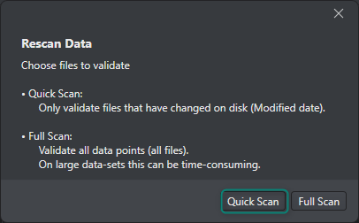

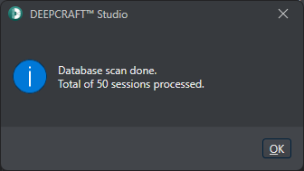

9. For the newly added data, select the drop-down menu under **Set** and set to **Train**

This sets the data as part of the training data set.

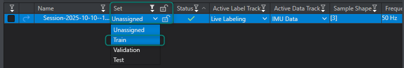

10. A recommended distribution is: 60% train, 20% validation, 20% test

The **Redistribution Sets** button can be used to redistribute collected data.

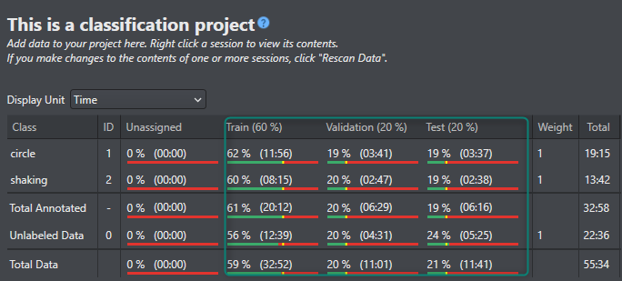

After the data is completely labeled and distributed, it can be used to train the model.

### Pre-processing

[DEEPCRAFT™ Studio](https://www.infineon.com/design-resources/embedded-software/deepcraft-edge-ai-solutions/deepcraft-studio) includes pre-processing that can be configured depending on the type of data being used. For this lab, the pre-processing pipeline is already set in the starter projects. It is encouraged to look at the preprocessor to get familiar with the process of adding layers.

1. To observe the pre-processing layers, select the **Preprocessor** tab
2. For IMU, the preprocessor uses a 50‑frame sliding window for evaluating data over a period of 2 seconds as the data rate is 50 Hz

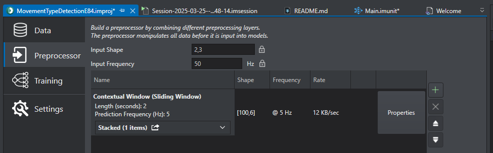

3. For PDM/PCM, the preprocessor includes the following layers: sliding window, Hann smoothing, real discrete Fourier transform, Frobenuis norm, Mel filterbank, clip, logarithm, and a second sliding window as shown in the figure below

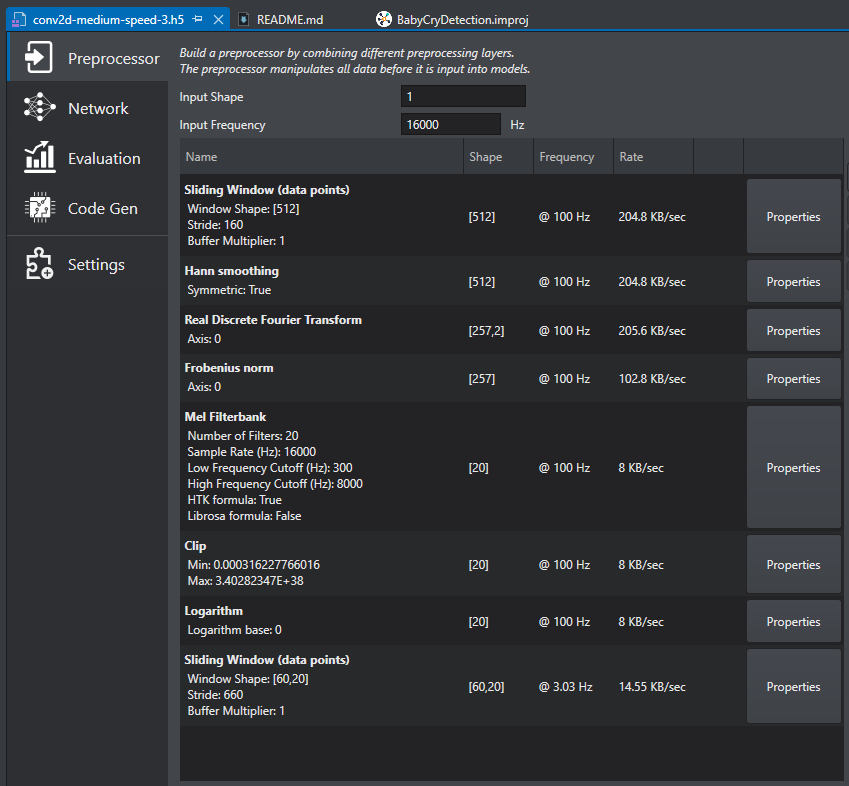

### Model generation

Once all data has been collected and the preprocessor is built, data needs to be passed to the model for training. The movement type detection and baby crying detection accelerator projects include four model architectures that are ready to be trained with your data.

1. To observe the supplied models, select the **Training** tab, and observe that four models are included

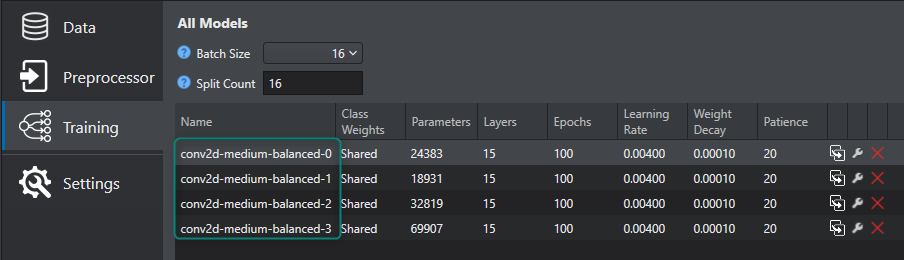

2. Select one of the four models generated by [DEEPCRAFT™ Studio](https://www.infineon.com/design-resources/embedded-software/deepcraft-edge-ai-solutions/deepcraft-studio). This brings up the corresponding model architecture
3. For movement type detection using IMU, the supplied model is a 2D convolutional neural network containing several convolutional layers, batch normalization, activation functions, pooling, and a dense layer for classification into three classes, as shown in the following image:

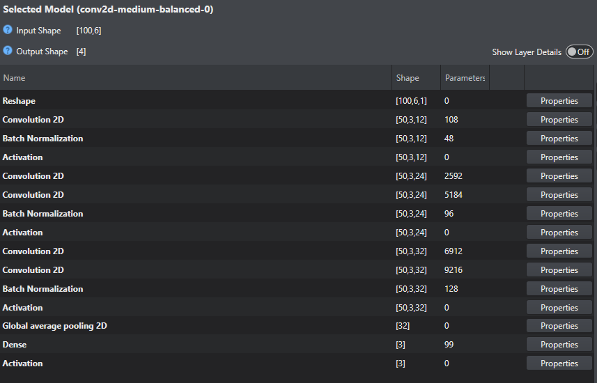

4. For baby crying detection using PDM/PCM, the detection model is a 2D convolutional neural network containing the following layers:

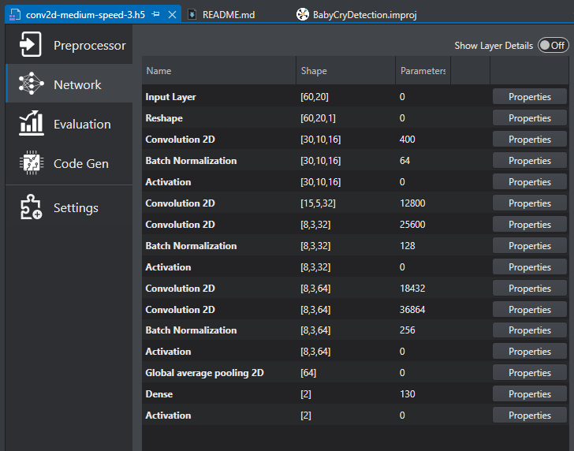

5. Layers can be added or removed by using the plus (+) and X buttons. This is not required for this lab as the models provided are ready for training
6. Start the model training by selecting **Start New Training Job**

7. If not signed in already, a prompt directs you to the DEEPCRAFT™ account sign-in to start the training
8. A **New Training Job** window comes up showing the available credits, and a Description window to add comments about the training job. Select **OK** to start the training job

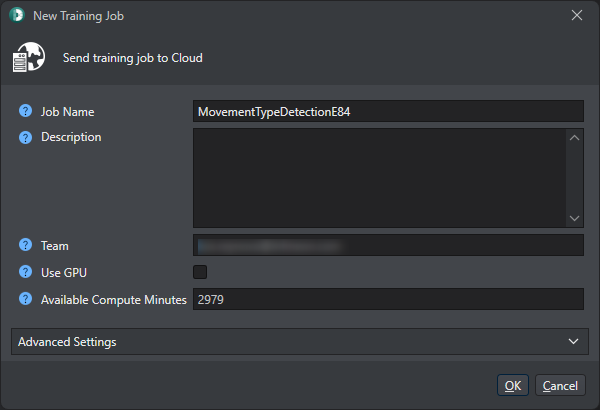

9. Once a training job is started, a window comes up asking if you want to open the current job. Select **Open**

A job screen will show up, showing statistics on the training progress.

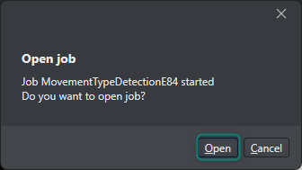

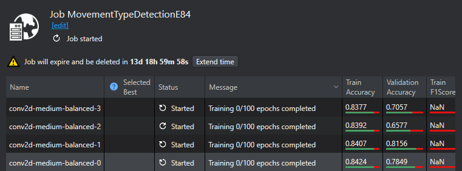

Once the **Status** for each model has changed from **Unknown** to **Started** to **Completed**, the model’s results can be validated.   
Select one of the models, and the training statistics for that model will display.

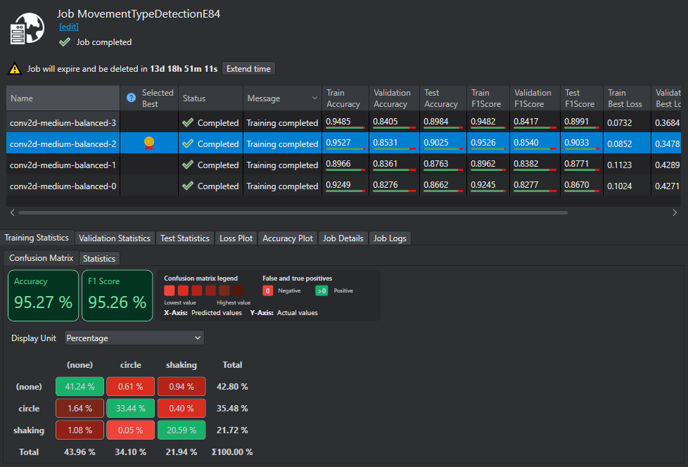

10. [DEEPCRAFT™ Studio](https://www.infineon.com/design-resources/embedded-software/deepcraft-edge-ai-solutions/deepcraft-studio) compares the model statistics and recommends the best model by putting a gold medal in the **Selected Best** category

> [!NOTE] Model development is an iterative process. If a model does not perform a**s needed, this may mean that more training data is needed, the preprocessor needs to be reconfigured, or the model layers needs to be changed.

11. When a model meets the user’s criteria, the model can be downloaded using the **Download** icon next to the model

A **Download Model Files** windowcomes up. Click on **Download**, select the **Models** folder inside the [DEEPCRAFT™ Studio](https://www.infineon.com/design-resources/embedded-software/deepcraft-edge-ai-solutions/deepcraft-studio) project, then select **OK**.

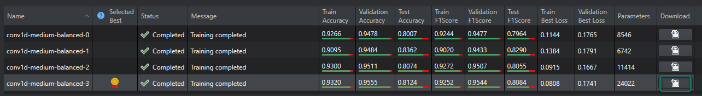

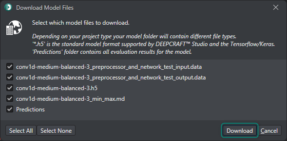

A model was created and trained with default data from the DEEPCRAFT™ accelerator, and additional data captured using PSOC™ Edge.

### Generate model files

The last step in [DEEPCRAFT™ Studio](https://www.infineon.com/design-resources/embedded-software/deepcraft-edge-ai-solutions/deepcraft-studio) is to generate the machine learning model files.

Along with generating a model, [DEEPCRAFT™ Studio](https://www.infineon.com/design-resources/embedded-software/deepcraft-edge-ai-solutions/deepcraft-studio) generates files for the pre-processing that was selected for the project. To use the preprocessor, three functions are provided:

**Table 5. Model functions**

| Function | Description |
| --- | --- |
| IMAI\_init | Initializes the preprocessor |
| IMAI\_enqueue | Feeds the preprocessor data |
| IMAI\_dequeue | Returns a buffer with the preprocessed data, which is used to get an inference |

To generate the files required for deployment:

1. Following the steps from the previous section, the model should be available in   
   `{[DEEPCRAFT™ Studio](https://www.infineon.com/design-resources/embedded-software/deepcraft-edge-ai-solutions/deepcraft-studio) project}/Models/{model name}`

Double-click the \*.h5 model in this folder.

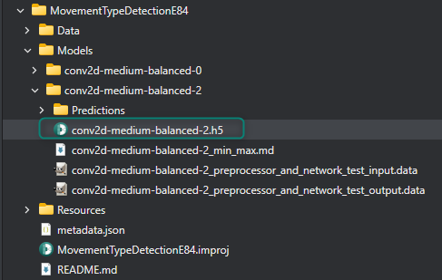

2. A new page with model information is displayed

Observe that this window includes information about the Model’s **Preprocessor**, **Network**, and **Evaluation,** but it also allows to generate code for the model using the **Code Gen** tab.   
Try navigating through the different tabs to observe the model configuration and evaluation results.

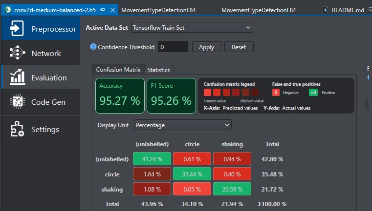

3. Select the **Code Gen** tab and configure the parameters.  
> [!NOTE] The Code Gen tab allows you to generate output that can then be used in an embedded device.

**Table 6. Code generation for IMU using CM55+U55 with int8x8 quantization**

| Parameter | Value | Description |
| --- | --- | --- |
| Architecture | Infineon PSOC™ | Generate code for PSOC™ MCU |
| Target Device | PSOC™ Edge M55/U55 | Generate code for M55 CPU + U55 NPU |
| Output directory | Infineon | Project folder for output files |
| Output File Prefix | model | Prefix to match corresponding deploy code example |
| C Prefix | IMAI\_ | Prefix to match deploy code example |
| ModusToolbox™ Project Path | Blank | Files created locally and will be copied manually |
| Preprocessor Acceleration | CMSIS Floating Point (Float32) | Use CMSIS floating point library |
| Enable Network Quantization | Enabled | Use 8-bit quantization. |
| Use Project File | Select corresponding .improj file | Select DEEPCRAFT™ .improj project file for quantization. |
| Enable Sparsity | Disabled | Sparsity disabled |
| Skip cleanup | Disabled | Enable cleanup of temporary files |
| Ethos™-U Tensor Allocator | Hill Climb | Using Hill Climb algorithm for allocating non‑constant tensors on the NPU and CPU |
| Ethos™-U System Config | SOCMEM 300MHz | Using SOCMEM/SystemSRAM at 300MHz |
| Ethos™-U Optimize | Performance | Performance strategy prioritizes maximal performance by utilizing the specified arena cache memory area size |
| Ethos™-U Memory Mode | Shared Sram | Shared SRAM is shared between Ethos™-U and Cortex®-M software |
| Max Block Dependency | 3 | Maximum value that can be used for the block dependency delay between NPU kernel operations. A lower value may result in longer execution time. |
| Recursion Limit | 1000 | Python internal limit to depth of recursion. If generation fails with a recursion error, increase the limit using this option. |
| Arena Cache Size | 2936012 | Size of the arena cache memory area, in bytes |

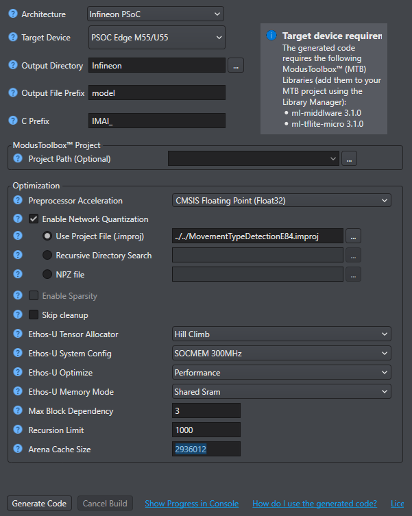

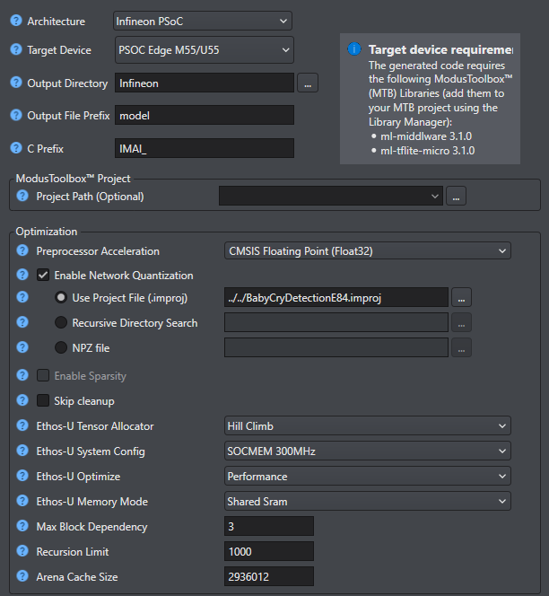

4. Select **Generate Code** to generate the source.   
   A **Code Generation Report** will appear after completion.

The generated files will be available under `Models/{model name}/Infineon folder`.

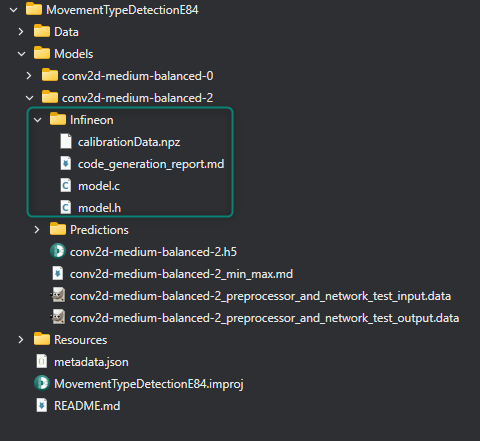

### Conclusion

This exercise successfully generated model files with the addition of the previously collected data.

These model files are now ready to be deployed onto a PSOC™ Edge E84 MCU device once they are copied to the ModusToolbox™ deploy project.

## Code example: DEEPCRAFT™ ML deploy (IMU or PDM/PCM)

### Objective

Now that the model is created and trained, it’s time to deploy it. This section demonstrates how to deploy a model onto a PSOC™ Edge E84 MCU device.

ModusToolbox™ includes deploy examples for IMU and PDM/PCM, and the projects can be configured to run the model on the Arm® Cortex®‑M55 CPU leveraging the Arm® Ethos™‑U55 NPU (M55/U55), or the Arm® Cortex®‑M33 CPU (CM33).

> [!NOTE] Images and steps in this section are shown for IMU if the process between both flows is similar; otherwise, the guide explains the differences when using PDM/PCM.

### Description

ModusToolbox™ includes the following code examples to deploy ML models:

- PSOC™ Edge Machine learning DEEPCRAFT™ Deploy Motion: for deploying IMU-based movement type detection model
- PSOC™ Edge Machine learning DEEPCRAFT™ Deploy Audio: for deploying PDM/PCM-based baby crying detection model

These examples use the output of DEEPCRAFT™ code generation to deploy the model to the device.

#### Description of movement type detection project

The **movement type detection** model takes data from the BMI270 motion sensor. The data consists of the 3-axis accelerometer data and 3-axis gyroscope data obtained from the BMI270 IMU at 50 Hz. The MCU receives the data from the IMU once every 200ms using an internal FIFO within the BMI270 IMU, and the IMU then triggers a hardware interrupt so that the PSOC™ Edge MCU can receive the data and perform data processing.

The interrupt handler reads all the data from the sensor via I2C and feeds it to the [DEEPCRAFT™ Studio](https://www.infineon.com/design-resources/embedded-software/deepcraft-edge-ai-solutions/deepcraft-studio) preprocessor using the `IMAI_enqueue()` function. After the preprocessor has enough data, the `IMAI_dequeue()` function returns the results as scores corresponding to each label. All label scores, along with the label corresponding to the maximum score, are printed on the UART terminal.

The pre-processing layer uses a 50‑frame sliding window and is shown in Pre-processing.

The model is a 2D convolutional neural network model consisting of several convolutional layers, as shown in Model generation.

#### Description of baby crying detection project

The **baby crying detection** model processes audio data from the pulse-density modulation (PDM) microphone to detect whether a baby is crying or not.

Input data is received as raw audio from the PDM microphones, then converted to PCM using the built-in PDM/PCM converter block. The received PCM data has a 16kHz sampling rate and it is fed into the audio processing code generated by [DEEPCRAFT™ Studio](https://www.infineon.com/design-resources/embedded-software/deepcraft-edge-ai-solutions/deepcraft-studio) using the `IMAI_enqueue()` function after 1024 samples are received. After the processing is done, the `IMAI_dequeue()` function returns the results in the form of scores corresponding to each of the labels.

All the label scores, along with the label corresponding to the maximum score beyond a threshold, are printed on the UART terminal.

The pre-processing layer is shown in section 4.5.

This project uses a 2D convolutional neural network model, as shown in section 4.6.

### Hardware overview

- UART (Transmit data):
- P6\_7 (UART\_TX)
- P6\_5 (UART\_RX)
- GPIO (User button):
- P8\_3 (USER\_BTN1)
- I2C (IMU):
- P8.1 (SDA)
- P8.0 (SCL)
- PDM/PCM (Audio):
- P8\_6 (PDM\_Data)
- P8\_5 (PDM\_CLK)
- USB device

> [!NOTE] This example requires BOOT SW in ON position.

See [Appendix B: KIT\_PSE84\_EVAL details](pse84-technical-intro-features-training-manual-appendix-b.md) for more details.

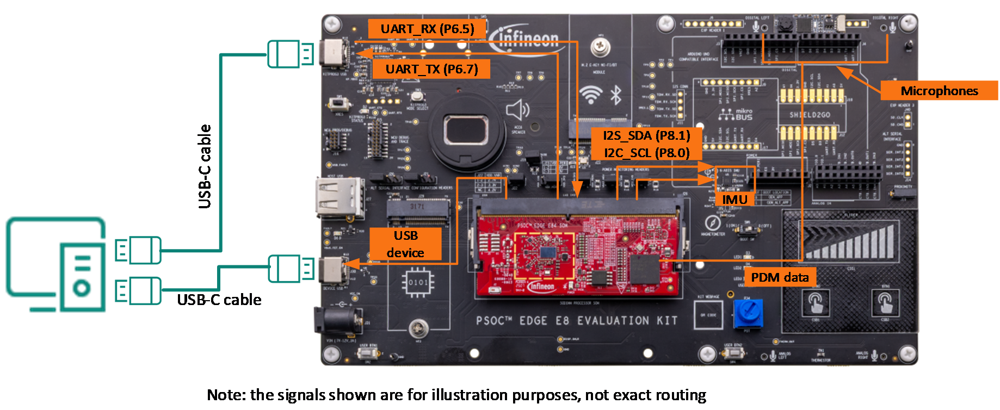

### Project creation

1. Follow steps in [Appendix A: Creating a PSOC™ Edge application in ModusToolbox™](pse84-technical-intro-features-training-manual-appendix-a.md) to create a new application
2. Select the corresponding application, depending on whether you are using IMU or PDM/PCM

   Note: To prevent issues with Windows path length, it’s recommended to rename the project if your workspace path is long.

3. For IMU, select the PSOC™ Edge Machine Learning DEEPCRAFT™ Deploy Motion application under the **Machine Learning** section

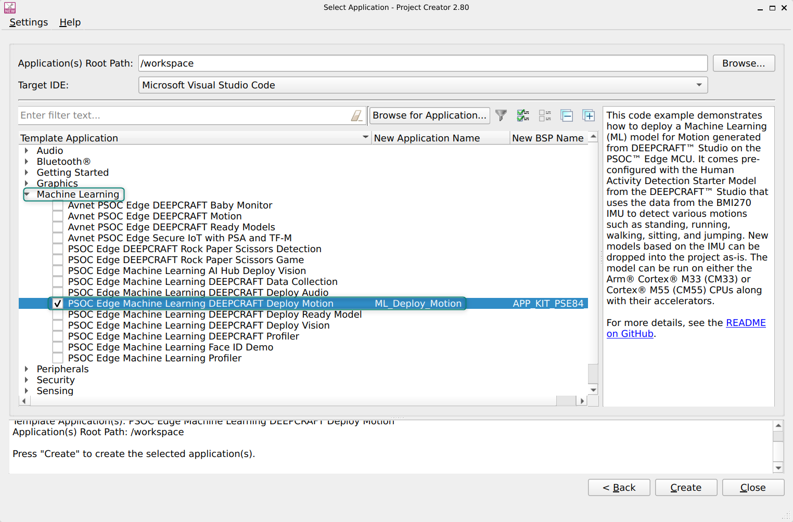

4. For PDM/PCM, select the PSOC™ Edge Machine Learning DEEPCRAFT™ Deploy Audio application under the **Machine Learning** section

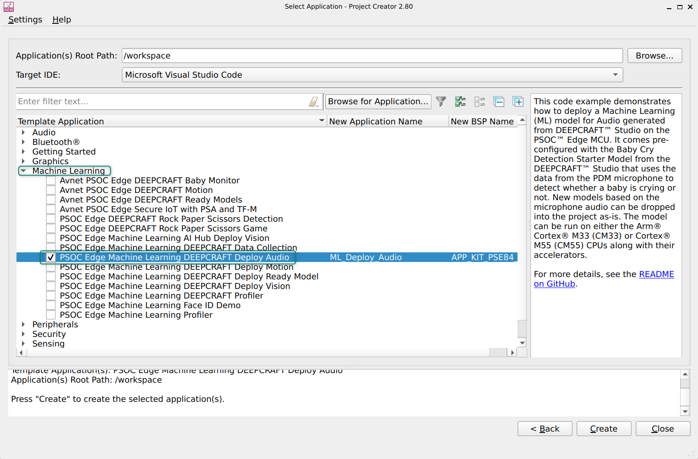

5. Build and program the project

> [!NOTE] First, the default project included in ModusToolbox™ is used, and the updated model is added in subsequent steps.

### Output

#### Output using IMU

After programing is successful, open the serial terminal and configure it as 115200-8-N-1.

The confidence for each classification is shown on the terminal. Shake the board or perform a circle motion and see the confidence levels change accordingly.

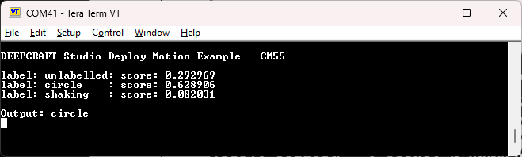

#### Output using PDM/PCM

After programing is successful, open the serial terminal and configure it as 115200-8-N-1.  
The confidence for each classification is shown on the terminal.   
Use a speaker to play baby-crying sounds and observe confidence levels in the terminal.

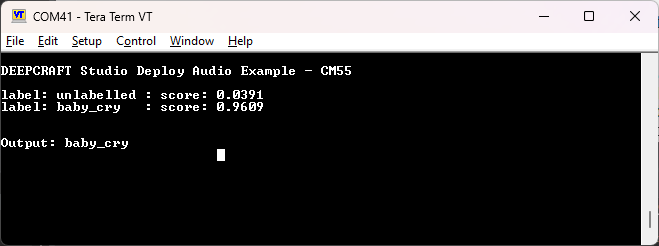

### Modify the application

The deploy code example comes with corresponding pre-trained model files for movement type detection and baby crying detection. After completing the previous labs, you should have generated the new model files required to deploy your own customized DEEPCRAFT™ model.

To deploy the updated model:

1. Copy the following files from the [DEEPCRAFT™ Studio](https://www.infineon.com/design-resources/embedded-software/deepcraft-edge-ai-solutions/deepcraft-studio) project into the deploy project

- Source: `{DEEPCRAFT project}/Models/{model_name}/Infineon/`
- Destination: `{ModusToolbox™ Deploy Example}.proj_cm55/model/`
- Files: `model.c/.h`

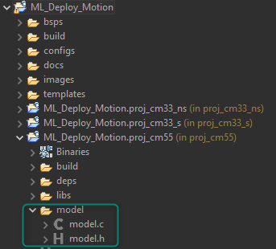

2. Build and re-program the device with the configured application
3. Open a terminal program and select the KitProg3 COM port. Set the serial port parameters to **8N1** and **115200** baud

#### Further modification

The code examples support running models on both the M33 and M55.

- Open *common.mk* and set ML\_DEEPCRAFT\_CPU to cm55 or cm33.
- Open the corresponding `proj_cmxx/Makefile` and set NN\_TYPE to **int8x8** or float to select desired quantization
- Adjust the **Code Generation** parameters accordingly in [DEEPCRAFT™ Studio](https://www.infineon.com/design-resources/embedded-software/deepcraft-edge-ai-solutions/deepcraft-studio)

### Conclusion

You have now successfully created a PSOC™ Edge E84 MCU code example that runs a model generated in [DEEPCRAFT™ Studio](https://www.infineon.com/design-resources/embedded-software/deepcraft-edge-ai-solutions/deepcraft-studio).

### Revision history

| Document revision | Date       | Description of changes                                |
| ----------------- | ---------- | ----------------------------------------------------- |
| \*A               | 2026-09-26 | Updated to latest tools and using Visual Studio Code. |
|                   | 2025-01-15 | Initial release.                                      |

### Disclaimer
All referenced product or service names and trademarks are the property of their respective owners.

The Bluetooth&reg; word mark and logos are registered trademarks owned by Bluetooth SIG, Inc., and any use of such marks by Infineon is under license.

PSOC&trade;, formerly known as PSOC&trade;, is a trademark of Infineon Technologies. Any references to PSOC&trade; in this document or others shall be deemed to refer to PSOC&trade;.

---------------------------------------------------------

© Cypress Semiconductor Corporation, 2023-2026. This document is the property of Cypress Semiconductor Corporation, an Infineon Technologies company, and its affiliates ("Cypress").  This document, including any software or firmware included or referenced in this document ("Software"), is owned by Cypress under the intellectual property laws and treaties of the United States and other countries worldwide.  Cypress reserves all rights under such laws and treaties and does not, except as specifically stated in this paragraph, grant any license under its patents, copyrights, trademarks, or other intellectual property rights.  If the Software is not accompanied by a license agreement and you do not otherwise have a written agreement with Cypress governing the use of the Software, then Cypress hereby grants you a personal, non-exclusive, nontransferable license (without the right to sublicense) (1) under its copyright rights in the Software (a) for Software provided in source code form, to modify and reproduce the Software solely for use with Cypress hardware products, only internally within your organization, and (b) to distribute the Software in binary code form externally to end users (either directly or indirectly through resellers and distributors), solely for use on Cypress hardware product units, and (2) under those claims of Cypress's patents that are infringed by the Software (as provided by Cypress, unmodified) to make, use, distribute, and import the Software solely for use with Cypress hardware products.  Any other use, reproduction, modification, translation, or compilation of the Software is prohibited.
 
TO THE EXTENT PERMITTED BY APPLICABLE LAW, CYPRESS MAKES NO WARRANTY OF ANY KIND, EXPRESS OR IMPLIED, WITH REGARD TO THIS DOCUMENT OR ANY SOFTWARE OR ACCOMPANYING HARDWARE, INCLUDING, BUT NOT LIMITED TO, THE IMPLIED WARRANTIES OF MERCHANTABILITY AND FITNESS FOR A PARTICULAR PURPOSE.  No computing device can be absolutely secure.  Therefore, despite security measures implemented in Cypress hardware or software products, Cypress shall have no liability arising out of any security breach, such as unauthorized access to or use of a Cypress product. CYPRESS DOES NOT REPRESENT, WARRANT, OR GUARANTEE THAT CYPRESS PRODUCTS, OR SYSTEMS CREATED USING CYPRESS PRODUCTS, WILL BE FREE FROM CORRUPTION, ATTACK, VIRUSES, INTERFERENCE, HACKING, DATA LOSS OR THEFT, OR OTHER SECURITY INTRUSION (collectively, "Security Breach").  Cypress disclaims any liability relating to any Security Breach, and you shall and hereby do release Cypress from any claim, damage, or other liability arising from any Security Breach.  In addition, the products described in these materials may contain design defects or errors known as errata which may cause the product to deviate from published specifications. To the extent permitted by applicable law, Cypress reserves the right to make changes to this document without further notice. Cypress does not assume any liability arising out of the application or use of any product or circuit described in this document. Any information provided in this document, including any sample design information or programming code, is provided only for reference purposes.  It is the responsibility of the user of this document to properly design, program, and test the functionality and safety of any application made of this information and any resulting product.  "High-Risk Device" means any device or system whose failure could cause personal injury, death, or property damage.  Examples of High-Risk Devices are weapons, nuclear installations, surgical implants, and other medical devices.  "Critical Component" means any component of a High-Risk Device whose failure to perform can be reasonably expected to cause, directly or indirectly, the failure of the High-Risk Device, or to affect its safety or effectiveness.  Cypress is not liable, in whole or in part, and you shall and hereby do release Cypress from any claim, damage, or other liability arising from any use of a Cypress product as a Critical Component in a High-Risk Device. You shall indemnify and hold Cypress, including its affiliates, and its directors, officers, employees, agents, distributors, and assigns harmless from and against all claims, costs, damages, and expenses, arising out of any claim, including claims for product liability, personal injury or death, or property damage arising from any use of a Cypress product as a Critical Component in a High-Risk Device. Cypress products are not intended or authorized for use as a Critical Component in any High-Risk Device except to the limited extent that (i) Cypress's published data sheet for the product explicitly states Cypress has qualified the product for use in a specific High-Risk Device, or (ii) Cypress has given you advance written authorization to use the product as a Critical Component in the specific High-Risk Device and you have signed a separate indemnification agreement.
 
Cypress, the Cypress logo, and combinations thereof, ModusToolbox, PSOC, CAPSENSE, EZ-USB, F-RAM, and TRAVEO are trademarks or registered trademarks of Cypress or a subsidiary of Cypress in the United States or in other countries. For a more complete list of Cypress trademarks, visit www.infineon.com. Other names and brands may be claimed as property of their respective owners.
